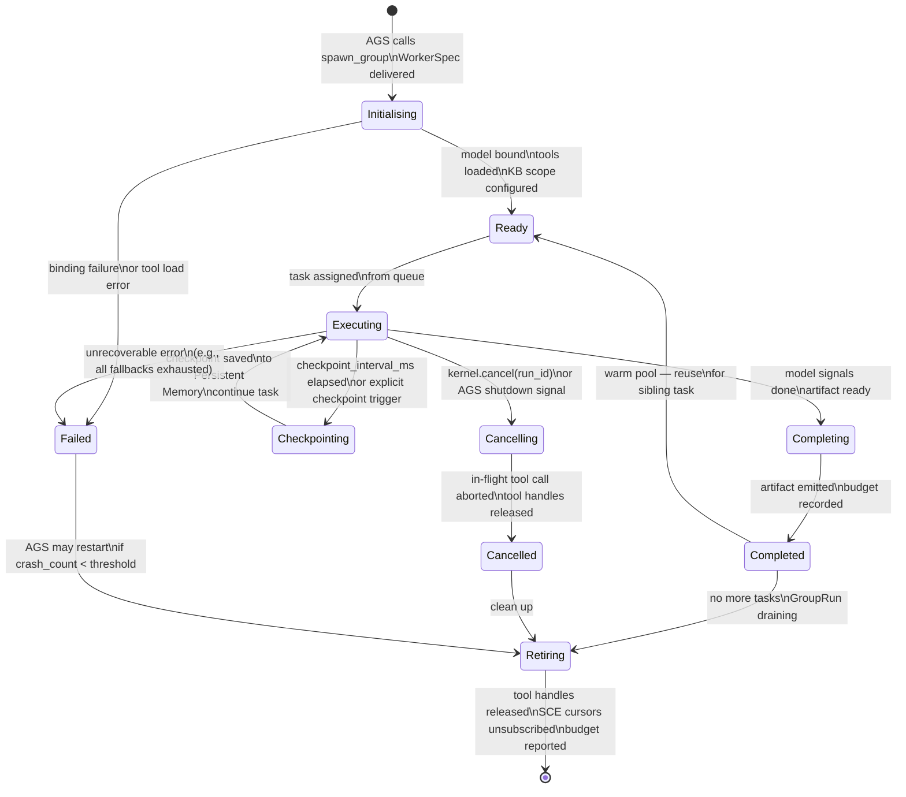
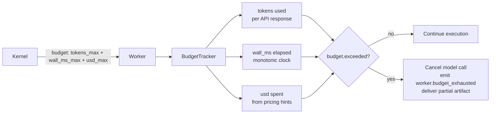
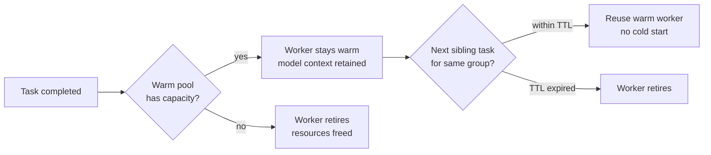

# Agent Lifecycle — State Machine and Event Schema

> Complete state machine for a Dynamic Worker, from spawn to retirement, with all events published to the SCE.

## State Machine



## Lifecycle Events on SCE

All events are published on `run.<run_id>` topic with `worker_id`, `task_id`, `correlation_id`, and `ts`.

| State transition | SCE Event | Key payload fields |
|-----------------|-----------|-------------------|
| Initialising → Ready | `worker.started` | `role, model_id, tools[]` |
| Ready → Executing | `worker.task_assigned` | `task_id, budget_slice` |
| Executing (stream) | `worker.token` | `text, finish_reason?` |
| Executing (tool) | `worker.tool_call` | `name, args, result?, error?, duration_ms` |
| Tool denied | `worker.tool_denied` | `name, reason` |
| Fallback used | `router.fallback` | `role, from_model, to_model, reason` |
| Checkpointing → Executing | `worker.checkpointed` | `checkpoint_id, budget_spent` |
| Completing → Completed | `worker.completed` | `artifact_id, budget_spent` |
| Executing → Failed | `worker.failed` | `error_code, message, budget_spent` |
| Executing → Cancelling | `worker.cancelling` | `reason` |
| Cancelling → Cancelled | `worker.cancelled` | `reason, budget_spent` |
| Budget exceeded | `worker.budget_exhausted` | `budget_type, spent, limit` |
| Context compressed | `worker.context_compressed` | `tokens_before, tokens_after` |
| Retiring → [*] | `worker.retired` | `total_tasks, total_tokens, wall_ms` |

## Checkpoint Structure

```mermaid
flowchart LR
  subgraph Checkpoint["Checkpoint record\n(stored in Persistent Memory)"]
    W_ID[worker_id: ulid]
    T_ID[task_id: ulid]
    R_ID[run_id: ulid]
    TS[ts: rfc3339]
    CTX_H[context_hash: sha256\nhash of current context window]
    BUDGET[budget_spent: tokens + ms + usd]
    TOOLS[tool_history: ToolCall[]\nall tool calls so far]
    PARTIAL[partial_artifact: string?\npartial output]
    MODEL_S[model_state: object?\nprovider continuation state]
  end

  MEM[(Persistent Memory)] --> Checkpoint
  Checkpoint --> REPLAY[Replay: fresh worker\nloads checkpoint and continues]
```

## Budget Lifecycle



## Warm Pool Strategy



## Related Documents

- [Dynamic Workers](../docs/DYNAMIC_WORKERS.md)
- [AI Group System](../docs/AI_GROUP_SYSTEM.md)
- [Agent Memory](../docs/AGENT_MEMORY.md)
- [Persistent Memory](../docs/PERSISTENT_MEMORY.md)
- [Tool Calling](../docs/TOOL_CALLING.md)
- [Main AI Kernel](../docs/MAIN_AI_KERNEL.md)
