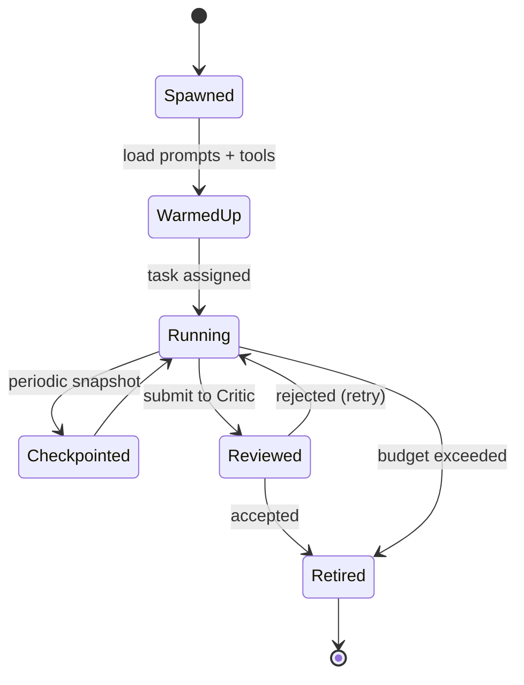

# Agent Lifecycle Flow

```mermaid
stateDiagram-v2
  [*] --> Spawned
  Spawned --> WarmedUp: load prompts + tools
  WarmedUp --> Running: task assigned
  Running --> Checkpointed: periodic snapshot
  Checkpointed --> Running
  Running --> Reviewed: submit to Critic
  Reviewed --> Running: rejected (retry)
  Reviewed --> Retired: accepted
  Running --> Retired: budget exceeded
  Retired --> [*]
```
