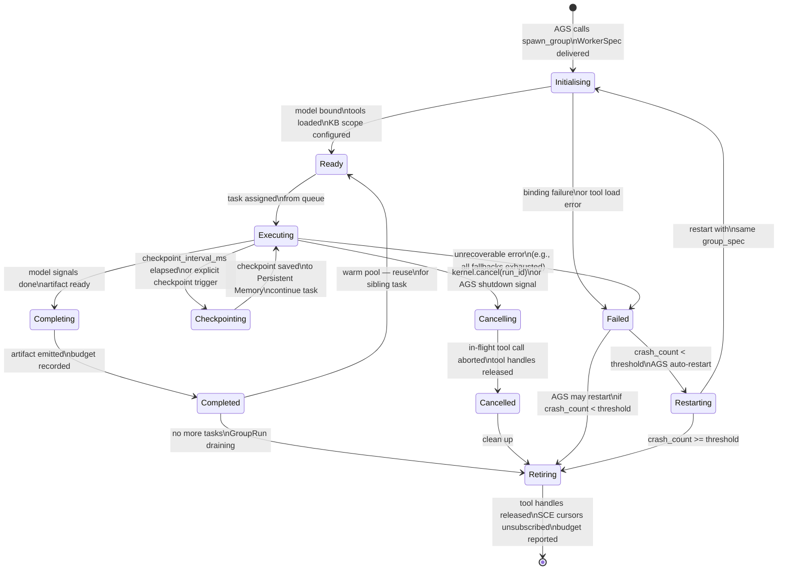
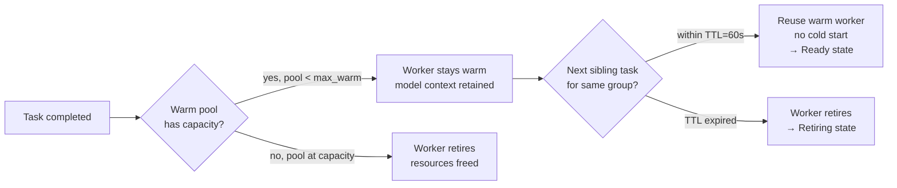
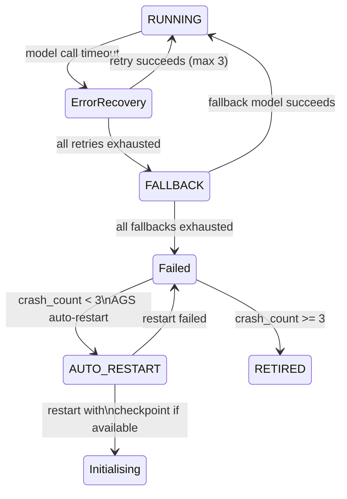
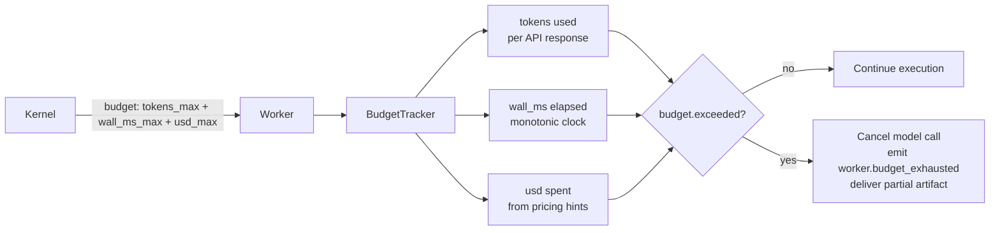

# Agent Lifecycle — State Machine and Event Schema

> Complete state machine for a Dynamic Worker, from spawn to retirement, with all events published to the SCE, transition triggers, timeout calculations, and failure recovery paths.

## State Machine



## Transition Triggers Table

| Current State | Next State | Trigger | Source | Async? |
|---------------|------------|---------|--------|--------|
| `[*]` | Initialising | `AGS.spawn_group(WorkerSpec)` | AI Group System | No |
| Initialising | Ready | Model client + tools loaded | Worker self | No |
| Initialising | Failed | Binding error or tool load exception | Worker self | No |
| Ready | Executing | `DW.execute(task)` | Task Scheduler | No |
| Executing | Checkpointing | `CHECKPOINT_INTERVAL_MS` timer fires | Worker timer | Yes (every 5s) |
| Executing | Checkpointing | `worker.checkpoint()` explicit call | Worker self | Yes |
| Checkpointing | Executing | Checkpoint saved to Persistent Memory | Worker self | No |
| Executing | Completing | Model returns `finish_reason: stop` | Model Provider | No |
| Completing | Completed | Artifact written, budget finalised | Worker self | No |
| Executing | Failed | Unrecoverable error (all fallbacks exhausted) | Worker self | No |
| Executing | Cancelling | `kernel.cancel(run_id)` or AGS shutdown | Kernel / AGS | Yes |
| Cancelling | Cancelled | In-flight tool call aborted, handles released | Worker self | No |
| Completed | Ready | Warm pool reuse (sibling task within TTL) | Worker Scheduler | No |
| Completed | Retiring | No more tasks, GroupRun draining | Worker Scheduler | No |
| Cancelled | Retiring | Cleanup complete | Worker Scheduler | No |
| Failed | Retiring | AGS decides not to restart | AGS | No |
| Failed | Restarting | `crash_count < threshold` | AGS | Yes |
| Restarting | Initialising | Restart with same group_spec | AGS | No |
| Restarting | Retiring | `crash_count >= threshold` | AGS | No |
| Retiring | `[*]` | Resources released, budget reported | Worker self | No |

## Timeout Calculations

| Timeout | Applies To | Default | Calculation |
|---------|------------|---------|-------------|
| Model invoke | `Executing` → model response | 120s | `max(30, budget.remaining_tokens / rate * 1.5)s` |
| Tool call | `Executing` → tool result | 30s | `tool.timeout` from tool spec (default 30s) |
| Checkpoint write | `Checkpointing` | 5s | Fixed; scaled to 99th percentile write time |
| Idle (warm pool) | `Ready` → `Retiring` | 60s | `warm_pool_ttl_ms` config (per group override) |
| Preemption yield | `Executing` → `IDLE` | 10s | Time to write emergency checkpoint + yield |
| Overall task | `Executing` → end | remaining budget wall_ms | `budget.wall_ms_max - budget.wall_ms_spent` |
| Cancellation | `Cancelling` | 5s | Graceful shutdown window before force-kill |

## Preemption Integration

```mermaid
flowchart LR
    subgraph Preemption["Preemption Flow"]
        SIGNAL[SCE: preemption_request\nfor worker_id] --> DETECT[Worker detects signal\non subscribed topic]
        DETECT --> EMERGENCY[Write emergency checkpoint\nstate_snapshot + preempted:true]
        EMERGENCY --> RELEASE[Release tool handles\nbudget logged]
        RELEASE --> YIELD[DW.yield() to Task Scheduler]
        YIELD --> RESCHEDULE[Task re-queued with checkpoint_id]
        RESCHEDULE --> CONTINUE[New worker\nloads checkpoint → Executing]
    end
```

Preemption is triggered by:
- Higher-priority task entering the queue
- Kernel-initiated run cancellation (e.g., user cancels)
- System memory pressure
- Budget exhaustion warning (within 10% of limit)

## Warm Pool Lifecycle



Warm pool capacity: `min(5, max_workers * 0.2)` global, per-group override `max_warm = 2`.

## Checkpoint State Schema

```mermaid
flowchart LR
  subgraph Checkpoint["Checkpoint record\n(stored in Persistent Memory)"]
    W_ID[worker_id: ulid]
    T_ID[task_id: ulid]
    R_ID[run_id: ulid]
    TS[ts: rfc3339]
    CTX_H[context_hash: sha256\nhash of current context window]
    BUDGET[budget_spent: tokens + ms + usd]
    TOOLS[tool_history: ToolCall[]\nall tool calls so far]
    PARTIAL[partial_artifact: string?\npartial output]
    MODEL_S[model_state: object?\nprovider continuation state]
  end

  MEM[(Persistent Memory)] --> Checkpoint
  Checkpoint --> REPLAY[Replay: fresh worker\nloads checkpoint and continues]
```

Checkpoint fields:

| Field | Type | Description |
|-------|------|-------------|
| `worker_id` | ULID | Unique worker identifier |
| `task_id` | ULID | Task being executed |
| `run_id` | ULID | Parent run |
| `ts` | RFC3339 | When checkpoint was taken |
| `context_hash` | SHA256 | Hash of current context window for dedup |
| `budget_spent` | `{tokens, ms, usd}` | Cumulative budget consumed |
| `tool_history` | `ToolCall[]` | All tool calls made so far with results |
| `partial_artifact` | `string?` | Partial output (e.g., code file in progress) |
| `model_state` | `object?` | Provider-specific continuation state (e.g., assistant message ID) |

## Failure Recovery Paths



- Each error recovery path writes a `worker.failed_recovery` event to SCE with the recovery strategy used.
- Checkpoint-based recovery loads the most recent checkpoint and replays the context from there.
- Fallback-based recovery reassigns the model binding and continues from the last checkpoint.

## Observability Events per Transition

| Transition | SCE Event | Log Level | Key Metrics |
|------------|-----------|-----------|-------------|
| `[*]` → Initialising | `worker.spawning` | INFO | spawn_latency_ms |
| Initialising → Ready | `worker.started` | INFO | init_duration_ms, model, tools_loaded |
| Initialising → Failed | `worker.spawn_failed` | ERROR | error_code, init_duration_ms |
| Ready → Executing | `worker.task_assigned` | INFO | task_id, budget_slice |
| Executing → Checkpointing | `worker.checkpoint` | DEBUG | checkpoint_id, budget_spent |
| Checkpointing → Executing | (implied by next progress) | DEBUG | checkpoint_write_ms |
| Executing → Completing | `worker.completing` | INFO | tokens_used, tool_calls_count |
| Completing → Completed | `worker.completed` | INFO | artifact_id, total_tokens, wall_ms |
| Executing → Failed | `worker.failed` | ERROR | error_code, message, budget_spent |
| Executing → Cancelling | `worker.cancelling` | WARN | reason |
| Cancelling → Cancelled | `worker.cancelled` | WARN | reason, budget_spent |
| Completed → Ready | `worker.reassigned` | INFO | warm_reuse=true |
| Completed → Retiring | `worker.retiring` | INFO | reason, total_tasks |
| Failed → Restarting | `worker.restarting` | WARN | crash_count, threshold |
| Restarting → Initialising | `worker.restarted` | INFO | restart_attempt |
| Retiring → `[*]` | `worker.retired` | INFO | total_tasks, total_tokens, wall_ms |

## Budget Lifecycle



## Related Documents

- [Dynamic Workers](../docs/DYNAMIC_WORKERS.md)
- [AI Group System](../docs/AI_GROUP_SYSTEM.md)
- [Agent Memory](../docs/AGENT_MEMORY.md)
- [Persistent Memory](../docs/PERSISTENT_MEMORY.md)
- [Tool Calling](../docs/TOOL_CALLING.md)
- [Main AI Kernel](../docs/MAIN_AI_KERNEL.md)
