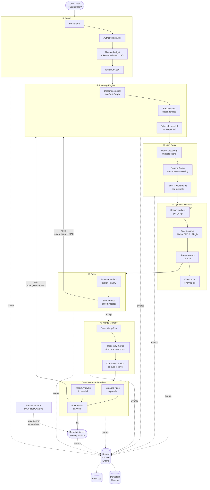

# AI Kernel — Detailed Internal Flow

> Zoomed-in view of the Main AI Kernel's internal loop, showing all eight stages, their inputs/outputs, how each stage publishes to the Shared Context Engine, the kernel API surface, thread model, concurrency approach, and extension points.

## Kernel Loop



## Kernel API Surface

| Method | Input | Output | Description |
|--------|-------|--------|-------------|
| `kernel.submit(goal, context?)` | `Goal {text, actor, workspace}` | `RunID` | Submit a new goal for execution |
| `kernel.cancel(run_id)` | `RunID` | `void` | Cancel an active run; workers receive preemption signal |
| `kernel.status(run_id)` | `RunID` | `RunStatus {stage, progress}` | Poll current run status |
| `kernel.replay(run_id)` | `RunID` | `RunID` | Full replay of a previous run |
| `kernel.replay_stage(run_id, stage)` | `RunID, Stage` | `void` | Replay from a specific stage |
| `kernel.list_runs(filter?)` | `RunFilter` | `RunSummary[]` | List recent runs with optional filters |

## Event Catalog per Stage

| Stage | SCE Topic | Events Emitted | Key Payload |
|-------|-----------|----------------|-------------|
| Intake | `run.<id>` | `run.submitted`, `run.intake_complete` | `{run_id, goal, actor, budget}` |
| Plan | `run.<id>` | `plan.started`, `plan.complete`, `plan.replanning`, `plan.replanned` | `{task_graph, task_count}` |
| Route | `run.<id>` | `run.routing`, `run.routing_failed` | `{role, model_binding}` |
| Execute | `run.<id>` | `worker.task.started`, `worker.task.progress`, `worker.task.completed` | `{task_id, artifacts}` |
| Critique | `run.<id>` | `critique.started`, `critique.accepted`, `critique.rejected` | `{artifact_id, score}` |
| Merge | `run.<id>` | `merge.started`, `merge.completed`, `merge.conflict` | `{artifact_ids, merged}` |
| Guard | `run.<id>` | `guardian.evaluating`, `guardian.verdict` | `{artifact_id, ok, violations}` |
| Deliver | `run.<id>` | `run.completed`, `run.failed` | `{result, total_duration_ms}` |

## Thread Model

```mermaid
flowchart LR
    subgraph MainThread["Main Kernel Goroutine"]
        API[kernel.submit()\nhandler]
        STATUS[kernel.status()\npoller]
        CANCEL[kernel.cancel()\nhandler]
    end

    subgraph StagePool["Stage Goroutine Pool\n(size = 4)"]
        PLANNER[Plan stage\nworker goroutine]
        ROUTER[Route stage\nworker goroutine]
        MERGER[Merge stage\nworker goroutine]
        GUARDER[Guard stage\nworker goroutine]
    end

    subgraph WorkerPool["Dynamic Worker Pool\n(size = up to max_workers)"]
        W1[Worker goroutine 1]
        W2[Worker goroutine 2]
        WN[Worker goroutine N]
    end

    MainThread -->|serial stages| StagePool
    StagePool -->|spawn| WorkerPool
    WorkerPool -->|results| StagePool
    StagePool -->|events| MainThread
```

- The **Main Kernel** runs on a single goroutine that handles API calls and state transitions.
- Each **stage** has a dedicated goroutine from the stage pool. Stages are serial within a run (one stage completes before the next starts), but multiple runs can progress through different stages concurrently.
- **Dynamic Workers** each run in their own goroutine, up to `max_workers` (default 10) per Kernel instance.

## Concurrency Approach

- **Per-run isolation**: Each run has its own `RunState` object, isolated from other runs. No shared state between runs.
- **Stage-level serialisation**: Within a run, stages execute sequentially. State is passed from one stage to the next via the `RunState` object.
- **Worker-level parallelism**: Independent tasks within a stage (e.g., multiple tools calls in Execute, parallel rule evaluation in Guard) use goroutine fan-out within a `errgroup` with shared context for cancellation.
- **SCE as coordination point**: All cross-component communication goes through SCE topics, not direct function calls. This decouples stages and allows independent scaling.
- **Budget as synchronisation**: The budget tracker acts as a concurrency limiter — when budget is exhausted, the stage context is cancelled and all in-flight workers are preempted.

## State Management

Each active run maintains a `RunState` object:

```
RunState {
    run_id: ULID
    status: enum { pending, active, completing, completed, failed, cancelled }
    current_stage: enum { intake, plan, route, execute, critique, merge, guard, deliver }
    stage_started_at: RFC3339
    task_graph: TaskGraph
    artifacts: Map<task_id, Artifact>
    replan_count: int
    budget: Budget{ tokens_spent, wall_ms_spent, usd_spent }
    created_at, updated_at: RFC3339
}
```

The `RunState` is persisted to Persistent Memory every stage transition for crash recovery.

## SCE Integration Points

| Kernel Action | SCE Interaction | Behaviour |
|---------------|----------------|-----------|
| Stage start | `publish(stage.started)` | All subscribers notified |
| Stage progress | `publish(stage.progress)` | During long-running stages (Execute) |
| Stage complete | `publish(stage.completed)` | Next stage triggered from event log |
| Stage error | `publish(stage.failed)` | Error propagated to run status |
| Replan | `publish(run.replanning)` | Subscribers see replan count |
| Cancellation | `publish(run.cancelling)` | Workers preempt via SCE subscription |

## Kernel Extension Points

| Extension Point | Interface | Registered By | Example |
|-----------------|-----------|---------------|---------|
| Pre-intake filter | `PreIntakeHook` | Plugin SDK | Custom auth, rate limiting |
| Post-delivery hook | `PostDeliveryHook` | Plugin SDK | Slack notification, webhook |
| Custom stage | `StageHandler` | Plugin SDK | Custom validation stage |
| Budget strategy | `BudgetAllocator` | Config | Fixed, proportional, priority-based |
| TaskGraph transformer | `TaskGraphTransformer` | Plugin SDK | Inject extra tasks, modify deps |

## Failure Modes

| Mode | Stage | Trigger | Effect | Recovery |
|------|-------|---------|--------|----------|
| Goal parse failure | Intake | Goal cannot be parsed | Run rejected immediately | Return error to user |
| Auth failure | Intake | Actor not authenticated | Run not created | User must authenticate |
| Plan generation failure | Plan | TaskGraph cannot be generated | Retry with simpler decomposition | If retry fails, run fails |
| No matching model | Route | No model passes must-have filter | Run cannot start | User notified to assign model |
| Worker unavailable | Execute | All workers busy or crashed | Task queued, retry with backoff | Auto-retry when worker freed |
| All fallbacks exhausted | Execute | Every model in chain fails | Task fails; run may fail if critical | Kernel may replan without failed task |
| Critic unavailable | Critique | Critic service down | Artifact accepted with warning | Logged to audit |
| Merge conflict | Merge | Conflict cannot be auto-resolved | Escalated to human | Human resolves or task replanned |
| Guardian veto (critical) | Guard | Rule violation prevents commit | Immediate replan | Max 5 replans then escalate |
| Timeout (any stage) | Any | Stage exceeds SLA | Graceful degradation | Stage-specific fallback (see SLA table) |

## Implementation Notes

- The Kernel loop is implemented as a state machine with explicit stage transitions. Each stage handler returns `(next_stage, error)`.
- Stage timeouts are enforced by a `context.WithTimeout` per stage, propagated to all sub-operations.
- All SCE events include `correlation_id = run_id` for tracing across the entire event log.
- The `MAX_REPLANS` guard (default 5) prevents infinite replan loops. When exceeded, the run is marked as `failed` and escalated to human review.
- Kernel startup reads unfinished runs from Persistent Memory and resumes or fails them based on staleness (runs older than 1 hour are failed).
- Plugin SDK hooks are called synchronously within the stage handler. A slow hook delays the stage; timeout is enforced per hook.

## Related Documents

- [Main AI Kernel](../docs/MAIN_AI_KERNEL.md)
- [Planning Engine](../docs/PLANNING_ENGINE.md)
- [Nine Router](../docs/NINE_ROUTER.md)
- [Dynamic Workers](../docs/DYNAMIC_WORKERS.md)
- [Merge Manager](../docs/MERGE_MANAGER.md)
- [Architecture Guardian](../docs/ARCHITECTURE_GUARDIAN.md)
- [Shared Context Engine](../docs/SHARED_CONTEXT_ENGINE.md)
