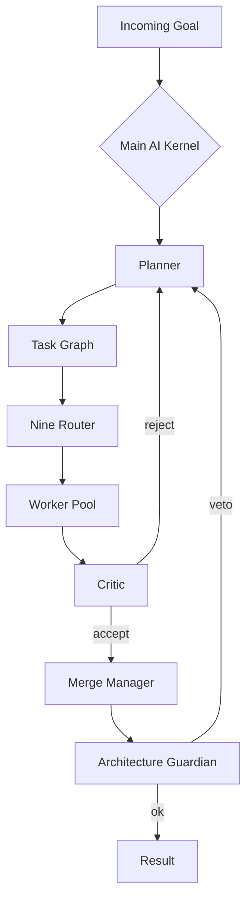

# AI Kernel

```mermaid
flowchart TB
  IN[Incoming Goal] --> KERNEL{Main AI Kernel}
  KERNEL --> PLAN[Planner]
  PLAN --> TASKS[Task Graph]
  TASKS --> ROUTE[Nine Router]
  ROUTE --> EXEC[Worker Pool]
  EXEC --> CRITIC[Critic]
  CRITIC -->|accept| MERGE[Merge Manager]
  CRITIC -->|reject| PLAN
  MERGE --> GUARD[Architecture Guardian]
  GUARD -->|ok| OUT[Result]
  GUARD -->|veto| PLAN
```
