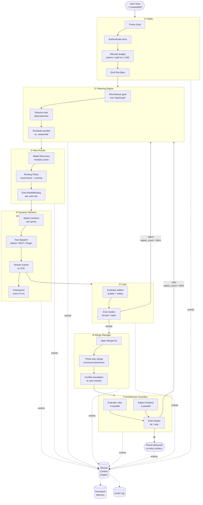
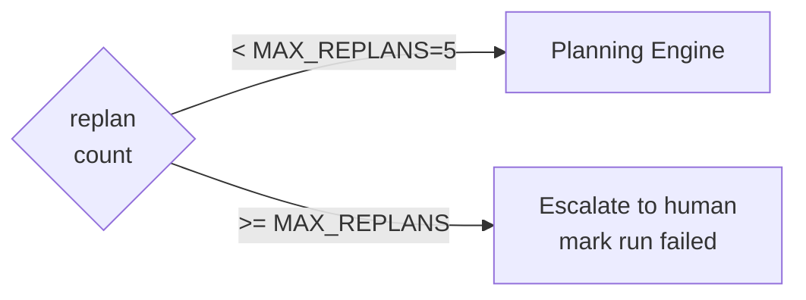

# AI Kernel — Detailed Internal Flow

> Zoomed-in view of the Main AI Kernel's internal loop, showing all eight stages, their inputs/outputs, and how each stage publishes to the Shared Context Engine.

## Kernel Loop

## Stage Contracts

| Stage | Input type | Output type | Max replans |
|-------|-----------|-------------|-------------|
| Intake | `Goal` | `RunSpec` | — |
| Planning | `RunSpec` \| `ReplanSpec` | `TaskGraph` | 5 |
| Route | `Task` | `ModelBinding` | — |
| Execute | `Task + ModelBinding` | `Artifact[]` | — |
| Critique | `Artifact` | `Verdict` | (triggers replan) |
| Merge | `Verdict[]` | `MergedArtifact` | — |
| Guard | `MergedArtifact` | `Verdict (ok\|veto)` | (triggers replan) |
| Deliver | `Artifact` | `Response` | — |

## Replan Guard Rail

## Related Documents

- [Main AI Kernel](../docs/MAIN_AI_KERNEL.md)
- [Planning Engine](../docs/PLANNING_ENGINE.md)
- [Nine Router](../docs/NINE_ROUTER.md)
- [Dynamic Workers](../docs/DYNAMIC_WORKERS.md)
- [Merge Manager](../docs/MERGE_MANAGER.md)
- [Architecture Guardian](../docs/ARCHITECTURE_GUARDIAN.md)
- [Shared Context Engine](../docs/SHARED_CONTEXT_ENGINE.md)
