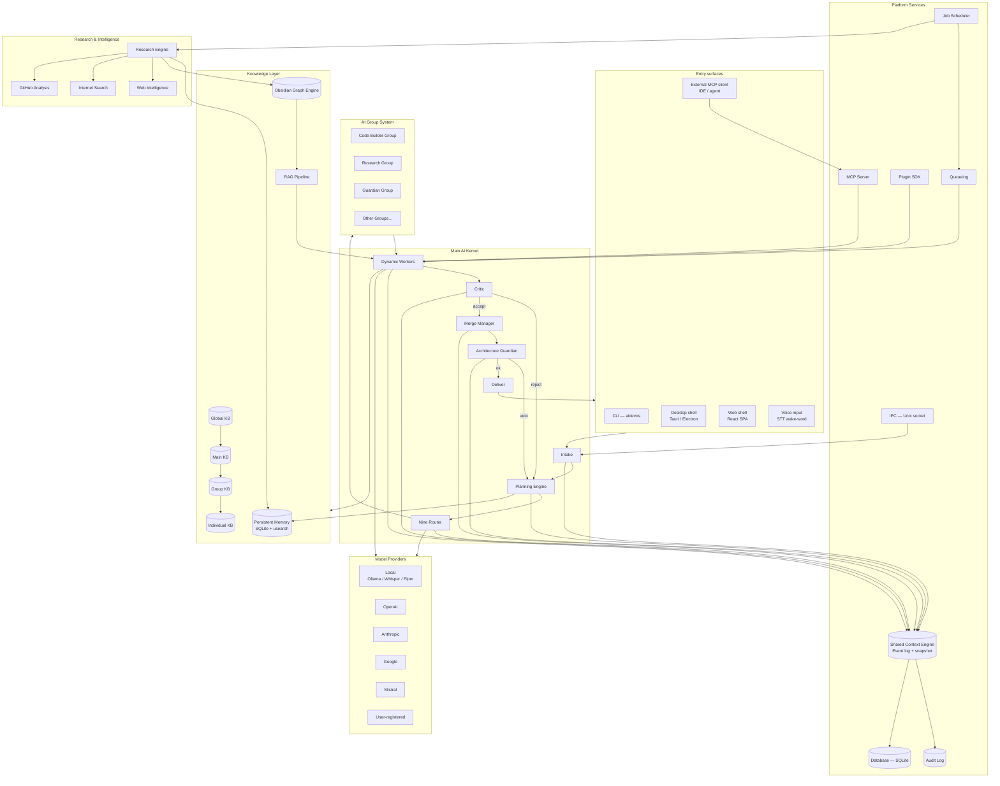

# Architecture — High-Level System Diagram

> Complete view of every major subsystem and how they interconnect. See individual subsystem docs for component-level diagrams. Includes component responsibility tables, communication pattern catalog, data flow, deployment topology options, scaling characteristics, and failure domains.

## Top-Level Flowchart

## Subsystem Relationship Summary

| Subsystem | Calls | Called by |
|-----------|-------|-----------|
| Main AI Kernel | Nine Router, Planning Engine, AI Group System, Merge Manager, Architecture Guardian | All entry surfaces |
| Nine Router | Model Providers, Persistent Memory (cache) | Kernel, Dynamic Workers |
| AI Group System | Dynamic Workers, Nine Router, Knowledge Layer | Kernel |
| Dynamic Workers | Model Providers, Tool Calling, MCP, Plugin SDK | AI Group System |
| Merge Manager | Architecture Guardian, Impact Analysis, Persistent Memory | Kernel |
| Architecture Guardian | Impact Analysis, Audit Log | Kernel, Merge Manager |
| Shared Context Engine | Database, Audit Log | Every subsystem |
| Persistent Memory | Vector Store, Embeddings, Database | Memory clients |
| Research Engine | Web Intelligence, Internet Search, GitHub Analysis, Persistent Memory | Job Scheduler, Kernel |
| Obsidian Graph Engine | Persistent Memory, Vector Store | RAG Pipeline, Research Engine, MCP |

## Component Responsibility Table

| Component | Primary Responsibility | State | Scale Unit |
|-----------|----------------------|-------|------------|
| Main AI Kernel | Orchestrate run lifecycle (8 stages) | In-memory + Persistent Memory | Per run |
| Planning Engine | Goal decomposition → TaskGraph | Stateless | Per plan request |
| Nine Router | Model discovery, role assignment, binding | In-memory cache + DB | Per Kernel instance |
| AI Group System | Worker pool management, group lifecycle | In-memory + Persistent Memory | Per group |
| Dynamic Worker | Task execution, model invoke, tool calls | In-memory (checkpointed) | Per task |
| Critic | Artifact quality evaluation | Stateless | Per artifact |
| Merge Manager | Three-way merge, conflict resolution | Transaction state in Persistent Memory | Per merge |
| Architecture Guardian | Rule evaluation, impact analysis | Stateless (rules loaded from DB) | Per artifact |
| Shared Context Engine | Event bus, snapshot, fan-out | SQLite / JetStream | Per topic partition |
| Persistent Memory | Key-value + vector storage | SQLite + usearch (on disk) | Per Memory service |
| Research Engine | Scheduled crawl, dedup, KB write | Stateless (cache in SCE) | Per crawl |
| Obsidian Graph Engine | Graph construction, traversal, query | In-memory + SQLite | Per vault |

## Communication Pattern Catalog

| Pattern | Example | Mechanism | Characteristics |
|---------|---------|-----------|-----------------|
| Synchronous RPC | Kernel → Nine Router `binding(role)` | gRPC (in-process) | Request-response, < 100ms |
| Asynchronous event | Worker → SCE `publish(worker.token)` | Event bus | Fire-and-forget, fan-out to multiple subscribers |
| Stream | SCE → CLI `subscribe(tail)` | SSE / AsyncIterator | Ordered, live, full-duplex |
| Request-reply with backpressure | Publisher → SCE `publish(topic)` | HTTP-like (ACK/429) | Synchronous with flow control |
| Cursor-based replay | Subscriber → SCE `subscribe(cursor)` | Bidirectional stream | Reconnect-safe, at-least-once delivery |
| Checkpoint | Worker → Persistent Memory `write_checkpoint` | SQLite write | ACID, synchronous per checkpoint |

## Data Flow Between Components

The key data flow for a single run:

1. **User → Kernel**: `Goal{text, actor, workspace}` via IPC/HTTP.
2. **Kernel → Plan → Kernel**: `RunSpec{goal_hash, budget}` → `TaskGraph{tasks, deps}`.
3. **Kernel → Router → Kernel**: `ModelBinding{primary, fallbacks}` for each task.
4. **Kernel → AGS → Worker**: `WorkerSpec{role, binding, tools, budget}`.
5. **Worker → Provider**: Model invoke via HTTP streaming.
6. **Worker → Kernel**: `Artifact{content, tool_history, metadata}`.
7. **Kernel → Critic → Kernel**: `Verdict{ok, violations, score}`.
8. **Kernel → Merge → Kernel**: `MergedArtifact{combined}`.
9. **Kernel → Guard → Kernel**: `Verdict{ok, violations}`.
10. **Kernel → User**: `Result{artifact, run_summary}`.

## Deployment Topology Options

| Topology | Description | When to use |
|----------|-------------|-------------|
| Single-node (embedded) | All processes in one OS process, SQLite backend | Development, personal use |
| Single-node (process-per-component) | Each subsystem runs as its own process, Unix socket IPC | Production single-user |
| Multi-node (SCE as NATS) | SCE backed by NATS JetStream cluster, persistent memory on shared volume | Multi-user, team deployment |
| Multi-node (full cluster) | Stateless Kernel replicas behind load balancer, shared SCE + DB cluster | Enterprise, high availability |

## Scaling Characteristics

| Component | Scaling | Bottleneck | Mitigation |
|-----------|---------|------------|------------|
| Kernel | Horizontal (stateless stages) | Replan loops | MAX_REPLANS guard |
| Planning Engine | Vertical (CPU-bound) | Large goal graphs | Decomposition depth limit |
| Nine Router | Horizontal (cache-based) | Cache TTL | Per-provider cache, partial refresh |
| Dynamic Workers | Horizontal (per-worker goroutine) | Provider rate limits | Fallback chain, warm pool |
| SCE | Horizontal (partition-based) | Disk I/O (event log) | Compaction, snapshotting |
| Persistent Memory | Vertical (memory-bound) | Vector index size | HNSW config, tiered storage |

## Failure Domains

| Failure Domain | Impacted Components | Blast Radius | Recovery Mechanism |
|----------------|---------------------|--------------|-------------------|
| Provider outage | Dynamic Workers, Nine Router | Active runs using that provider | Fallback chain, degraded health state |
| SCE broker down | All publishers, all subscribers | Platform-wide event loss | Local WAL buffer, reconnection |
| Persistent Memory down | Knowledge retrieval, checkpointing | Runs without memory/checkpoints | Graceful degradation (no memory read, no checkpoint write) |
| Filesystem corruption | Obsidian Graph Engine, Persistent Memory | Knowledge layer | Rebuild from vault, backup restoration |
| Kernel process crash | Active runs | Single-user session | Checkpoint-based recovery, unfinished runs resume |
| Database corruption | All stateful components | Platform-wide | Database restore from periodic backup |

## Implementation Notes

- All inter-process communication uses the Shared Context Engine as the backbone, with in-process function calls for co-located components.
- The system is designed to be operable in a fully offline mode — no external dependencies beyond model providers.
- Each component exposes a health check endpoint (`/health`) returning `{status, dependencies, latency_ms}`.
- Component startup order: Database → SCE → Persistent Memory → Graph Engine → Nine Router → Kernel → Surfaces.
- Graceful shutdown: Surfaces → Kernel (cancel active runs) → Workers (checkpoint) → SCE (flush WAL) → DB (close).

## Related Documents

- [System Overview](../docs/SYSTEM_OVERVIEW.md)
- [Main AI Kernel](../docs/MAIN_AI_KERNEL.md)
- [Nine Router](../docs/NINE_ROUTER.md)
- [AI Groups](../docs/AI_GROUPS.md)
- [Shared Context Engine](../docs/SHARED_CONTEXT_ENGINE.md)
- [Persistent Memory](../docs/PERSISTENT_MEMORY.md)
- [Plugin SDK](../docs/PLUGIN_SDK.md)
