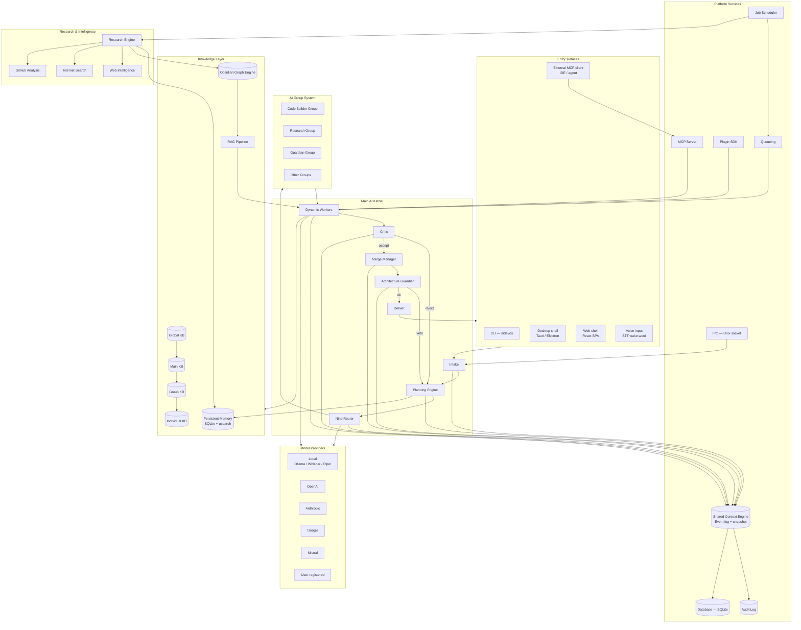

# Architecture — High-Level System Diagram

> Complete view of every major subsystem and how they interconnect. See individual subsystem docs for component-level diagrams.

## Top-Level Flowchart

## Subsystem Relationship Summary

| Subsystem | Calls | Called by |
|-----------|-------|-----------|
| Main AI Kernel | Nine Router, Planning Engine, AI Group System, Merge Manager, Architecture Guardian | All entry surfaces |
| Nine Router | Model Providers, Persistent Memory (cache) | Kernel, Dynamic Workers |
| AI Group System | Dynamic Workers, Nine Router, Knowledge Layer | Kernel |
| Dynamic Workers | Model Providers, Tool Calling, MCP, Plugin SDK | AI Group System |
| Merge Manager | Architecture Guardian, Impact Analysis, Persistent Memory | Kernel |
| Architecture Guardian | Impact Analysis, Audit Log | Kernel, Merge Manager |
| Shared Context Engine | Database, Audit Log | Every subsystem |
| Persistent Memory | Vector Store, Embeddings, Database | Memory clients |
| Research Engine | Web Intelligence, Internet Search, GitHub Analysis, Persistent Memory | Job Scheduler, Kernel |
| Obsidian Graph Engine | Persistent Memory, Vector Store | RAG Pipeline, Research Engine, MCP |

## Related Documents

- [System Overview](../docs/SYSTEM_OVERVIEW.md)
- [Main AI Kernel](../docs/MAIN_AI_KERNEL.md)
- [Nine Router](../docs/NINE_ROUTER.md)
- [AI Groups](../docs/AI_GROUPS.md)
- [Shared Context Engine](../docs/SHARED_CONTEXT_ENGINE.md)
