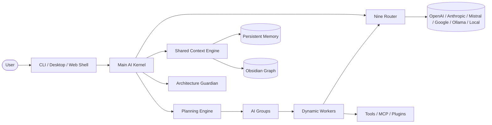

# Architecture

```mermaid
flowchart LR
  USER([User]) --> SHELL[CLI / Desktop / Web Shell]
  SHELL --> KERNEL[Main AI Kernel]
  KERNEL --> ROUTER[Nine Router]
  KERNEL --> PLANNER[Planning Engine]
  KERNEL --> CONTEXT[Shared Context Engine]
  KERNEL --> GUARDIAN[Architecture Guardian]
  PLANNER --> GROUPS[AI Groups]
  GROUPS --> WORKERS[Dynamic Workers]
  WORKERS --> ROUTER
  ROUTER --> PROVIDERS[(OpenAI / Anthropic / Mistral / Google / Ollama / Local)]
  CONTEXT --> MEMORY[(Persistent Memory)]
  CONTEXT --> GRAPH[(Obsidian Graph)]
  WORKERS --> TOOLS[Tools / MCP / Plugins]
```
