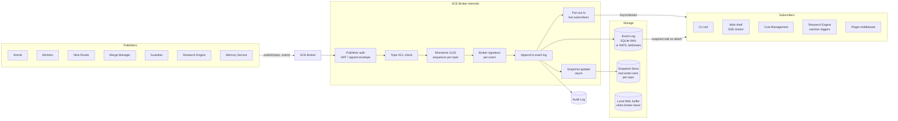
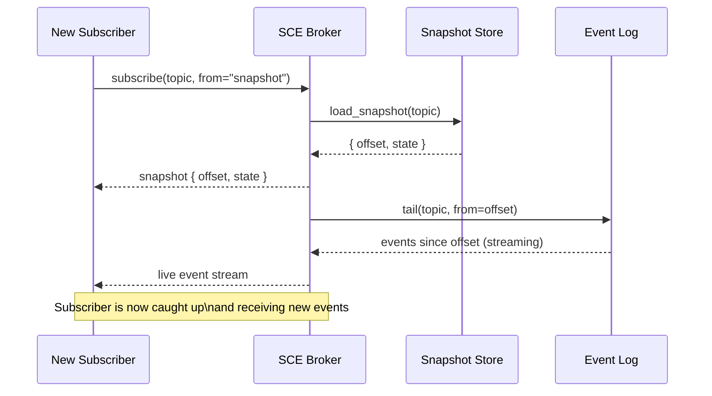
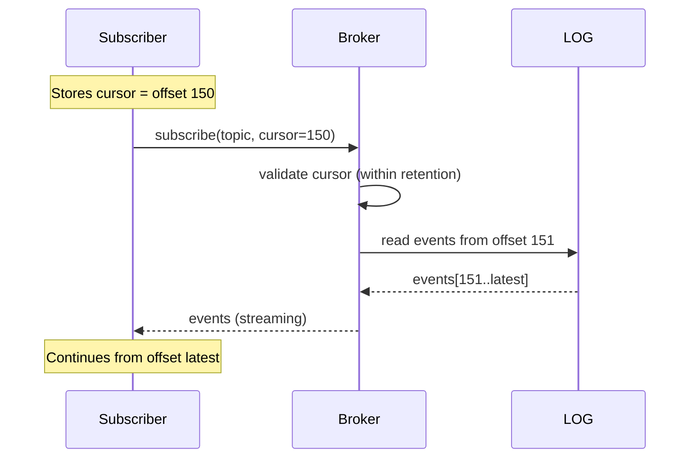
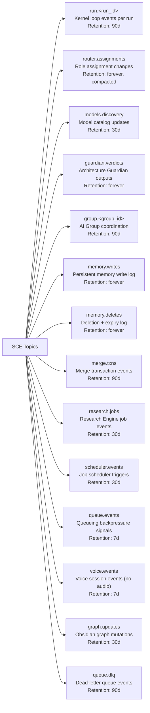
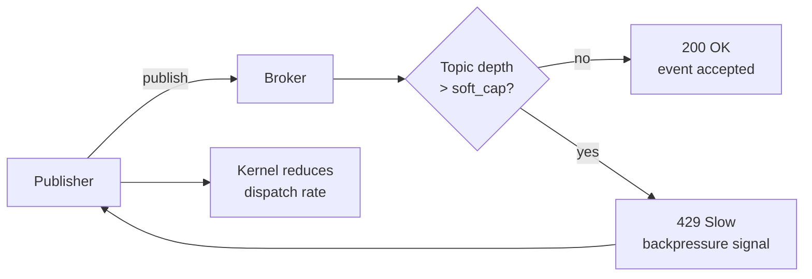
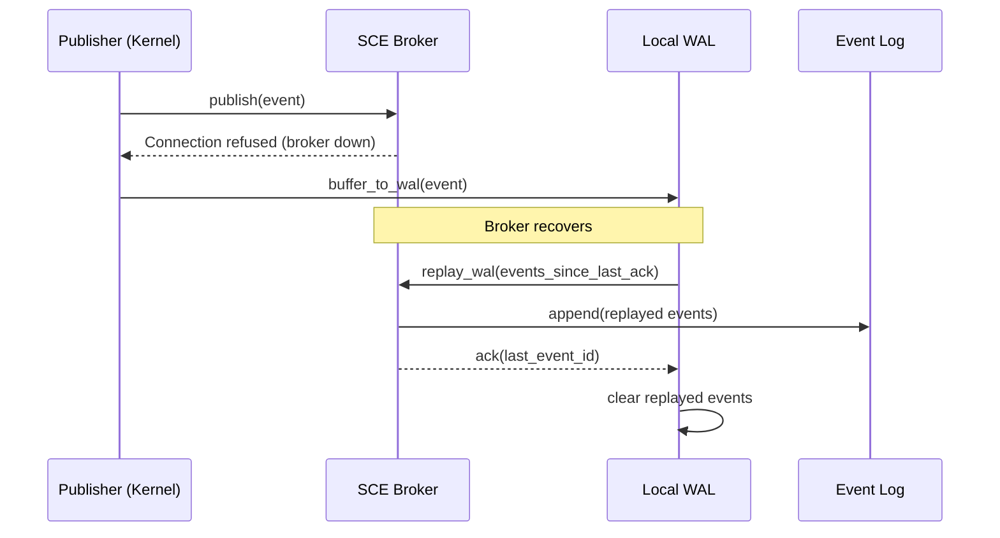

# Shared Context Engine — Architecture and Data Flow

> How events flow from publishers through the SCE broker to subscribers, snapshots, and the audit log. Includes snapshot creation, topic partitioning, cursor management, subscriber management, ordering guarantees, and failure modes.

## Broker Architecture



## Subscriber Attach Protocol



## Snapshot Creation Algorithm

```
function create_snapshot(topic, events_since_last_snapshot):
    // Load previous snapshot
    prev = snapshot_store.get(topic)

    // Apply each event's state mutation
    current = prev.state
    for event in events_since_last_snapshot:
        current = apply_event_to_state(current, event)

    // Write new snapshot with current offset
    snapshot_store.put(topic, {
        state: current,
        offset: events_since_last_snapshot[-1].offset,
        created_at: now()
    })

    return snapshot
```

- Snapshots are created every 100 events per topic, or every 60 seconds, whichever comes first.
- The snapshot updater runs asynchronously — it does not block the publish path.
- Snapshot state is a last-writer-wins merge of all events since the previous snapshot.

## Topic Partitioning Strategy

Topics are categorised by retention and partitioning strategy:

| Topic Pattern | Partition Key | Retention | Compaction |
|---------------|---------------|-----------|------------|
| `run.<run_id>` | `run_id` (implicit) | 90d | None (full log) |
| `router.assignments` | `role` | Forever | Compacted (latest per role) |
| `models.discovery` | `provider` | 30d | None |
| `guardian.verdicts` | `artifact_id` | Forever | Compacted (latest per artifact) |
| `group.<group_id>` | `group_id` | 90d | None |
| `memory.writes` | `kb_entry_id` | Forever | Compacted (latest per entry) |
| `merge.txns` | `txn_id` | 90d | None |
| `research.jobs` | `source_uri` | 30d | None |
| `queue.events` | `queue_name` | 7d | None |
| `graph.updates` | `node_id` | 30d | None |

Partitioning by partition key means that events for the same key are always delivered in order. Cross-key ordering is not guaranteed.

## Cursor Management

Each subscriber maintains a cursor — the offset of the last event they processed:

- **Initial attach**: Cursor starts at snapshot offset. Subscriber receives snapshot + tail from that offset.
- **Disconnect/reconnect**: Cursor is stored by the subscriber (client-side). On reconnect, subscriber provides cursor offset and broker replays from that offset.
- **Broker crash**: Cursor is persisted in the subscriber's client library. On broker recovery, subscriber reconnects with cursor.
- **Stale cursor**: If cursor is older than event log retention, subscriber receives a full snapshot as initial state.



## Subscriber Management

| Aspect | Behaviour |
|--------|-----------|
| Subscription model | Pull-based via `AsyncIterator<Event>`. Broker pushes events to live subscribers. |
| Heartbeat | Broker expects periodic heartbeat (every 30s). If missing for 60s, subscriber is removed and topic resources released. |
| Backpressure | Broker maintains a per-subscriber buffer (default 1000 events). If buffer is full, oldest events are dropped (subscriber must catch up via cursor). |
| Fan-out limit | Maximum 100 live subscribers per topic. Attempting to subscribe beyond this returns an error. |
| Auth on subscribe | Subscriber must have `read` ACL for the topic. ACL check is cached for 60s. |

## Replay Mechanism

```
function replay_event(topic, event_id):
    // Load the event
    event = event_log.get(topic, event_id)
    if event == nil:
        return error(EVENT_NOT_FOUND)

    // Publish as a replay with correlation
    replay_event = Event{
        id: new_ulid(),
        topic: topic,
        type: event.type,
        payload: event.payload,
        metadata: {
            original_id: event.id,
            is_replay: true,
            replayed_at: now()
        }
    }

    broker.publish(topic, replay_event)
    return replay_event.id
```

Replay emits the same payload as the original event but with `metadata.is_replay: true` and a new event ID. Subscribers can distinguish replayed events from live events and choose to skip idempotent processing.

## Ordering Guarantees

| Scope | Guarantee | Rationale |
|-------|-----------|-----------|
| Per-partition (same partition key) | Strict total order | Monotonic ULID sequencer per partition |
| Cross-partition (different keys) | No ordering guarantee | Events are distributed; order is not deterministic |
| Per-publisher (single publisher) | Publisher order preserved | Publisher's publish calls are serialised by the broker |
| Replay vs live | No ordering guarantee between replay and live | Replay is an independent publish; may interleave |
| Snapshot | Snapshot reflects all events up to snapshot offset | Events after snapshot offset are not included |

## Topic Namespace Conventions



## Backpressure and Flow Control



- Soft cap: 10,000 unprocessed events per topic (configurable).
- Hard cap: 50,000 events. Broker rejects publishes with `429 Too Many Requests` when hard cap is exceeded.
- Backpressure signal includes `retry_after_ms` — the estimated time until the topic drains below soft cap.

## Failure and Recovery — Local WAL



## Failure Modes

| Mode | Trigger | Effect | Recovery |
|------|---------|--------|----------|
| Partition unavailable | Storage backend (SQLite/JetStream) down | New publishes to that partition fail | Publishers receive error and buffer to WAL; retry with exponential backoff |
| Cursor divergence | Subscriber missed events due to buffer overflow | Subscriber skips events between last processed and oldest buffered | Subscriber detects gap (offset jump), reconnects with cursor to replay missed range |
| Snapshot stale | Snapshot updater crashes | Latest events not reflected in snapshot | Next subscriber attach triggers fresh snapshot from event log head |
| Broker crash | Process terminates | In-flight events may be lost (depends on storage durability) | Publishers replay from WAL; subscribers reconnect with cursor |
| Event log corruption | Storage layer data corruption | Events after corruption point may be lost | Recover from last good snapshot + WAL replay |
| ACL misconfiguration | Subscriber lacks read permission on topic | Subscription rejected with `403 Forbidden` | Logged; operator must update ACL |
| Subscriber slow | Subscriber processes events slower than they arrive | Per-subscriber buffer fills; oldest events dropped | Subscriber detects gap, reconnects from last known cursor |

## Implementation Notes

- The SCE Broker supports two backends: `sqlite` (single-node, WAL mode, embedded) and `nats` (multi-node, JetStream, clustered). Default is `sqlite`.
- Event IDs are ULIDs — they encode timestamp + randomness, providing monotonic ordering within a partition.
- The Local WAL is an on-disk SQLite database per publisher process. It is truncated after successful replay.
- Subscribers use a client library (`SCEClient`) that handles cursor persistence, reconnection, and backpressure negotiation.
- The `Snapshot Store` is a separate SQLite database (or NATS KV bucket) that maps `topic → { state, offset, created_at }`.
- Audit log writes are synchronous — the broker does not acknowledge a publish until the event is appended to the audit log.

## Related Documents

- [Shared Context Engine](../docs/SHARED_CONTEXT_ENGINE.md)
- [Event Bus](../docs/EVENT_BUS.md)
- [Persistent Memory](../docs/PERSISTENT_MEMORY.md)
- [Audit Log](../docs/AUDIT_LOG.md)
- [Main AI Kernel](../docs/MAIN_AI_KERNEL.md)
