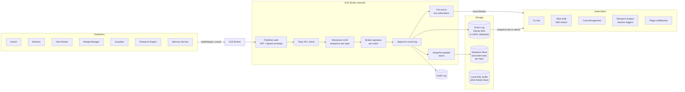
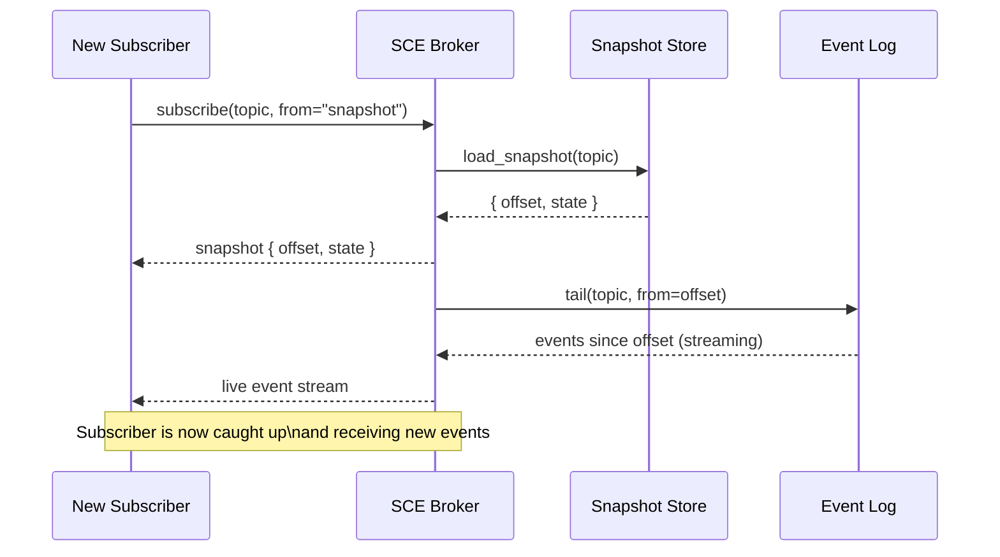
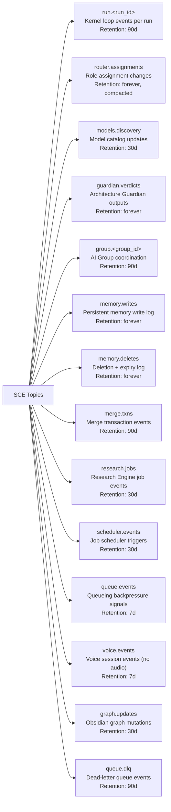
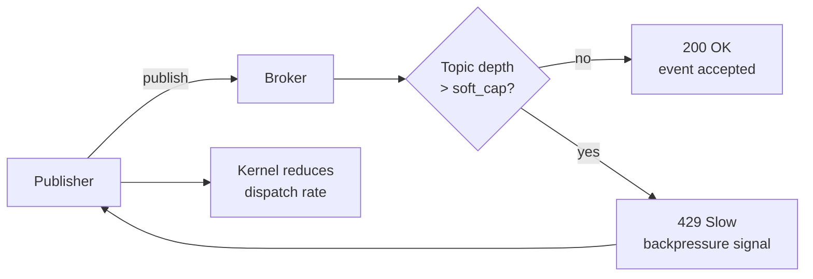
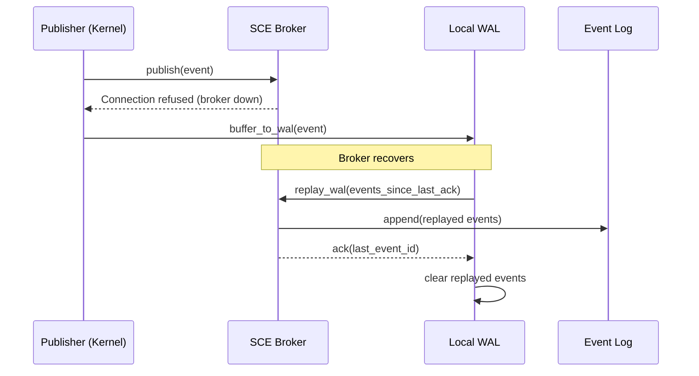

# Shared Context Engine — Architecture and Data Flow

> How events flow from publishers through the SCE broker to subscribers, snapshots, and the audit log.

## Broker Architecture

## Subscriber Attach Protocol

## Topic Namespace Conventions

## Backpressure and Flow Control

## Failure and Recovery — Local WAL

## Related Documents

- [Shared Context Engine](../docs/SHARED_CONTEXT_ENGINE.md)
- [Event Bus](../docs/EVENT_BUS.md)
- [Persistent Memory](../docs/PERSISTENT_MEMORY.md)
- [Audit Log](../docs/AUDIT_LOG.md)
- [Main AI Kernel](../docs/MAIN_AI_KERNEL.md)
