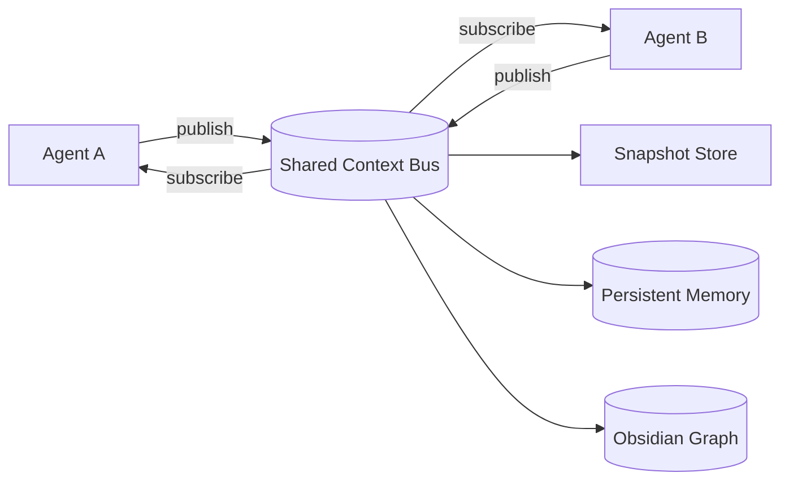

# Context Engine

```mermaid
flowchart LR
  A[Agent A] -- publish --> BUS[(Shared Context Bus)]
  B[Agent B] -- publish --> BUS
  BUS -- subscribe --> A
  BUS -- subscribe --> B
  BUS --> SNAP[Snapshot Store]
  BUS --> MEM[(Persistent Memory)]
  BUS --> GRAPH[(Obsidian Graph)]
```
