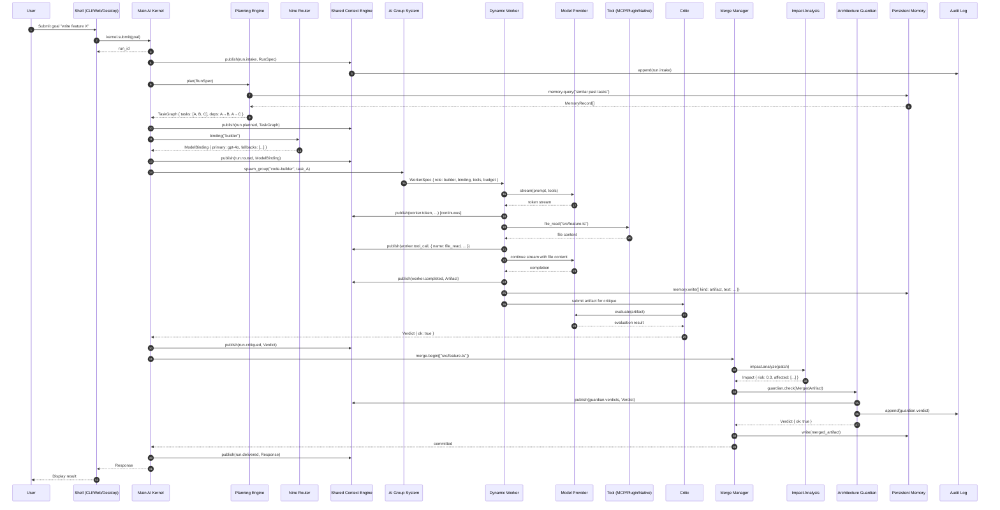
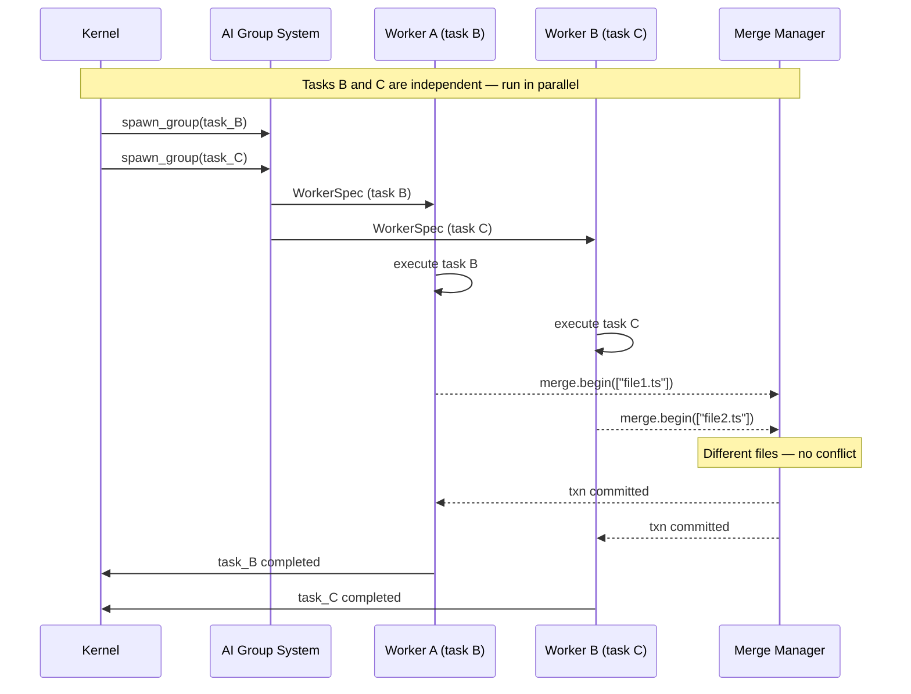
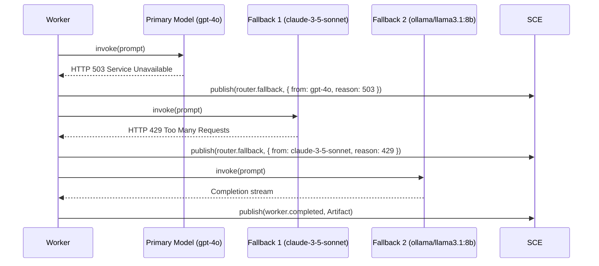

# Data Flow — End-to-End Request Lifecycle

> Sequence diagram tracing a user goal from submission through delivery, showing every major subsystem interaction, with timing notes, event catalog, and failure handling.

## Full Request Lifecycle

## Parallel Task Execution

## Model Fallback Flow

## Timing and Performance Notes

| Step | Operation | Expected Duration | Notes |
|------|-----------|-------------------|-------|
| 1–2 | Submit goal to Kernel | < 10ms | IPC or in-process call |
| 3–4 | Intake + audit | < 100ms | Auth check, budget allocation |
| 5–8 | Plan + memory query | 1–10s | Depends on goal complexity, memory size |
| 9–10 | Route (model binding) | < 50ms | Cache hit (primary path) |
| 11–12 | Spawn worker | < 50ms | Warm pool hit; 500ms-2s cold start |
| 13–24 | Execute (model + tools) | 5–120s | Dominant factor; depends on task size |
| 25–30 | Critique | 2–10s | Model evaluation of artifact |
| 31–38 | Merge + guard | < 5s | Three-way merge + rule evaluation |
| 39–41 | Deliver | < 50ms | Result formatted and returned |

**End-to-end typically**: 10–150s depending on task complexity and model speed.

## Event Catalog Summary

| Event | Publisher | Subscribers | Frequency |
|-------|-----------|-------------|-----------|
| `run.intake` | Kernel | Audit Log, CLI | 1 per run |
| `run.planned` | Kernel | Kernel (self) | 1 per plan |
| `run.routed` | Kernel | Cost Management | 1 per task |
| `worker.token` | Worker | CLI (streaming) | Many per task |
| `worker.tool_call` | Worker | Audit Log, CLI | Per tool call |
| `worker.completed` | Worker | Kernel, Cost Management | 1 per task |
| `run.critiqued` | Kernel | Audit Log | 1 per artifact |
| `guardian.verdicts` | Guardian | Audit Log, CLI | 1 per merge |
| `run.delivered` | Kernel | CLI, Cost Management | 1 per run |

## Performance Characteristics

| Step | Operation | Typical | P99 | Notes |
|------|-----------|---------|-----|-------|
| 1–2 | Submit goal | < 10ms | 50ms | IPC or in-process call |
| 3–4 | Intake + audit | < 100ms | 500ms | Auth + budget allocation |
| 5–8 | Plan + memory query | 2s | 15s | Model call for decomposition |
| 9–10 | Route binding | < 50ms | 200ms | Cache hit |
| 11–12 | Spawn worker | 50ms | 2s | Warm vs cold pool |
| 13–24 | Execute (model + tools) | 15s | 120s | Dominant factor |
| 25–30 | Critique | 3s | 15s | Model evaluation |
| 31–38 | Merge + guard | 2s | 10s | Merge + rule eval |
| 39–41 | Deliver | < 50ms | 200ms | Format result |

**End-to-end**: typically 20–150s. The execute stage dominates (> 80% of total time).

## Configuration Limits Impacting Data Flow

| Setting | Default | Impact |
|---------|---------|--------|
| `kernel.max_concurrent_runs` | 5 | Max parallel run submissions |
| `kernel.max_workers` | 10 | Max concurrent worker goroutines |
| `kernel.stage.timeout` | 300s | Per-stage timeout before fallback |
| `kernel.budget.wall_ms_max` | 300000 | Max wall-clock time per run |
| `kernel.budget.tokens_max` | 100000 | Max tokens per run |

## Related Documents

- [Main AI Kernel](../docs/MAIN_AI_KERNEL.md)
- [Dynamic Workers](../docs/DYNAMIC_WORKERS.md)
- [Nine Router](../docs/NINE_ROUTER.md)
- [Merge Manager](../docs/MERGE_MANAGER.md)
- [Architecture Guardian](../docs/ARCHITECTURE_GUARDIAN.md)
- [Shared Context Engine](../docs/SHARED_CONTEXT_ENGINE.md)
- [Planning Engine](../docs/PLANNING_ENGINE.md)
