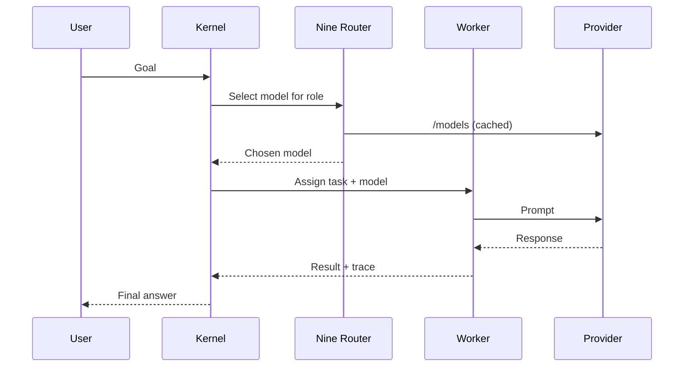

# Data Flow

```mermaid
sequenceDiagram
  participant U as User
  participant K as Kernel
  participant R as Nine Router
  participant W as Worker
  participant P as Provider
  U->>K: Goal
  K->>R: Select model for role
  R->>P: /models (cached)
  R-->>K: Chosen model
  K->>W: Assign task + model
  W->>P: Prompt
  P-->>W: Response
  W-->>K: Result + trace
  K-->>U: Final answer
```
