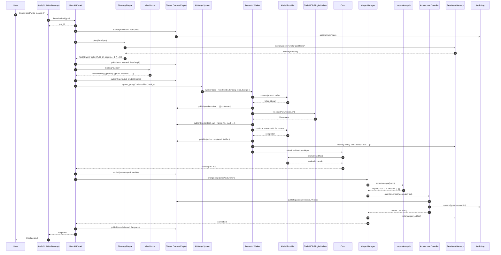
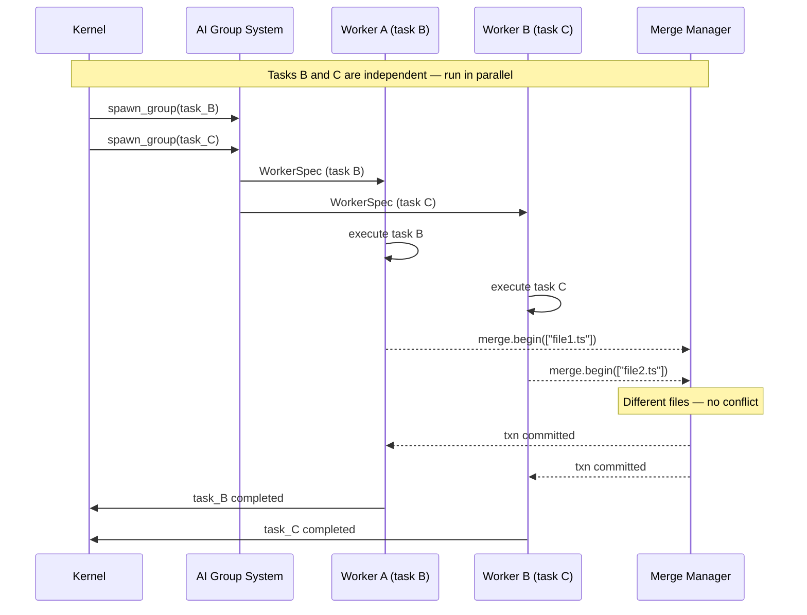
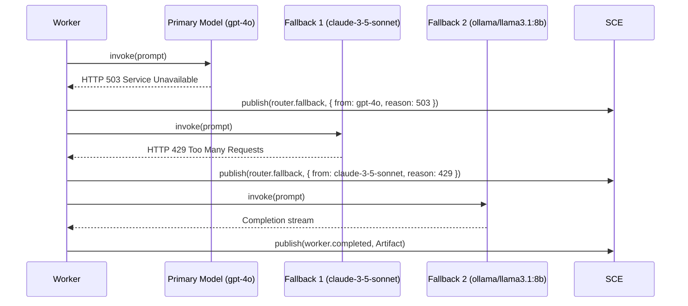

# Data Flow — End-to-End Request Lifecycle

> Sequence diagram tracing a user goal from submission through delivery, showing every major subsystem interaction.

## Full Request Lifecycle

## Parallel Task Execution

## Model Fallback Flow

## Related Documents

- [Main AI Kernel](../docs/MAIN_AI_KERNEL.md)
- [Dynamic Workers](../docs/DYNAMIC_WORKERS.md)
- [Nine Router](../docs/NINE_ROUTER.md)
- [Merge Manager](../docs/MERGE_MANAGER.md)
- [Architecture Guardian](../docs/ARCHITECTURE_GUARDIAN.md)
- [Shared Context Engine](../docs/SHARED_CONTEXT_ENGINE.md)
