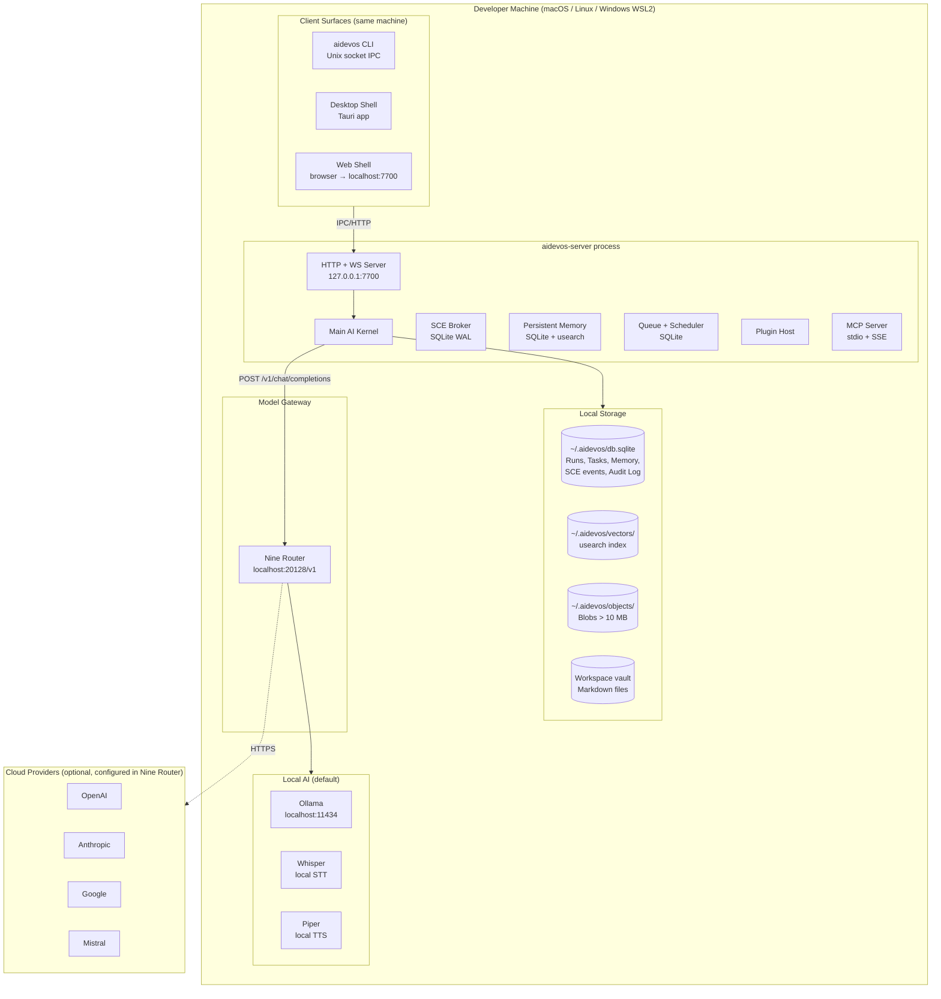
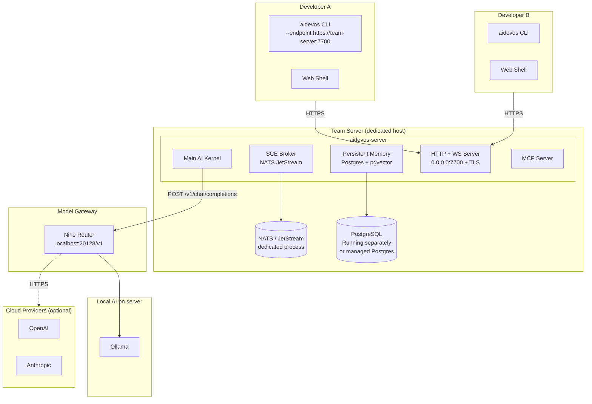
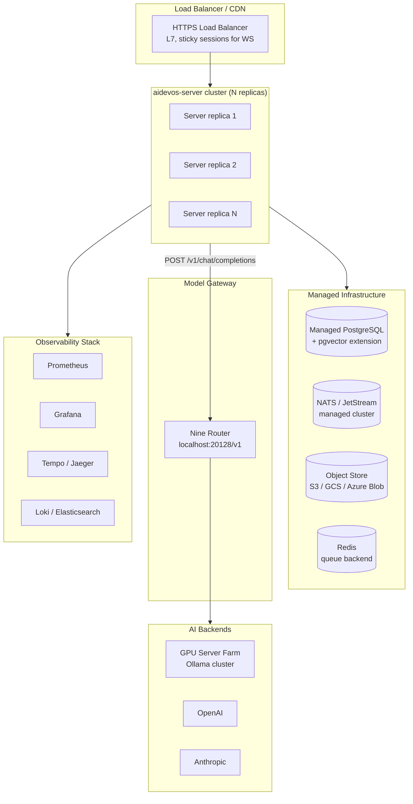

# Deployment Topology

> Supported deployment configurations from single-developer laptop to multi-node production cluster.

## Topology 1 — Single Developer Machine (Default)

The standard installation: one binary, one SQLite database, local models via Ollama, optional cloud provider keys. All model access flows through Nine Router.

**Characteristics:**
- Zero cloud dependencies in default config.
- All data stays on the local machine.
- Single SQLite file — trivial backup (`cp db.sqlite db.backup.sqlite`).
- Suitable for one developer or a small team sharing a machine.

---

## Topology 2 — Team Server (LAN / VPN)

One shared `aidevos-server` accessible to multiple developers on the same network. NATS replaces SQLite as the SCE backend for concurrent write performance. All model access flows through Nine Router.

**Characteristics:**
- Multiple concurrent users supported (RBAC via [AuthZ/RBAC](../docs/AUTHZ_RBAC.md)).
- NATS provides high-throughput SCE; Postgres provides concurrent-safe memory.
- TLS required when `listen != 127.0.0.1`.
- Local Ollama keeps most inference on-prem; cloud providers optional.

---

## Topology 3 — Cloud / Multi-Tenant Production

Horizontally scalable deployment with multiple `aidevos-server` replicas, a managed database, managed NATS, and an object store.

**Characteristics:**
- Stateless application servers; all state in managed services.
- NATS cluster for SCE; PostgreSQL + pgvector for memory.
- Redis for queue (vs. SQLite in single-node).
- Horizontal scaling: add replicas to handle more concurrent runs.
- See [Deployment](../docs/DEPLOYMENT.md) for full production configuration reference.

---

## Port Reference

| Service | Default port | Protocol | TLS |
|---------|-------------|----------|-----|
| HTTP API | 7700 | HTTP/1.1, HTTP/2 | optional (required for remote) |
| WebSocket | 7700 | WS over HTTP | same as HTTP |
| MCP stdio | — | stdio (local subprocess) | N/A |
| MCP SSE | 7701 | HTTP SSE | optional |
| Ollama | 11434 | HTTP | none (local) |
| llama.cpp | 8080 | HTTP | none (local) |
| NATS | 4222 | TCP | optional |
| PostgreSQL | 5432 | TCP | optional |
| Prometheus | 9090 | HTTP | optional |

## Related Documents

- [Backend](../docs/BACKEND.md)
- [Localhost Architecture](../docs/LOCALHOST_ARCHITECTURE.md)
- [Deployment](../docs/DEPLOYMENT.md)
- [Security Model](../docs/SECURITY_MODEL.md)
- [Auth System](../docs/AUTH_SYSTEM.md)
- [Reliability](../docs/RELIABILITY.md)
- [Scalability](../docs/SCALABILITY.md)
