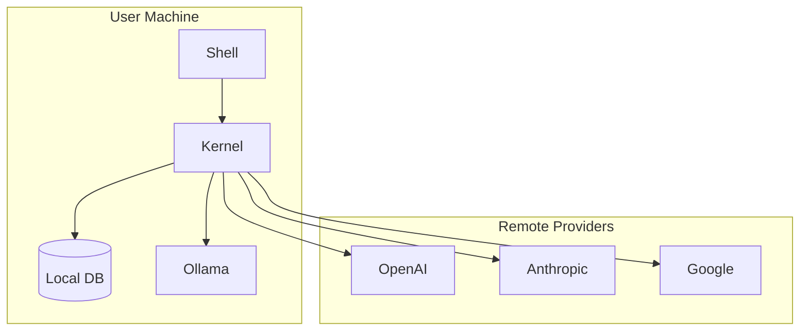

# Deployment Topology

```mermaid
flowchart TB
  subgraph LOCAL[User Machine]
    SHELL[Shell]
    KERNEL[Kernel]
    DB[(Local DB)]
    OLLAMA[Ollama]
  end
  subgraph REMOTE[Remote Providers]
    OAI[OpenAI]
    ANT[Anthropic]
    GOO[Google]
  end
  SHELL --> KERNEL --> DB
  KERNEL --> OLLAMA
  KERNEL --> OAI
  KERNEL --> ANT
  KERNEL --> GOO
```
