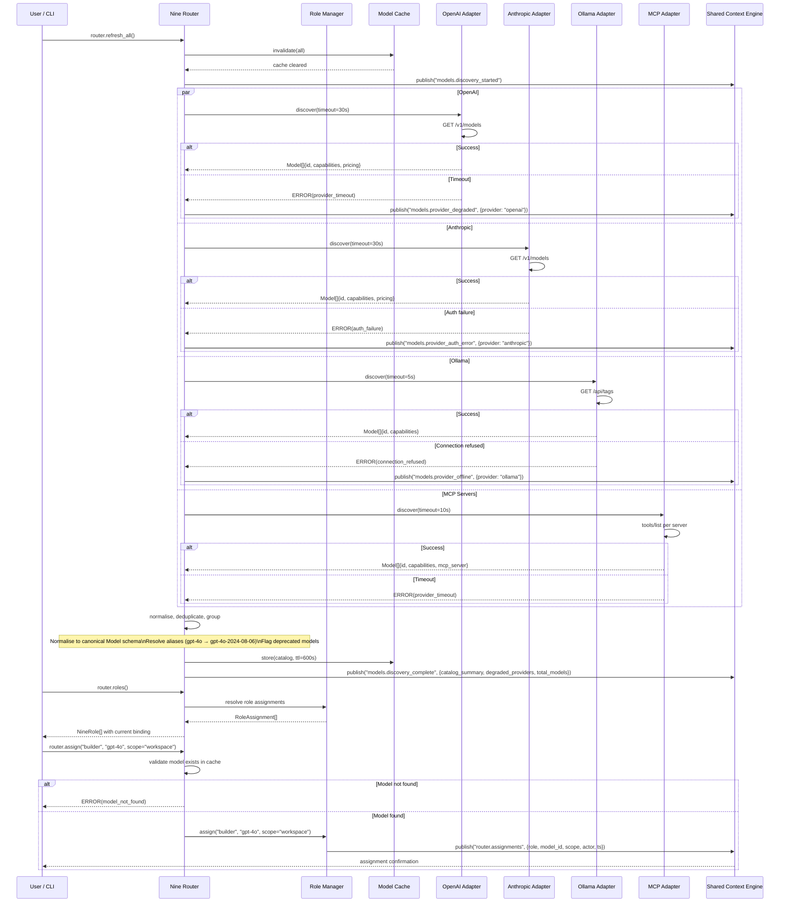

# Model Discovery Sequence

> Sequence diagram of the Nine Router performing model discovery across multiple providers, with failure modes, timing assumptions, and alternative flows.

## Full Discovery Sequence

## Swimlane Descriptions

| Lane | Role | Responsibilities |
|------|------|-----------------|
| User / CLI | Initiator | Triggers discovery, queries roles, assigns models |
| Nine Router | Orchestrator | Coordinates discovery, normalises results, manages cache |
| Role Manager | Persistence | Stores and resolves role-to-model assignments |
| Model Cache | Transient store | TTL-based cache of discovered models (10 min per provider) |
| Provider Adapter | Adapter | Translates provider-specific API to canonical Model schema |
| Shared Context Engine | Event bus | Publishes discovery lifecycle events to all subscribers |

## Event-by-Event Walkthrough

1. **router.refresh_all()** — User or cron triggers full model discovery. All provider caches are invalidated.
2. **models.discovery_started** — SCE event signals the start. Cost Management resets cost forecasts.
3. **Parallel discovery** — Each provider adapter runs concurrently with its own timeout. OpenAI/Anthropic use 30s, Ollama uses 5s (local), MCP uses 10s.
4. **Provider errors** — Individual provider failures are captured per-provider. A timeout on OpenAI does not block Anthropic. Degraded providers are flagged in the DiscoveryReport.
5. **Normalise + deduplicate** — Raw models are converted to canonical `Model{}` schema. Aliases are resolved (e.g. `gpt-4o-2024-08-06` → `gpt-4o`). Deprecated models are flagged but kept for backward compat.
6. **store(catalog)** — The full catalog is written to TTL cache. Each provider's models are cached independently so partial rediscovery is efficient.
7. **models.discovery_complete** — Final event includes `catalog_summary`, `degraded_providers[]`, and `total_models`. Subscribers (UI, Cost Management, Kernel) react.
8. **router.roles()** — Non-mutating query. Returns all nine roles with their currently assigned models.
9. **router.assign()** — Mutating operation. Validates the model exists in cache, writes RoleAssignment to DB, and emits `router.assignments` SCE event.

## Timing Assumptions

| Operation | Typical | P95 | Timeout |
|-----------|---------|-----|---------|
| OpenAI discovery (50+ models) | 2–4s | 8s | 30s |
| Anthropic discovery (10–20 models) | 1–3s | 6s | 30s |
| Ollama discovery (local, 5–20 models) | 200ms | 1s | 5s |
| MCP discovery (per server) | 500ms | 3s | 10s |
| Normalise + deduplicate (100 models) | 150ms | 500ms | — |
| Cache write (100 models) | 50ms | 200ms | — |
| Full end-to-end (all providers healthy) | 4–8s | 15s | 45s aggregate |

## Failure Scenarios

| Scenario | Detection | Effect | Recovery |
|----------|-----------|--------|----------|
| Provider timeout (OpenAI > 30s) | Adapter timeout | Provider excluded from catalog; degraded badge in UI | Automatic retry on next cron (10 min) |
| Auth failure (Anthropic 401) | HTTP 401 response | Provider excluded; auth error event emitted | User re-enters credentials; next trigger retries |
| Connection refused (Ollama not running) | TCP connection error | Provider excluded; offline badge | User starts Ollama; next trigger retries |
| Partial discovery (one provider fails) | Per-adapter error handling | Remaining providers still in catalog | Degraded flag cleared on next success |
| Cache write failure | SQLite busy / disk full | Discovery succeeds but cache miss for all queries | Next discovery retries; fallback to stale cache |
| Duplicate model across providers | Alias resolver detects same ID | Deduplicated in catalog; first provider wins | N/A — deterministic ordering by provider priority |

## Alternative Flows

- **Incremental discovery**: When only one provider needs refreshing, `router.refresh(provider)` skips cache invalidation for other providers and hits only the specified adapter.
- **Manual override**: `router.assign(role, model_id, force=true)` bypasses cache validation, allowing assignment of models not in the current catalog.
- **Scope inheritance**: When no workspace-level assignment exists, `resolve role assignments` falls back to project → group → default policy hierarchy.

## Implementation Notes

- Provider adapters implement the `ModelAdapter` interface with `discover(timeout)` and `health()` methods.
- The alias resolver uses a configurable map loaded from `config/aliases.yaml`.
- TTL cache uses a separate `Map<provider, {models, fetched_at}>` per provider so partial refreshes don't evict healthy providers.
- The `DiscoveryReport` emitted on `models.discovery_complete` is JSON-serialised and stored in the event log for audit.
- Rate limiting: providers are not rate-limited during discovery (it's read-only and infrequent), but the adapter logs warnings if > 10 discoveries per minute are triggered.

## Swimlane Interaction Timing

The parallel discovery block is the most latency-sensitive part. Each adapter runs independently with its own timeout context:

- **OpenAI** (50 models, paginated): The `/v1/models` endpoint returns all models in a single response. No pagination is needed. Response size is ~30 KB.
- **Anthropic** (10–20 models): Single-response endpoint. Response size is ~10 KB.
- **Ollama** (local, 5–20 models): `/api/tags` returns model tags with size info. Response size is ~5 KB. Connection failure is common if Ollama is not running.
- **MCP servers** (variable): Calls `tools/list` on each registered MCP server. Some servers may be slow or unavailable; each has its own timeout.

The overall discovery completes when the slowest adapter finishes or times out. A slow OpenAI adapter (8s P95) does not block Ollama (200ms typical).

## Performance Notes

- Discovery is the most network-intensive operation in the Nine Router. On a typical connection, OpenAI returns ~50 models in 2–4s; Ollama returns ~20 models in < 200ms.
- The normalise/dedup step is CPU-bound for large catalogs. Aliasing and sorting run in O(n log n) where n = total models across all providers.
- Cache invalidation is O(1) per provider — the cache is keyed by provider, not by individual model.
- The `models.discovery_complete` event payload size is typically 10–50 KB compressed. Subscribers should process it asynchronously.

## Configuration Reference

| Setting | Default | Description |
|---------|---------|-------------|
| `discovery.openai.timeout` | 30s | Timeout for OpenAI /v1/models |
| `discovery.anthropic.timeout` | 30s | Timeout for Anthropic /v1/models |
| `discovery.ollama.timeout` | 5s | Timeout for local Ollama /api/tags |
| `discovery.mcp.timeout` | 10s | Timeout per MCP server |
| `discovery.cache.ttl` | 600s | Per-provider cache TTL |
| `discovery.cron.interval` | 10m | Automatic discovery interval |
| `discovery.max_concurrent` | 4 | Max parallel adapter calls |

## Related Documents

- [Nine Router](../docs/NINE_ROUTER.md) — model discovery and role assignment
- [Model Discovery](../docs/MODEL_DISCOVERY.md) — adapter specifications
- [Model Providers](../docs/MODEL_PROVIDERS.md) — provider integration details
- [Model Routing Policy](../docs/MODEL_ROUTING_POLICY.md) — scoring and fallback rules
- [Shared Context Engine](../docs/SHARED_CONTEXT_ENGINE.md) — event bus for discovery events
- [Plugin SDK](../docs/PLUGIN_SDK.md) — custom provider adapter extension point
- [Cost Management](../docs/COST_MANAGEMENT.md) — cost forecast updates from discovery events
