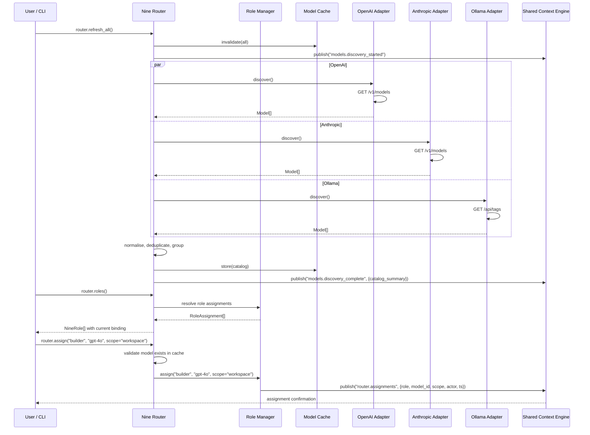

# Model Discovery Sequence

> Sequence diagram of the Nine Router performing model discovery across multiple providers.

## Related Documents

- [Nine Router](../docs/NINE_ROUTER.md) — model discovery and role assignment
- [Model Discovery](../docs/MODEL_DISCOVERY.md) — adapter specifications
- [Model Providers](../docs/MODEL_PROVIDERS.md) — provider integration details
