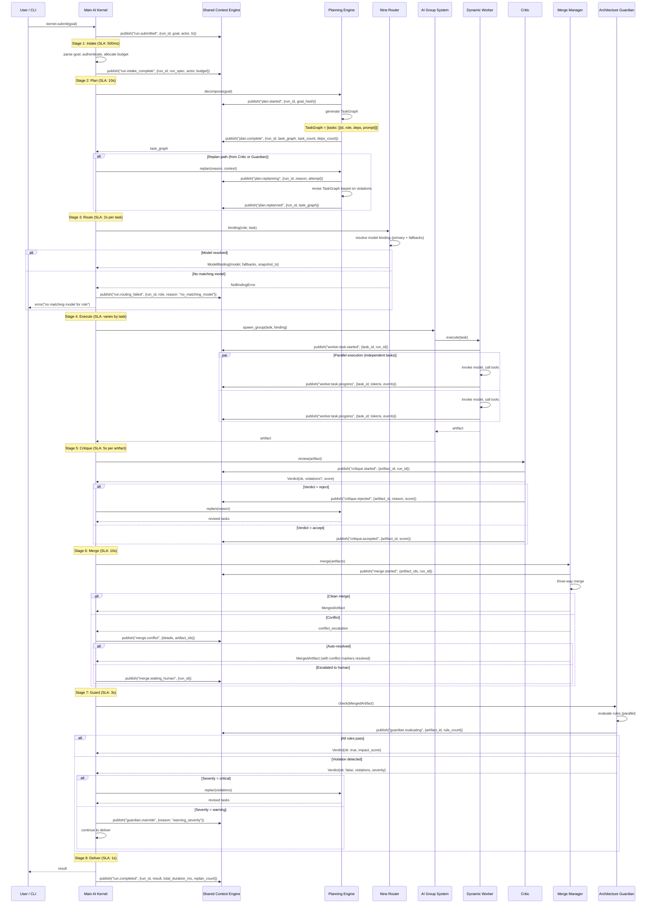

# Kernel Run Sequence

> Full sequence diagram of a Kernel run from goal submission to result delivery, with stage-by-stage event catalog, timing SLAs, error handling, and replay semantics.

## Full Kernel Run Sequence



## Stage-by-Stage Event Catalog

| Stage | SCE Topic (run.&lt;run_id&gt;) | Key Payload | Frequency |
|-------|-------------------------------|-------------|-----------|
| Intake | `run.submitted` | `{goal, actor, budget}` | 1 per run |
| Intake | `run.intake_complete` | `{run_spec}` | 1 per run |
| Plan | `plan.started` | `{goal_hash}` | 1 per plan attempt |
| Plan | `plan.complete` | `{task_graph, task_count}` | 1 per plan |
| Plan | `plan.replanning` | `{reason, attempt}` | 0–5 per run |
| Plan | `plan.replanned` | `{task_graph}` | 0–5 per run |
| Route | `run.routing` | `{role, model_binding}` | 1 per task |
| Route | `run.routing_failed` | `{role, reason}` | 0–N per run |
| Execute | `worker.task.started` | `{task_id}` | 1 per task |
| Execute | `worker.task.progress` | `{tokens, events}` | Many per task |
| Execute | `worker.task.completed` | `{artifact_id}` | 1 per task |
| Critique | `critique.started` | `{artifact_id}` | 1 per artifact |
| Critique | `critique.accepted` | `{score}` | 0–1 per artifact |
| Critique | `critique.rejected` | `{reason}` | 0–N per run |
| Merge | `merge.started` | `{artifact_ids}` | 1 per merge |
| Merge | `merge.completed` | `{clean, artifact_id}` | 1 (or conflict) |
| Merge | `merge.conflict` | `{details}` | 0–1 per run |
| Guard | `guardian.evaluating` | `{rule_count}` | 1 per guard |
| Guard | `guardian.verdict` | `{ok, severity}` | 1 per guard |
| Deliver | `run.completed` | `{result, total_duration_ms}` | 1 per run |

## Timing SLAs per Stage

| Stage | SLA Target | P99 Bound | Exceeds → |
|-------|-----------|-----------|-----------|
| Intake | 500ms | 2s | Budget warning |
| Plan | 10s | 30s | Timeout → fallback to simple plan |
| Route | 2s per task | 5s | Async fallback resolution |
| Execute | varies by task | 300s default | Timeout → yield + checkpoint |
| Critique | 5s per artifact | 15s | Skip critic (accept with warning) |
| Merge | 10s | 30s | Force rollback |
| Guard | 3s | 10s | Accept with warning |
| Deliver | 1s | 5s | Degraded delivery |

## Error Handling per Stage

| Stage | Error | Handling |
|-------|-------|----------|
| Intake | Auth failure | Return 401, no run created |
| Intake | Budget allocation failure | Return error, insufficient resources |
| Plan | TaskGraph generation failure | Retry once with simplified decomposition |
| Route | No matching model | Return error to user, suggest next available model |
| Execute | Worker timeout | Checkpoint worker, retry with fresh worker |
| Execute | All fallbacks exhausted | Mark task as failed, escalate to replan |
| Critique | Critic unavailable | Accept artifact with warning, log to audit |
| Merge | Merge conflict not resolvable | Escalate to human, 300s timeout |
| Guard | Rule evaluation error | Rule fails open (logged, not veto) |

## Parallel Execution Paths

Tasks in the TaskGraph that have no dependency relationship are executed in parallel. The Kernel uses the following logic:

```
function schedule_tasks(task_graph):
    wave = topologically_sort(task_graph)
    for each independent batch in wave:
        for each task in batch:
            spawn_worker(task)  // all in parallel
        wait for all workers in batch to complete
    return artifacts
```

Dependency depth is unbounded, but each wave runs in parallel up to `max_concurrent_workers` (default 10).

## Replay Semantics

A run can be replayed in three ways:

- **Full replay**: `kernel.replay(run_id)` — re-executes from Intake with the same goal. New run_id assigned.
- **Checkpoint replay**: `worker.resume(checkpoint_id)` — a new worker loads checkpoint state and continues.
- **Stage replay**: `kernel.replay_stage(run_id, stage)` — re-executes a specific stage (Plan, Execute, Merge, Guard) with the same inputs.

Replay always generates new events on SCE with the original `correlation_id` and a `replay_of` field linking to the original event.

## Failure Scenarios

| Scenario | Stage | Effect | Recovery |
|----------|-------|--------|----------|
| Goal parse failure | Intake | Run rejected immediately | User revises goal |
| Plan timeout | Plan | Fallback to simple decomposition | Logged; plan quality may be lower |
| Model provider all degraded | Route | Run cannot start | User notified of degraded providers |
| Worker crash | Execute | Last checkpoint used for recovery | New worker spawned with checkpoint |
| Critic rejects all artifacts | Critique | Replan loop (max 5 iterations) | Escalated to human after MAX_REPLANS |
| Merge conflict not resolvable | Merge | Human escalation with 300s timeout | Merged manually or task split |
| Guardian veto (critical) | Guard | Immediate replan | Limited to MAX_REPLANS replans |
| Guardian veto (warning) | Guard | Override and continue | Logged to audit |

## Implementation Notes

- The Kernel maintains a `RunState` object in memory per active run, persisted to Persistent Memory for crash recovery.
- Each stage has a context with timeout — when exceeded, the stage handler is cancelled and a fallback path is taken.
- SCE topics are namespaced per run (`run.<run_id>`) so subscribers can filter by specific run.
- The replay mechanism uses the original `run_id` as a `correlation_id` to link replayed events to the original run.
- MAX_REPLANS is 5, configurable per run via `RunSpec.max_replans`.

## Related Documents

- [Main AI Kernel](../docs/MAIN_AI_KERNEL.md) — stage contracts and kernel loop
- [Shared Context Engine](../docs/SHARED_CONTEXT_ENGINE.md) — SCE event topics
- [Planning Engine](../docs/PLANNING_ENGINE.md)
- [Nine Router](../docs/NINE_ROUTER.md)
- [Dynamic Workers](../docs/DYNAMIC_WORKERS.md)
- [Merge Manager](../docs/MERGE_MANAGER.md)
- [Architecture Guardian](../docs/ARCHITECTURE_GUARDIAN.md)
