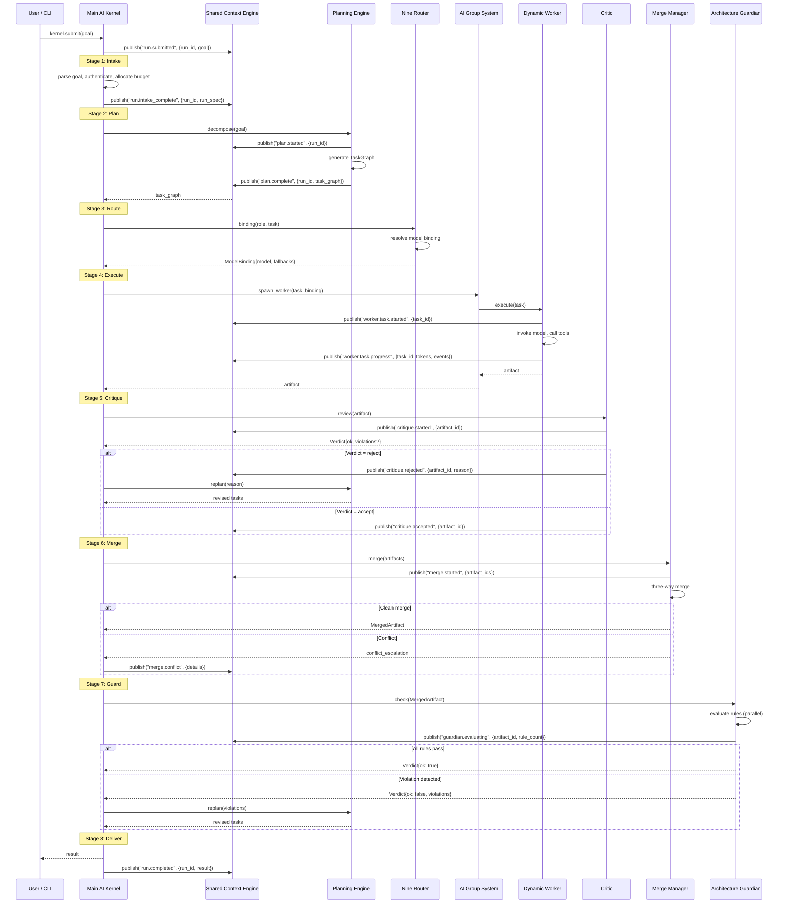

# Kernel Run Sequence

> Full sequence diagram of a Kernel run from goal submission to result delivery.

## Related Documents

- [Main AI Kernel](../docs/MAIN_AI_KERNEL.md) — stage contracts and kernel loop
- [Shared Context Engine](../docs/SHARED_CONTEXT_ENGINE.md) — SCE event topics
- [Planning Engine](../docs/PLANNING_ENGINE.md)
- [Nine Router](../docs/NINE_ROUTER.md)
- [Dynamic Workers](../docs/DYNAMIC_WORKERS.md)
- [Merge Manager](../docs/MERGE_MANAGER.md)
- [Architecture Guardian](../docs/ARCHITECTURE_GUARDIAN.md)
