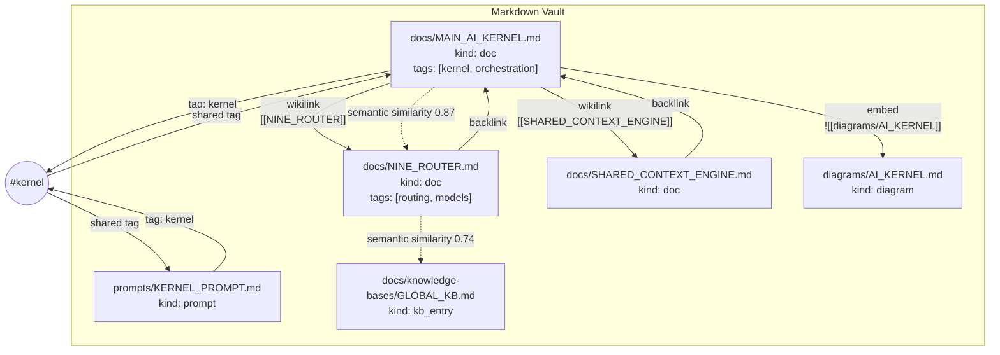
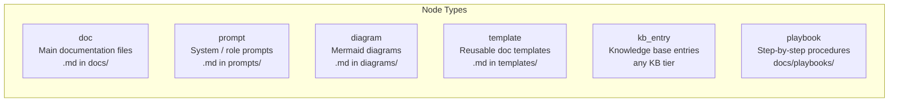
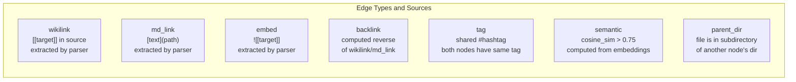
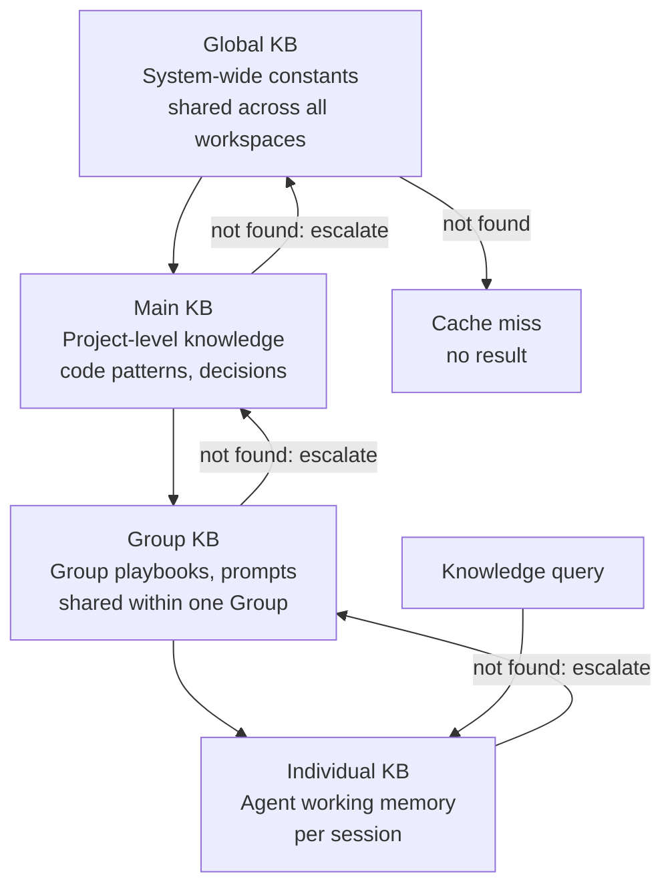
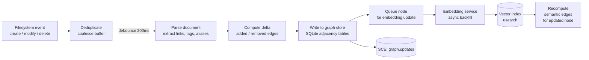

# Knowledge Graph — Structure, Node Types, Edge Types, and Query Patterns

> How the Obsidian Graph Engine models the vault as a graph, and how the RAG Pipeline traverses it.

## Graph Structure



## Node Types



## Edge Types



## Four-Tier KB Hierarchy



## RAG Pipeline — Graph-Augmented Retrieval

```mermaid
flowchart LR
  QUERY_TEXT[User query text] --> EMBED[Embed query\nnomic-embed-text]
  EMBED --> VEC_SEARCH[ANN search\nVector Store]
  VEC_SEARCH -->|top-K seed nodes| SEEDS[Seed node set]

  SEEDS --> GRAPH_EXP["graph.neighbors(seed, depth=1)\nExpand via wikilinks + backlinks"]
  GRAPH_EXP --> EXPANDED[Expanded node set]

  EXPANDED --> RANK["Rank nodes:\n0.6 * semantic_score\n+ 0.2 * backlink_count\n+ 0.2 * recency"]
  RANK --> TOP_N[Top-N nodes]
  TOP_N --> EXCERPT[Extract text excerpts\ncontext window slices]
  EXCERPT --> CONTEXT[Assembled RAG context\nfor model prompt]
```



## Graph Update Pipeline



## Cypher-Like Query Examples

```
# All documents reachable from MAIN_AI_KERNEL.md within 2 wikilink hops
MATCH (n:doc)-[:wikilink*1..2]->(m) WHERE n.id = "docs/MAIN_AI_KERNEL.md" RETURN m

# Documents sharing any tag with NINE_ROUTER.md
MATCH (n)-[:tag]->(t)<-[:tag]-(m) WHERE n.id = "docs/NINE_ROUTER.md" AND n <> m RETURN m

# Top semantic neighbours of a document
MATCH (n)-[e:semantic]->(m) WHERE n.id = "docs/PERSISTENT_MEMORY.md" AND e.weight > 0.8
RETURN m, e.weight ORDER BY e.weight DESC LIMIT 10

# Shortest path between two documents
MATCH p = shortestPath((a)-[*]-(b))
WHERE a.id = "docs/CLI.md" AND b.id = "docs/NINE_ROUTER.md" RETURN p
```

## Related Documents

- [Obsidian Graph Engine](../docs/OBSIDIAN_GRAPH_ENGINE.md)
- [Knowledge System](../docs/KNOWLEDGE_SYSTEM.md)
- [RAG Pipeline](../docs/RAG_PIPELINE.md)
- [Vector Store](../docs/VECTOR_STORE.md)
- [Persistent Memory](../docs/PERSISTENT_MEMORY.md)
- [Research Engine](../docs/RESEARCH_ENGINE.md)
