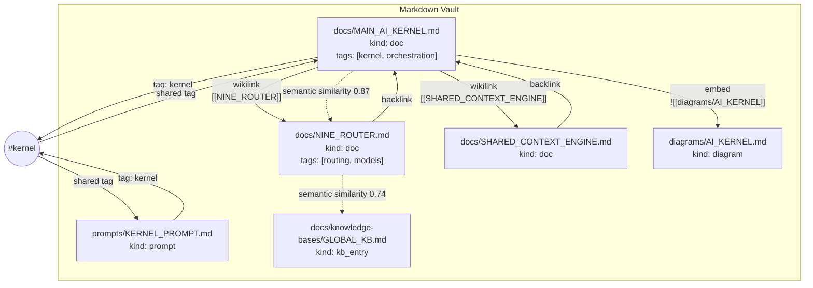
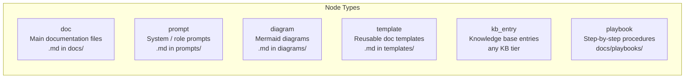
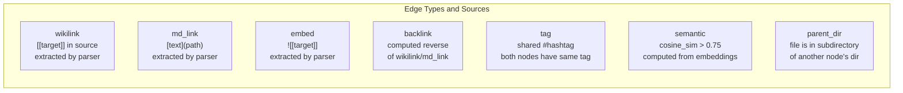
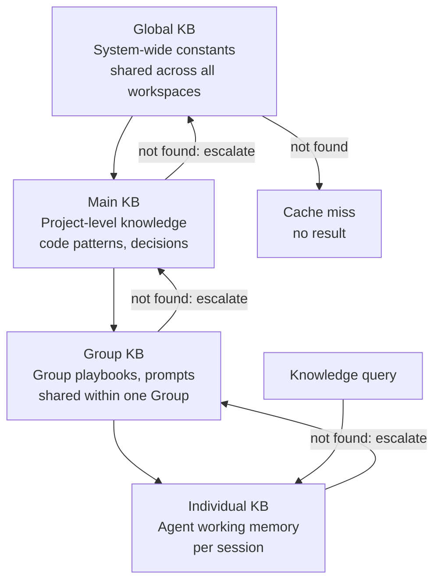
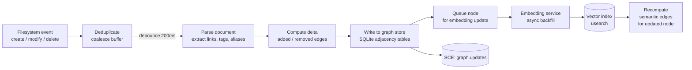

# Knowledge Graph — Structure, Node Types, Edge Types, and Query Patterns

> How the Obsidian Graph Engine models the vault as a graph, and how the RAG Pipeline traverses it. Includes traversal algorithms, node/edge schema, query patterns, indexing strategy, update propagation, and failure modes.

## Graph Structure



## Node Types



## Edge Types



## Node and Edge Schema

### Node Schema

```
Node {
    id: string          // relative path from vault root, e.g. "docs/MAIN_AI_KERNEL.md"
    kind: enum          // doc, prompt, diagram, template, kb_entry, playbook
    title: string       // extracted from frontmatter or first H1
    tags: string[]      // extracted from frontmatter #tags
    embedding: float[]  // 768-dim nomic-embed-text (nullable)
    checksum: string    // SHA-256 of file content
    updated_at: RFC3339
    metadata: map       // kind-specific fields
}
```

### Edge Schema

```
Edge {
    source_id: string   // source node id
    target_id: string   // target node id
    type: enum          // wikilink, md_link, embed, backlink, tag, semantic, parent_dir
    weight: float       // 1.0 for explicit links, 0.75–1.0 for semantic
    created_at: RFC3339
    metadata: map       // type-specific fields
}
```

## Graph Traversal Algorithms

### Neighbour Expansion (used by RAG Pipeline)

```
function expand_neighbors(seed_nodes, depth, max_nodes):
    expanded = seed_nodes.copy()
    frontier = seed_nodes

    for i in range(depth):
        next_frontier = []
        for node in frontier:
            neighbors = graph.get_neighbors(node.id, edge_types=["wikilink", "backlink", "semantic"])
            for n in neighbors:
                if n not in expanded:
                    expanded.add(n)
                    next_frontier.append(n)

        if len(expanded) >= max_nodes:
            break
        frontier = next_frontier

    return expanded[:max_nodes]
```

### Shortest Path (used by Query Engine)

```
function shortest_path(source_id, target_id):
    // Bidirectional BFS
    forward_queue = [(source_id, [source_id])]
    backward_queue = [(target_id, [target_id])]
    forward_visited = {source_id}
    backward_visited = {target_id}

    while forward_queue and backward_queue:
        // Forward step
        node, path = forward_queue.pop(0)
        for neighbor in graph.get_neighbors(node):
            if neighbor in backward_visited:
                backward_path = backward_visited[neighbor]
                return path + backward_path.reverse()
            if neighbor not in forward_visited:
                forward_visited.add(neighbor)
                forward_queue.append((neighbor, path + [neighbor]))

        // Backward step
        node, path = backward_queue.pop(0)
        for neighbor in graph.get_neighbors(node):
            if neighbor in forward_visited:
                forward_path = forward_visited[neighbor]
                return forward_path + path.reverse()
            if neighbor not in backward_visited:
                backward_visited.add(neighbor)
                backward_queue.append((neighbor, path + [neighbor]))

    return null  // no path exists
```

## Four-Tier KB Hierarchy



## Query Patterns

| Query Purpose | Algorithm | Typical Depth | Max Results |
|---------------|-----------|---------------|-------------|
| "What docs relate to this topic?" | Neighbour expansion + ranking | 2 hops | 20 |
| "How does X connect to Y?" | Bidirectional BFS shortest path | Unlimited | 1 path |
| "What shares a tag with this doc?" | Tag edge traversal | 1 hop | 50 |
| "Semantically similar docs" | ANN vector search + graph expansion | 1 hop | 10 |
| "All docs in subtree" | Parent_dir edge traversal | Unlimited | 1000 |

## Indexing Strategy

| Index | Engine | Key | Query |
|-------|--------|-----|-------|
| Node by ID | HashMap (in-memory) | `node.id` | O(1) lookup |
| Node by kind | Inverted index | `node.kind` | O(n) scan filtered by kind |
| Node by tag | Inverted index | `tag → Set<node.id>` | O(1) tag lookup |
| Edges by source | Adjacency list (in-memory) | `source_id → Edge[]` | O(1) neighbours |
| Edges by target | Reverse adjacency list | `target_id → Edge[]` | O(1) backlinks |
| Embedding vector | usearch (HNSW) | 768-dim float | ANN with < 10ms @ 10K nodes |
| Full-text | SQLite FTS5 | Content text | Full-text search with ranking |

## Update Propagation



Update propagation is eventual. The debounce window (200ms) coalesces rapid filesystem events (e.g., editor autosave). Embedding recomputation is async and can lag by up to 5 seconds. Semantic edge recomputation only runs for the updated node, not the full graph.

## Failure Modes

| Mode | Trigger | Effect | Recovery |
|------|---------|--------|----------|
| Stale edges | File deleted but graph not updated (missed FS event) | Graph contains dangling references | Periodic consistency scan (every 5 min) detects missing files and removes edges |
| Disconnected subgraph | New file with no links or tags | Node exists but no edges | Periodic orphan detection job links via parent_dir or suggests wikilinks |
| Cycle in graph | Circular wikilinks (A→B→C→A) | Traversal may infinite loop | Visited set in all traversal algorithms prevents cycles |
| Embedding service down | Async embedding queue backs up | Semantic edges not updated for new nodes | Queue persists to disk; retry with backoff up to 1 hour |
| Vector index corruption | usearch index file corruption | ANN search returns empty results | Rebuild index from embeddings stored in SQLite |
| Parse failure | Malformed markdown or frontmatter | Node created with partial data (content parsed, links/tags missing) | Logged; manual fix required |
| Concurrent write conflict | Two FS events for same file overlap | Last-writer-wins; one set of edges lost | Debounce + content-addressed checksum prevents lost updates |
| Tag inconsistency | Tag renamed but not all usages updated | Some nodes have old tag, some have new | No automatic migration; periodic graph sync resolves |

## Implementation Notes

- The graph is stored in two layers: an in-memory adjacency list for fast traversal, and a SQLite persistent store for crash recovery.
- The in-memory graph is rebuilt from SQLite on startup. For vaults > 10,000 nodes, this takes < 2s.
- Semantic edges are computed using cosine similarity on nomic-embed-text embeddings. Only edges with `similarity > 0.75` are stored.
- All traversal algorithms use a visited set to prevent infinite loops in cyclic graphs.
- The periodic consistency scan runs every 5 minutes and reconciles the graph with the filesystem. It removes stale nodes, adds missing nodes, and recomputes parent_dir edges.
- Edge weights for wikilinks, md_links, and embeds are always 1.0. Tag edges are 1.0. Semantic edges use the cosine similarity score (0.75–1.0).

## Cypher-Like Query Examples

```
# All documents reachable from MAIN_AI_KERNEL.md within 2 wikilink hops
MATCH (n:doc)-[:wikilink*1..2]->(m) WHERE n.id = "docs/MAIN_AI_KERNEL.md" RETURN m

# Documents sharing any tag with NINE_ROUTER.md
MATCH (n)-[:tag]->(t)<-[:tag]-(m) WHERE n.id = "docs/NINE_ROUTER.md" AND n <> m RETURN m

# Top semantic neighbours of a document
MATCH (n)-[e:semantic]->(m) WHERE n.id = "docs/PERSISTENT_MEMORY.md" AND e.weight > 0.8
RETURN m, e.weight ORDER BY e.weight DESC LIMIT 10

# Shortest path between two documents
MATCH p = shortestPath((a)-[*]-(b))
WHERE a.id = "docs/CLI.md" AND b.id = "docs/NINE_ROUTER.md" RETURN p

# All kb_entry nodes tagged with "kernel"
MATCH (n:kb_entry)-[:tag]-(t) WHERE t.id = "#kernel" RETURN n

# Count edges by type for a specific node
MATCH (n)-[e]->() WHERE n.id = "docs/MAIN_AI_KERNEL.md"
RETURN e.type, count(*) ORDER BY count(*) DESC
```

## Related Documents

- [Obsidian Graph Engine](../docs/OBSIDIAN_GRAPH_ENGINE.md)
- [Knowledge System](../docs/KNOWLEDGE_SYSTEM.md)
- [RAG Pipeline](../docs/RAG_PIPELINE.md)
- [Vector Store](../docs/VECTOR_STORE.md)
- [Persistent Memory](../docs/PERSISTENT_MEMORY.md)
- [Research Engine](../docs/RESEARCH_ENGINE.md)
