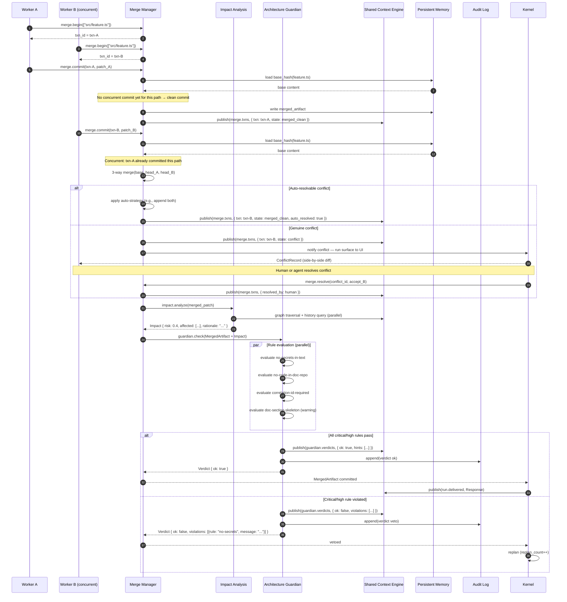
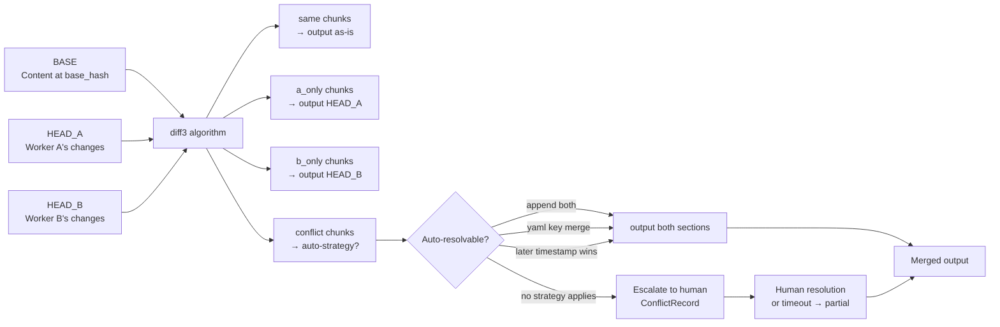
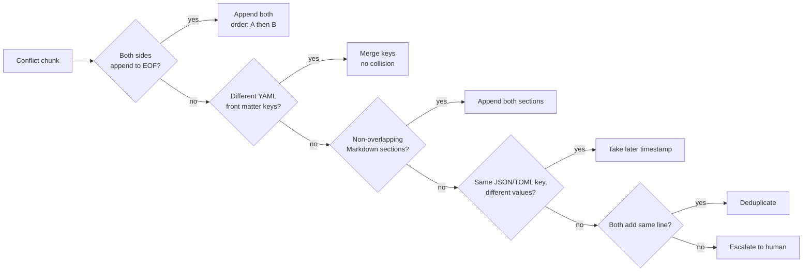

# Merge and Guardian Flow

> Detailed sequence of events from a worker submitting changes through three-way merge, impact analysis, Guardian rule evaluation, and final delivery or veto.

## Full Merge + Guardian Sequence



## Three-Way Merge Algorithm Detail



## Auto-Resolution Strategies



## Guardian Rule Evaluation

```mermaid
flowchart LR
  ARTIFACT[MergedArtifact] --> ENGINE[Rule Engine]

  subgraph PARALLEL["Parallel rule evaluation"]
    R1["no-secrets-in-text\ncritical — regex scan"]
    R2["no-code-in-doc-repo\ncritical — file extension check"]
    R3["correlation-id-required\nhigh — event payload check"]
    R4["doc-section-skeleton\nwarning — heading structure"]
    RN["custom rules\n~/.aidevos/rules/"]
  end

  ENGINE --> PARALLEL

  R1 & R2 & R3 -->|violations| VIOLATIONS[Collect violations[]]
  R4 -->|hints| HINTS[Collect hints[]]
  RN -->|violations or hints| VIOLATIONS

  VIOLATIONS --> VERDICT{Any critical\nor high violations?}
  VERDICT -->|yes| VETO["Verdict { ok: false }\nVeto — Kernel replans"]
  VERDICT -->|no| OK["Verdict { ok: true, hints[] }\nOK — deliver with warnings"]
```

## Related Documents

- [Merge Manager](../docs/MERGE_MANAGER.md)
- [Architecture Guardian](../docs/ARCHITECTURE_GUARDIAN.md)
- [Impact Analysis](../docs/IMPACT_ANALYSIS.md)
- [Main AI Kernel](../docs/MAIN_AI_KERNEL.md)
- [Shared Context Engine](../docs/SHARED_CONTEXT_ENGINE.md)
