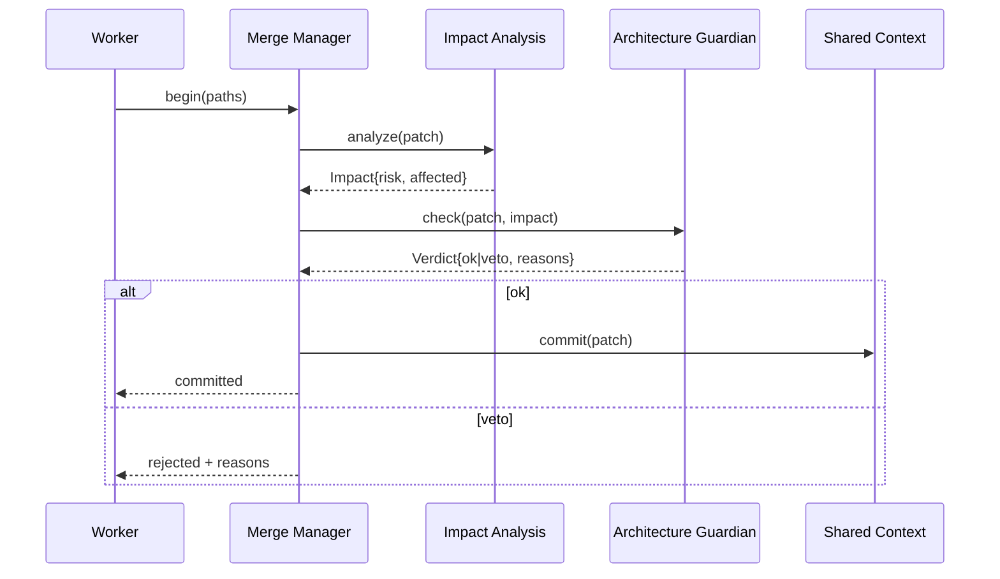

# Merge and Guardian Flow

```mermaid
sequenceDiagram
  participant W as Worker
  participant M as Merge Manager
  participant I as Impact Analysis
  participant G as Architecture Guardian
  participant C as Shared Context
  W->>M: begin(paths)
  M->>I: analyze(patch)
  I-->>M: Impact{risk, affected}
  M->>G: check(patch, impact)
  G-->>M: Verdict{ok|veto, reasons}
  alt ok
    M->>C: commit(patch)
    M-->>W: committed
  else veto
    M-->>W: rejected + reasons
  end
```
