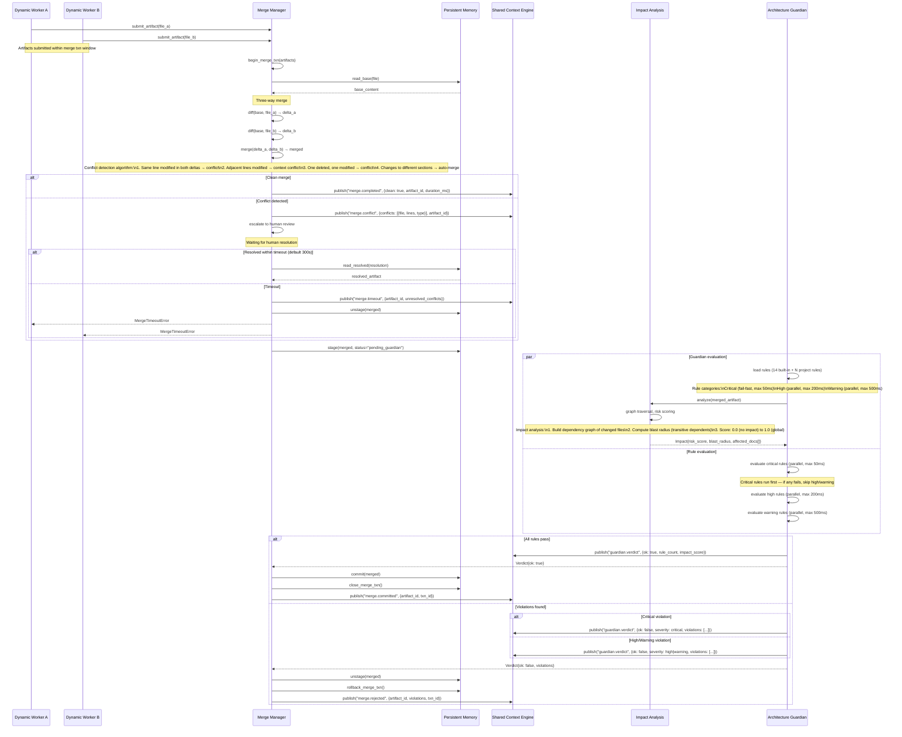
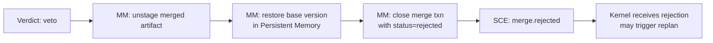

# Merge Guardian Sequence

> Sequence diagram of the Merge Manager and Architecture Guardian evaluation flow, including conflict detection, parallel rule evaluation, rollback, and timeout handling.

## Full Merge and Guardian Flow



## Conflict Detection Algorithm

The Merge Manager uses a three-way merge with structural awareness:

```
function merge(base, a, b):
    delta_a = diff(base, a)  // Myers diff algorithm
    delta_b = diff(base, b)

    for each hunk in delta_a and delta_b:
        if hunk_a.overlaps(hunk_b):
            if hunk_a.content == hunk_b.content:
                // Same change — accept once
                merged.append(hunk_a)
            else:
                // Conflicting changes — mark conflict
                conflicts.append({line, a_content, b_content, type: "overlap"})
        elif hunk_a.adjacent(hunk_b, threshold=3 lines):
            // Adjacent changes — context conflict
            conflicts.append({line, a_content, b_content, type: "adjacent"})
        else:
            // Non-overlapping — auto-merge
            merged.append(hunk_a) or merged.append(hunk_b)
    return merged, conflicts
```

## Rule Evaluation Parallelization

| Rule Tier | Count | Max Duration | Parallelism | Fail Behaviour |
|-----------|-------|-------------|-------------|----------------|
| Critical | 4 built-in | 50ms | `sync` (serial, fail-fast) | Immediate veto, skip rest |
| High | 6 built-in + N project | 200ms | `parallel` (all goroutines) | Collect all violations, no skip |
| Warning | 4 built-in | 500ms | `parallel` (all goroutines) | Informational, does not veto |

Critical rules are serial because they are cheap (file existence, structural integrity) and must short-circuit before expensive evaluations.

## Rollback Flow



## Acceptance and Rejection Criteria

| Condition | Action |
|-----------|--------|
| All rules pass, no conflicts | Merge committed, `merge.committed` emitted |
| All rules pass, conflicts auto-resolved | Merge committed, conflict resolution logged |
| Conflicts unresolved | Escalate to human, 300s timeout |
| Critical rule violation | Immediate veto, skip remaining rules |
| High rule violation (≤ N violations) | Veto, violations listed in `guardian.verdict` |
| Warning rule violation | Veto optional (configurable per workspace), logged |
| Merge txn timeout (> 60s total) | Force rollback, emit `merge.timeout` |

## Timeout Handling

| Timeout | Scope | Default | Action on expiry |
|---------|-------|---------|------------------|
| Merge txn total | Entire merge + guard pipeline | 60s | Force rollback, emit timeout event |
| Human conflict resolution | Waiting for user input | 300s | Revert to pre-merge state, notify workers |
| Critical rule evaluation | Per rule | 50ms | Rule fails open (logged, not veto) |
| High rule evaluation | Batch of high rules | 200ms per rule | Rule skipped, logged as warning |
| Impact analysis | Full graph traversal | 1s | Impact defaults to risk_score=0.5, logged |

## Failure Modes

| Mode | Trigger | Effect | Recovery |
|------|---------|--------|----------|
| Merge txn timeout | Processing > 60s | Force rollback, workers notified | Kernel retries with split artifacts |
| Persistent Memory write failure | Disk full / SQLite locked | Merge txn cannot commit | Retry up to 3 times with backoff |
| Impact Analysis timeout | Graph traversal > 1s | Default risk_score=0.5 used | Analysis retried async, result logged |
| Rule evaluation crash | Panic in rule plugin | Rule skipped, panic logged | Plugin sandbox restarted |
| Concurrent merge on same file | Two merges targeting same base | Optimistic lock conflict, second merge retried | Retry with fresh base after first commits |
| Human resolution timeout | User inactive > 300s | Merge reverted, workers notified | Re-trigger merge with same artifacts |

## Implementation Notes

- Merge Manager opens a `MergeTxn` record in Persistent Memory (status: `pending`) before starting the three-way merge.
- Impact Analysis walks the dependency graph using a BFS with max depth = 5 to bound traversal time.
- Rule evaluation uses a `errgroup` with context timeout for parallel rule batches.
- The rollback flow restores the base version atomically using Persistent Memory's snapshot mechanism.
- Merge transaction state is persisted so the system recovers mid-merge in case of Kernel restart.

## Configuration Reference

| Setting | Default | Description |
|---------|---------|-------------|
| `merge.txn.timeout` | 60s | Max duration for full merge + guard pipeline |
| `merge.conflict.timeout` | 300s | Max wait for human conflict resolution |
| `merge.impact_analysis.timeout` | 1s | Max duration for impact graph traversal |
| `merge.max_retries` | 3 | Max retries on optimistic lock conflict |
| `guardian.critical.timeout` | 50ms | Per-critical-rule evaluation timeout |
| `guardian.high.timeout` | 200ms | Per-high-rule evaluation timeout |
| `guardian.warning.timeout` | 500ms | Per-warning-rule evaluation timeout |
| `guardian.warning.veto` | false | Whether warning violations trigger veto |

## Performance Characteristics

| Operation | Typical | P99 | Notes |
|-----------|---------|-----|-------|
| Three-way merge (100 lines) | 5ms | 20ms | Myers diff + structural merge |
| Conflict detection | 2ms | 10ms | O(m + n) overlap check |
| Critical rule evaluation (4 rules) | 10ms | 40ms | Serial, fail-fast |
| High rule evaluation (6 rules) | 50ms | 200ms | Parallel goroutines |
| Impact analysis (100 nodes) | 100ms | 800ms | BFS with max depth 5 |
| Full pipeline (no conflicts) | 500ms | 3s | All stages combined |

## Related Documents

- [Merge Manager](../docs/MERGE_MANAGER.md) — three-way merge algorithm
- [Architecture Guardian](../docs/ARCHITECTURE_GUARDIAN.md) — rule evaluation and veto
- [Impact Analysis](../docs/IMPACT_ANALYSIS.md) — risk assessment
- [diagrams/MERGE_GUARDIAN](./MERGE_GUARDIAN.md) — flowchart diagram
- [Persistent Memory](../docs/PERSISTENT_MEMORY.md) — merge transaction storage
