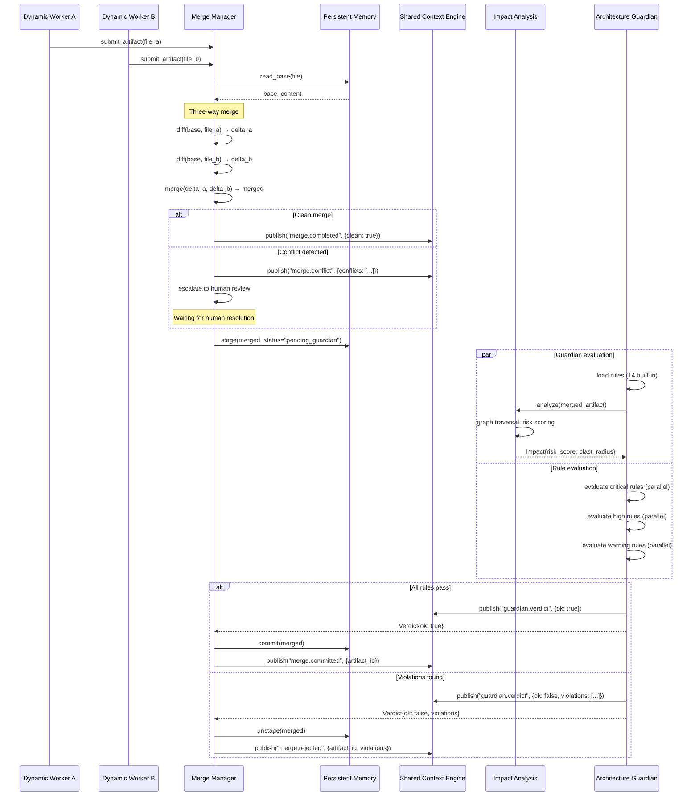

# Merge Guardian Sequence

> Sequence diagram of the Merge Manager and Architecture Guardian evaluation flow.

## Related Documents

- [Merge Manager](../docs/MERGE_MANAGER.md) — three-way merge algorithm
- [Architecture Guardian](../docs/ARCHITECTURE_GUARDIAN.md) — rule evaluation and veto
- [Impact Analysis](../docs/IMPACT_ANALYSIS.md) — risk assessment
- [diagrams/MERGE_GUARDIAN](./MERGE_GUARDIAN.md) — flowchart diagram
