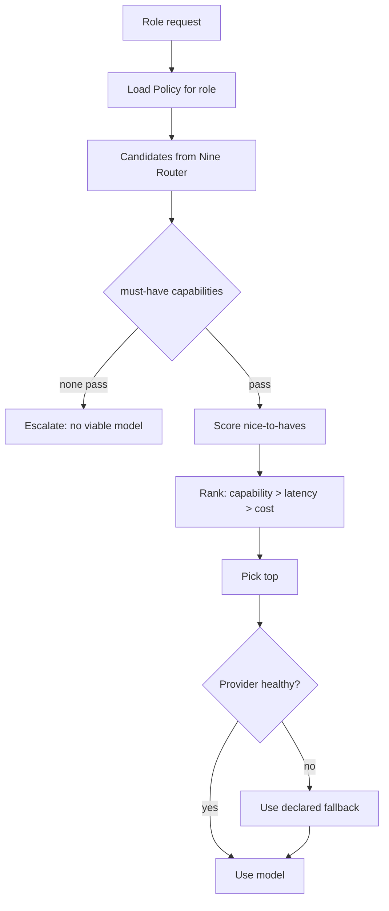

# Model Routing Policy Flow

```mermaid
flowchart TB
  ROLE[Role request] --> POLICY[Load Policy for role]
  POLICY --> CAND[Candidates from Nine Router]
  CAND --> MUST{must-have capabilities}
  MUST -->|none pass| ESC[Escalate: no viable model]
  MUST -->|pass| NICE[Score nice-to-haves]
  NICE --> RANK[Rank: capability > latency > cost]
  RANK --> PICK[Pick top]
  PICK --> HEALTH{Provider healthy?}
  HEALTH -->|no| FB[Use declared fallback]
  HEALTH -->|yes| USE[Use model]
  FB --> USE
```
