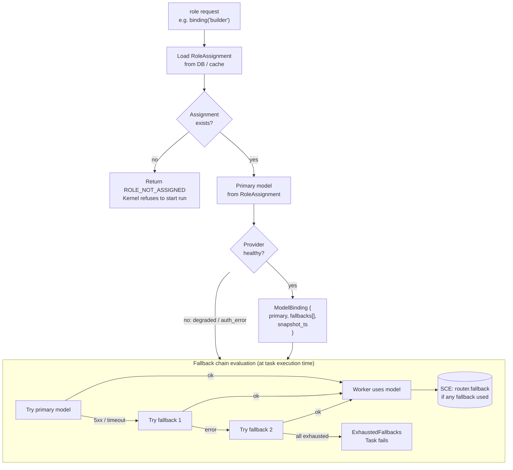
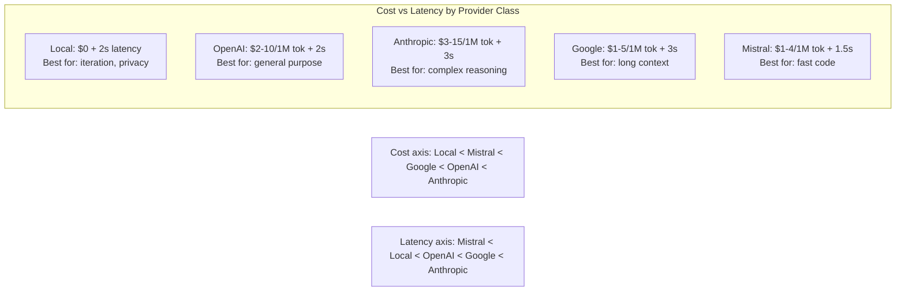
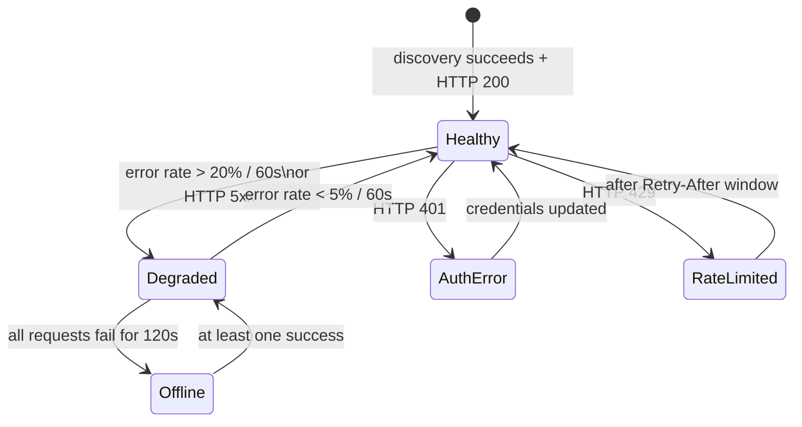

# Model Routing Policy Flow

> How the Nine Router resolves a model for a given role — capability filtering, scoring, health checking, fallback, and failure modes.

## Full Routing Policy Flow



## Routing Decision Algorithm

```
function resolve_binding(role, task):
    assignment = load_role_assignment(role)
    if not assignment:
        return ROLE_NOT_ASSIGNED

    candidates = get_candidates_for_role(role, assignment.provider_scope)
    must_pass = get_must_have_requirements(task)

    // Step 1: must-have capability filter
    surviving = []
    for model in candidates:
        if model.capabilities.satisfies(must_pass):
            surviving.append(model)

    if surviving.empty():
        return NO_MATCHING_MODEL

    // Step 2: score survivors
    scored = []
    for model in surviving:
        score = calculate_score(model, task)
        scored.append({model, score})

    // Step 3: rank and select
    ranked = sort_descending(scored, by=score)
    primary = ranked[0].model
    fallbacks = [m.model for m in ranked[1:min(4, len(ranked))]]

    return ModelBinding{primary, fallbacks}
```

## Scoring Function Formulas

The total score is a weighted sum of four sub-scores, each normalised to [0, 1]:

```
total_score = w_cap * capability_score
            + w_ctx * context_score
            + w_lat * latency_score
            + w_cost * cost_score
```

### Weights (configurable per workspace)

| Weight | Default | Description |
|--------|---------|-------------|
| `w_cap` | 0.40 | Capability score weight |
| `w_ctx` | 0.25 | Context window score weight |
| `w_lat` | 0.20 | Latency score weight |
| `w_cost` | 0.15 | Cost score weight |

### Sub-Score Formulas

- **Capability score**: `+5 per extra capability beyond must-haves`, normalised by max possible extra capabilities.

```
capability_score = min(1.0, (extra_capabilities * 5) / 30)
```

- **Context score**: Linear normalisation against the maximum context window among candidates.

```
context_score = model.context_window / max_context_window_among_candidates
```

- **Latency score**: Based on provider class latency percentile. Lower is better.

```
latency_score = 1.0 - (estimated_latency_ms / max_latency_among_candidates)
```

Estimated latency per provider class:
- Local (Ollama, llama.cpp): 500–2000ms
- OpenAI: 1000–5000ms
- Anthropic: 1500–8000ms
- Google: 2000–6000ms
- Mistral: 1000–4000ms

- **Cost score**: Inverse of combined input + output price per million tokens.

```
cost_score = min(1.0, 1.0 / (input_price_per_M + output_price_per_M * 3 + 0.01))
```

## Constraint Satisfaction Approach

The routing policy uses a hard + soft constraint model:

- **Hard constraints** (must-haves): Capability flags required by the task. A model that fails any hard constraint is dropped immediately.
- **Soft constraints** (should-haves): Preferences that influence scoring but do not eliminate candidates. Examples: preferred provider, minimum context size.

The constraint solver runs in O(n*m) where n = number of candidates and m = number of hard constraints. Soft constraints only affect scoring, not filtering.

## Model Capability Matrix

| Capability Flag | Models supporting it | Used by tasks requiring |
|----------------|---------------------|------------------------|
| `tools` (function calling) | gpt-4o, claude-3-5-sonnet, gemini-2.5-pro, mistral-large, local/llama3.1:latest | Tool-using workers (Builder, Researcher) |
| `vision` (image input) | gpt-4o, claude-3-5-sonnet, gemini-2.5-pro | Image analysis, UI screenshot review |
| `audio` (audio input) | gpt-4o-audio, gemini-2.5-pro | Voice role (STT/TTS) |
| `json_mode` (structured output) | gpt-4o, claude-3-5-haiku, gemini-2.5-flash | Schema-constrained generation |
| `streaming` | Most cloud models, some local | Real-time token display |
| `embeddings` | text-embedding-3-*, nomic-embed-text | RAG, vector search |

## Cost-Latency Trade-off Visualisation



The scoring weights can be tuned per workspace to favour cost efficiency (increase `w_cost`) or low latency (increase `w_lat`).

## Failure Modes

| Mode | Trigger | Result | Recovery |
|------|---------|--------|----------|
| No matching model | Must-have filter eliminates all candidates | `NO_MATCHING_MODEL` error emitted | Kernel falls back to default model for role, or refuses run |
| Scoring tie | Two models have identical total_score (< 0.01 difference) | Deterministic tiebreaker: lower cost wins | If equal cost, higher context wins; if still equal, first in discovery order |
| All providers degraded | Health check fails for every model in chain | `ExhaustedFallbacks` error | Kernel marks task as failed; user notified |
| Assignment missing | No RoleAssignment record for role | `ROLE_NOT_ASSIGNED` | User must assign a model via UI or CLI |
| Cache stale | Discovery hasn't run recently (TTL > 10 min) | Cache hit returns potentially outdated catalog | Stale flag is set on ModelBinding; binding resolved but warning emitted |
| Scoring inconsistency | task requires vision but no model with vision passes must-haves | Model is dropped, fallback chain may not help | Logged as configuration error; operator reviews role assignment |

## Implementation Notes

- The `RoleAssignment` record is cached in-memory with a 60s TTL; DB reads are batched by the Role Manager.
- Capability filtering is implemented as a bitmask comparison for O(1) per-model matching.
- The scoring function is an interface (`Scorer`) with pluggable implementations. Custom scorers can be registered via the Plugin SDK.
- Fallback chain evaluation happens at task-start time, not at routing time, because provider health can change between route and execution.
- Provider health state is tracked in-memory with a sliding window of the last 60s of requests.
- The `ModelBinding` snapshot_ts field allows downstream consumers to detect stale bindings.

## Performance Characteristics

| Operation | Typical | P99 | Notes |
|-----------|---------|-----|-------|
| Role assignment lookup | 2ms | 10ms | In-memory cache hit (60s TTL) |
| Must-have capability filter | 1ms | 5ms | Bitset comparison O(1) per model |
| Scoring (10 candidates) | 2ms | 10ms | 4 sub-scores, weighted sum |
| Ranking + pick top-N | 0.5ms | 2ms | Sort by score desc |
| Full binding resolution | 10ms | 50ms | End-to-end for healthy path |
| Fallback chain (1 fallback) | +2s | +10s | Due to model invoke timeout |

## Configuration Reference

| Setting | Default | Description |
|---------|---------|-------------|
| `routing.score.capability_weight` | 0.40 | Capability score weight |
| `routing.score.context_weight` | 0.25 | Context window weight |
| `routing.score.latency_weight` | 0.20 | Latency score weight |
| `routing.score.cost_weight` | 0.15 | Cost score weight |
| `routing.fallback.max` | 3 | Max fallback models in binding |
| `routing.cache.assignment_ttl` | 60s | In-memory assignment cache TTL |
| `routing.health.sliding_window` | 60s | Provider health check window |

## Provider Health State Machine Detail



Health states are tracked per-provider in memory. Each state transition emits an SCE event for observability.

## Related Documents

- [Model Routing Policy](../docs/MODEL_ROUTING_POLICY.md)
- [Nine Router](../docs/NINE_ROUTER.md)
- [Model Discovery](../docs/MODEL_DISCOVERY.md)
- [Model Providers](../docs/MODEL_PROVIDERS.md)
- [Dynamic Workers](../docs/DYNAMIC_WORKERS.md)
- [Main AI Kernel](../docs/MAIN_AI_KERNEL.md)
