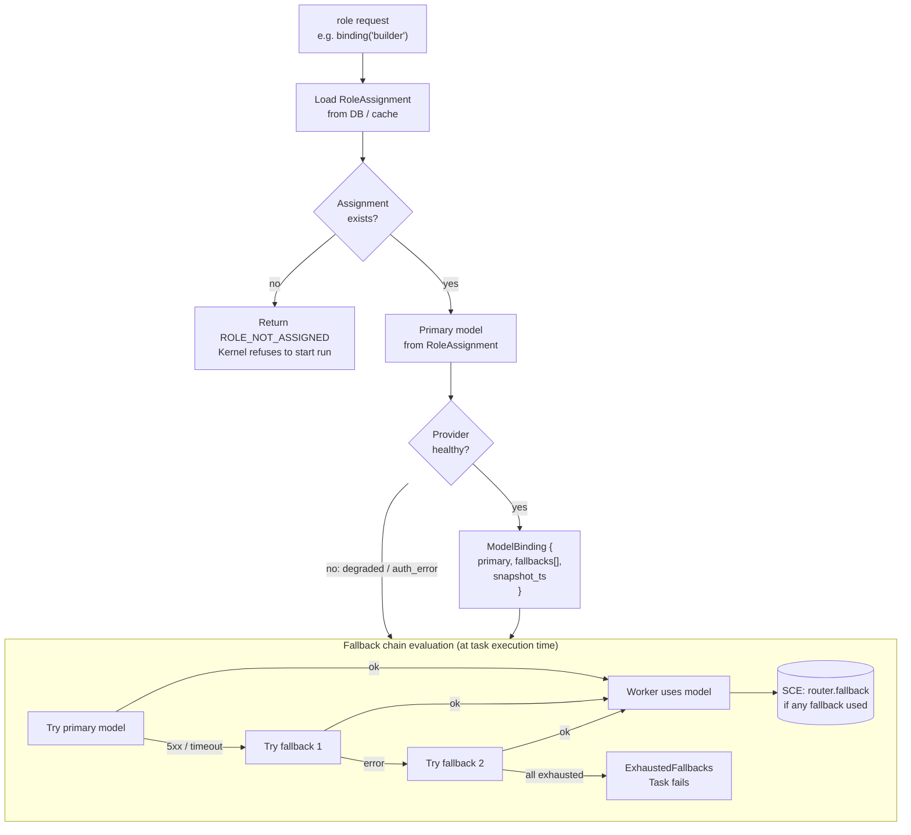
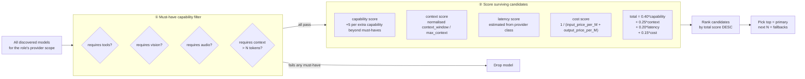
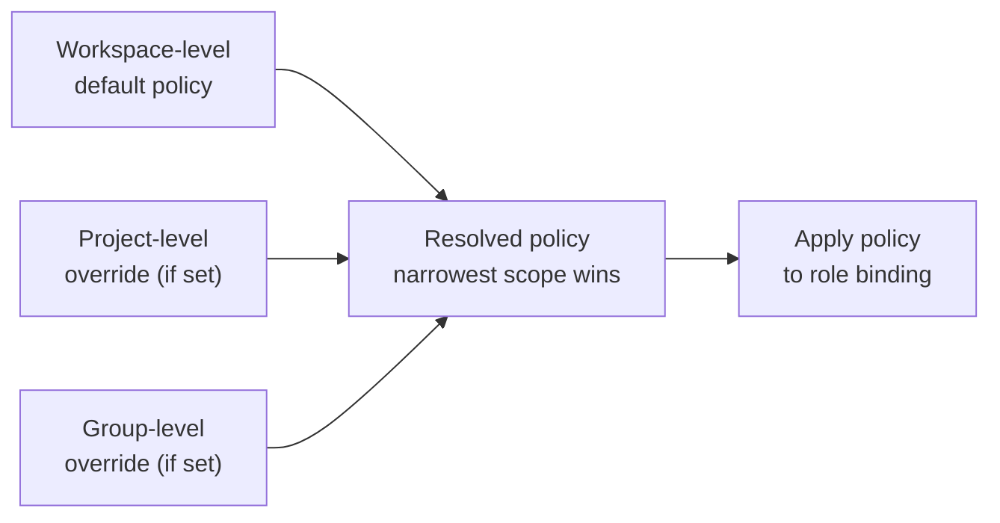
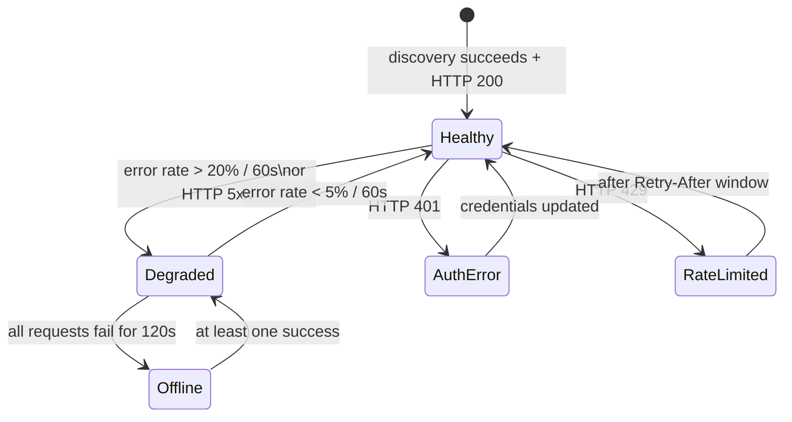
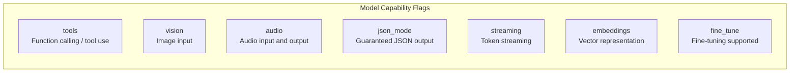

# Model Routing Policy Flow

> How the Nine Router resolves a model for a given role — capability filtering, scoring, health checking, and fallback.

## Full Routing Policy Flow

## Routing Policy Rules

## Policy Override Hierarchy

## Provider Health States

## Capability Taxonomy

## Related Documents

- [Model Routing Policy](../docs/MODEL_ROUTING_POLICY.md)
- [Nine Router](../docs/NINE_ROUTER.md)
- [Model Discovery](../docs/MODEL_DISCOVERY.md)
- [Model Providers](../docs/MODEL_PROVIDERS.md)
- [Dynamic Workers](../docs/DYNAMIC_WORKERS.md)
- [Main AI Kernel](../docs/MAIN_AI_KERNEL.md)
