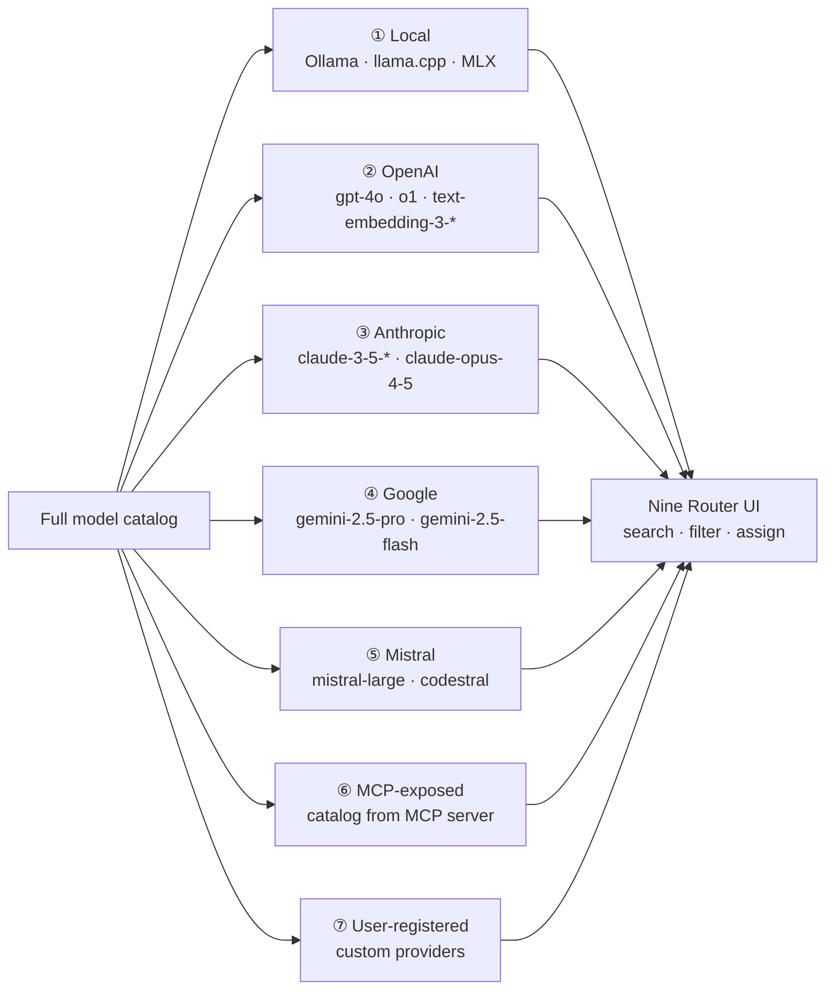
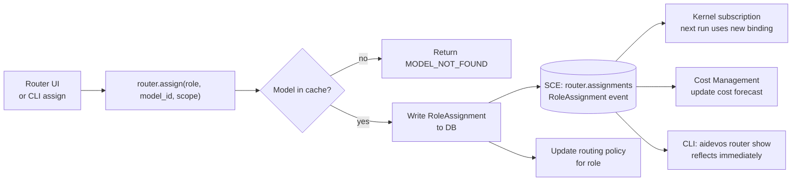
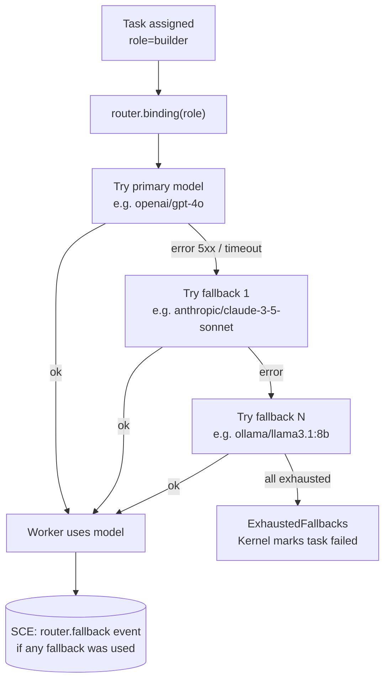
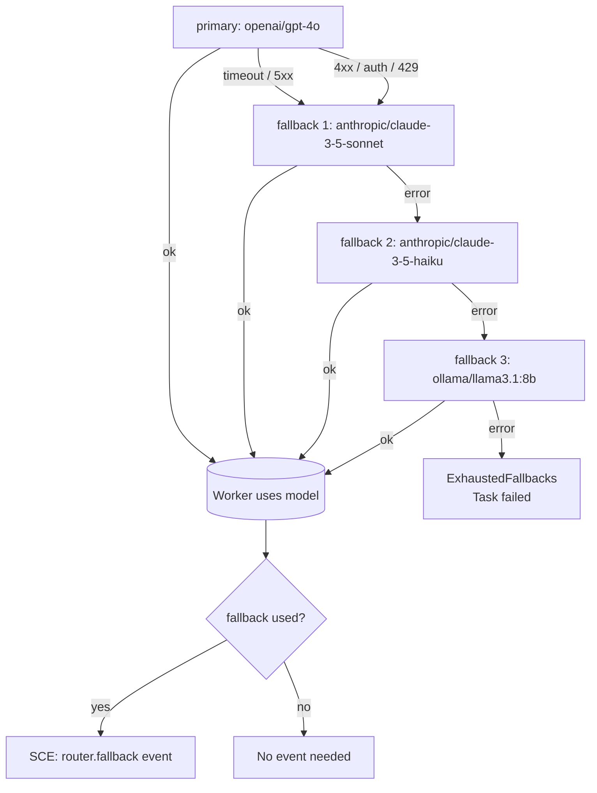
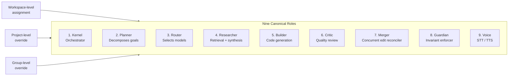

# Nine Router Flow — Model Discovery, Grouping, and Role Assignment

> Complete flow from discovery trigger through to a resolved ModelBinding delivered to the Kernel, with fallback chain escalation, capability matching, cost optimisation, and failure modes.

## Model Discovery Pipeline

```mermaid
flowchart TB
  subgraph Triggers
    UI_BTN[UI: Refresh button]
    CRON_JOB[Cron: every 10 min]
    CRED_CHG[Credential change event]
    CLI_CMD[CLI: aidevos models refresh]
  end

  Triggers --> DISP[Discovery Dispatcher]

  subgraph Adapters["Provider Adapters (all run in parallel)"]
    OLL[Ollama\nGET /api/tags\nlocalhost:11434]
    LLC[llama.cpp\nGET /v1/models\nlocalhost:8080]
    MLX[MLX\nFilesystem scan]
    OAI[OpenAI\nGET /v1/models]
    ANT[Anthropic\nGET /v1/models]
    GOO[Google\nGET /v1beta/models]
    MIS[Mistral\nGET /v1/models]
    MCP_A[MCP servers\ntools/list]
    USR[User-registered\ncustom base URL]
  end

  DISP --> Adapters

  subgraph Normalise["Normalization + Deduplication"]
    NORM[Schema normalizer\n→ canonical Model\{\}]
    ALIAS[Alias resolver\ngpt-4o vs gpt-4o-2024-08-06]
    SORT[Sort: family ASC, deprecated ASC,\ndisplay_name ASC]
  end

  Adapters -->|ok: raw models[]| NORM
  Adapters -->|error| ERR_BADGE[Mark provider degraded\nerror badge in UI]

  NORM --> ALIAS --> SORT

  SORT --> CACHE[(TTL Cache\n10 min per provider)]
  SORT --> SCE_BUS[(SCE: models.discovery\nDiscoveryReport)]

  CACHE --> UI_PANEL[Router UI Panel]
  SCE_BUS --> COST[Cost Management]
  SCE_BUS --> CLI_OUT[CLI output]
```

## Provider Grouping (UI Render Order)



## Role Assignment Flow



## Fallback Resolution (at task-start time)



## Route Decision Pseudocode

```
function resolve_model_binding(role, task, context):
    // 1. Load role assignment
    assignment = role_manager.get_assignment(role, context.scope)
    if assignment == nil:
        return error(ROLE_NOT_ASSIGNED)

    // 2. Get candidates for this role's provider scope
    candidates = model_cache.get_candidates(assignment.provider_scope)
    if candidates.empty():
        return error(NO_MODELS_IN_SCOPE)

    // 3. Apply must-have capability filter
    required = task.get_required_capabilities()
    survivors = [m for m in candidates if m.capabilities.contains_all(required)]
    if survivors.empty():
        return error(NO_MATCHING_MODEL)

    // 4. Score and rank
    scored = [(m, scoring_function(m, task, context)) for m in survivors]
    ranked = sort_descending(scored, by=score)

    // 5. Select primary and fallbacks
    primary = ranked[0].model
    fallbacks = [m.model for m in ranked[1:4]]  // up to 3 fallbacks

    return ModelBinding{
        primary: primary,
        fallbacks: fallbacks,
        snapshot_ts: now()
    }
```

## Fallback Chain Escalation



At each fallback step, an SCE `router.fallback` event is emitted with `{from_model, to_model, reason}`. This allows Cost Management to update cost forecasts and the UI to display fallback activity.

## Model Binding Resolution

The `ModelBinding` struct returned by the router:

```
ModelBinding {
    primary: ModelRef { provider, model_id }
    fallbacks: ModelRef[]
    snapshot_ts: RFC3339    // when this binding was resolved
    stale: bool             // true if discovery TTL has expired
}
```

If `stale = true`, the worker receives a warning that the model catalog may be outdated, but execution proceeds with the cached binding. The worker can optionally trigger a fresh binding resolution before starting.

## Capability Matching Algorithm

```
function satisfies_requirements(model, task):
    for req in task.required_capabilities:
        if req not in model.capabilities:
            return false
    return true
```

Capabilities are stored as a bitset for O(1) comparison:

| Bit | Capability |
|-----|------------|
| 0 | `tools` |
| 1 | `vision` |
| 2 | `audio` |
| 3 | `json_mode` |
| 4 | `streaming` |
| 5 | `embeddings` |
| 6 | `fine_tune` |

Must-have matching: `model.bitset & task.required_mask == task.required_mask`.

## Cost Optimisation Scoring

The scoring function balances capability, context, latency, and cost:

```
score = 0.40 * (extra_capabilities / max_extra)
      + 0.25 * (context_window / max_context)
      + 0.20 * (1 - latency / max_latency)
      + 0.15 * (1 / (cost_per_M_tokens))
```

Cost per million tokens is calculated as:

```
cost_per_M_tokens = input_price_per_M + output_price_per_M * 3
```

The output multiplier of 3 accounts for the typical input:output token ratio of 1:3 in code generation workloads.

## Failure Modes

| Mode | Trigger | Result | Recovery |
|------|---------|--------|----------|
| No routes available | No provider has models in cache | `NO_ROUTES_AVAILABLE` | Trigger discovery immediately; if still empty, error |
| All providers degraded | Every provider in the scope is marked degraded | `ALL_PROVIDERS_DEGRADED` | Use cached (stale) catalog if available; escalate to user |
| Scoring collision | Two models have score diff < 0.01 | Deterministic: lower cost wins; then higher context | Always deterministic; no random selection |
| Assignment cascade failure | Role A depends on Role B which is unassigned | `ROLE_NOT_ASSIGNED` for Role B | Planner restructures TaskGraph to avoid dependency |
| Model not found on assign | User assigns a model ID not in cache | `MODEL_NOT_FOUND` | Trigger discovery for that provider; if still not found, error |
| Cache poisoned | Cache contains stale/invalid model data | Binding resolution returns stale data | `stale` flag set; worker may trigger fresh discovery |
| Fallback loop | Fallback 1 = same model as primary (alias resolution gap) | Infinite fallback loop avoided via visited set | Each model tried at most once per binding resolution |

## Implementation Notes

- The Discovery Dispatcher uses a `sync.WaitGroup` to wait for all adapters to complete (or timeout), then collects results.
- Each adapter runs with its own context and timeout — a slow adapter does not block others.
- The alias resolver uses a config map loaded from `config/aliases.yaml` at startup. Aliases are resolved left-to-right: the first matching entry wins.
- TTL cache entries are per-provider, so re-discovery of a single provider does not evict other providers' entries. A `stale` flag is set on entries older than 10 min.
- Fallback chain evaluation uses a `for` loop over `[primary] + fallbacks` with a `visited` set to prevent duplicate attempts.
- The `router.fallback` event is emitted with `{role, from_model, to_model, reason, duration_ms}` for observability and cost tracking.

## The Nine Roles — Visual Summary



## Related Documents

- [Nine Router](../docs/NINE_ROUTER.md)
- [Model Discovery](../docs/MODEL_DISCOVERY.md)
- [Model Providers](../docs/MODEL_PROVIDERS.md)
- [Model Routing Policy](../docs/MODEL_ROUTING_POLICY.md)
- [Main AI Kernel](../docs/MAIN_AI_KERNEL.md)
