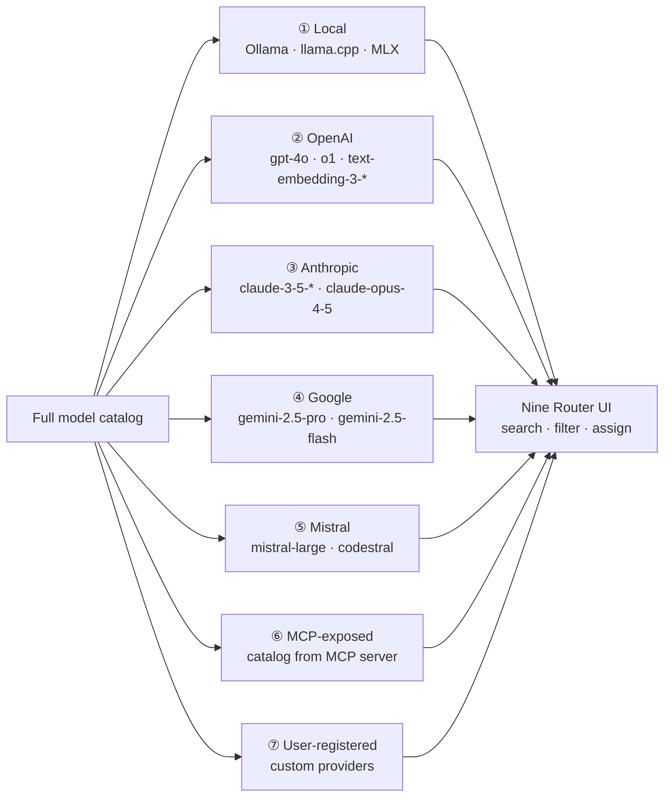
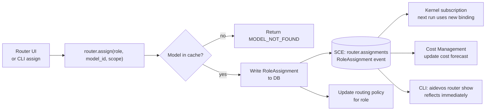
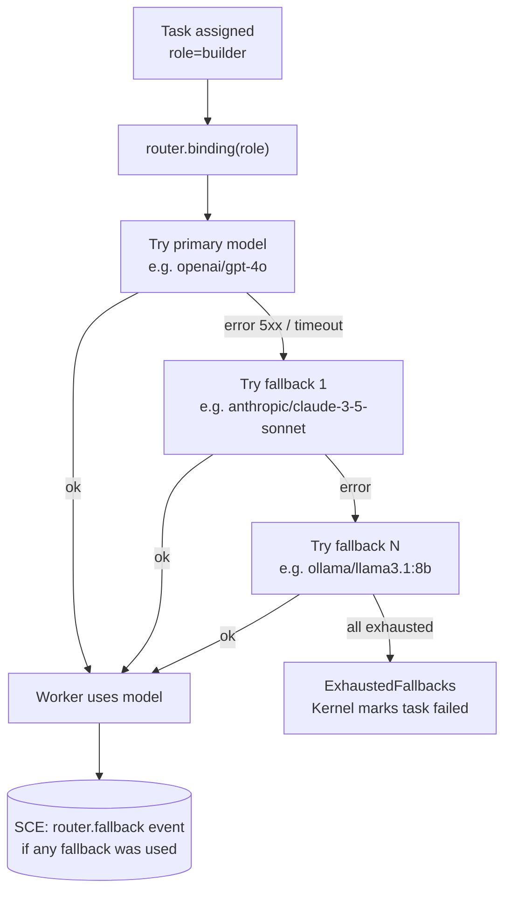
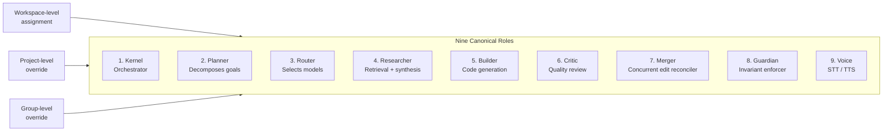

# Nine Router Flow — Model Discovery, Grouping, and Role Assignment

> Complete flow from discovery trigger through to a resolved ModelBinding delivered to the Kernel.

## Model Discovery Pipeline

```mermaid
flowchart TB
  subgraph Triggers
    UI_BTN[UI: Refresh button]
    CRON_JOB[Cron: every 10 min]
    CRED_CHG[Credential change event]
    CLI_CMD[CLI: aidevos models refresh]
  end

  Triggers --> DISP[Discovery Dispatcher]

  subgraph Adapters["Provider Adapters (all run in parallel)"]
    OLL[Ollama\nGET /api/tags\nlocalhost:11434]
    LLC[llama.cpp\nGET /v1/models\nlocalhost:8080]
    MLX[MLX\nFilesystem scan]
    OAI[OpenAI\nGET /v1/models]
    ANT[Anthropic\nGET /v1/models]
    GOO[Google\nGET /v1beta/models]
    MIS[Mistral\nGET /v1/models]
    MCP_A[MCP servers\ntools/list]
    USR[User-registered\ncustom base URL]
  end

  DISP --> Adapters

  subgraph Normalise["Normalization + Deduplication"]
    NORM[Schema normalizer\n→ canonical Model\{\}]
    ALIAS[Alias resolver\ngpt-4o vs gpt-4o-2024-08-06]
    SORT[Sort: family ASC, deprecated ASC,\ndisplay_name ASC]
  end

  Adapters -->|ok: raw models[]| NORM
  Adapters -->|error| ERR_BADGE[Mark provider degraded\nerror badge in UI]

  NORM --> ALIAS --> SORT

  SORT --> CACHE[(TTL Cache\n10 min per provider)]
  SORT --> SCE_BUS[(SCE: models.discovery\nDiscoveryReport)]

  CACHE --> UI_PANEL[Router UI Panel]
  SCE_BUS --> COST[Cost Management]
  SCE_BUS --> CLI_OUT[CLI output]
```

## Provider Grouping (UI Render Order)



## Role Assignment Flow



## Fallback Resolution (at task-start time)



## The Nine Roles — Visual Summary



## Related Documents

- [Nine Router](../docs/NINE_ROUTER.md)
- [Model Discovery](../docs/MODEL_DISCOVERY.md)
- [Model Providers](../docs/MODEL_PROVIDERS.md)
- [Model Routing Policy](../docs/MODEL_ROUTING_POLICY.md)
- [Main AI Kernel](../docs/MAIN_AI_KERNEL.md)
