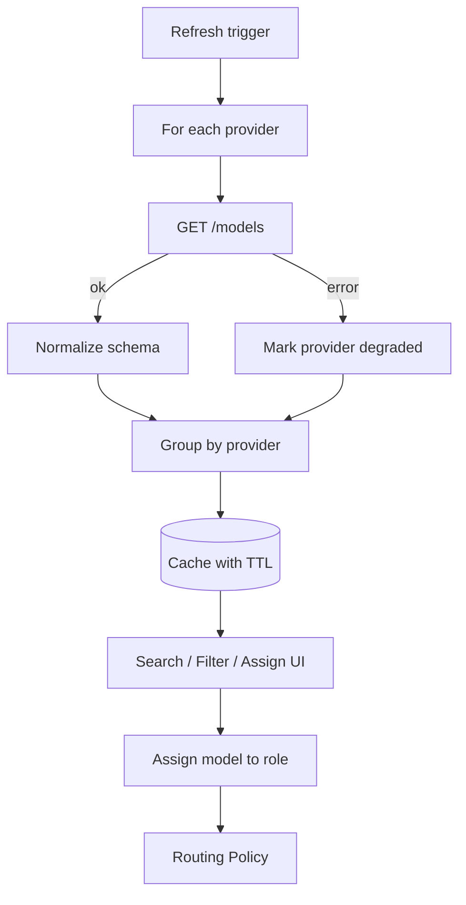

# Nine Router Flow

```mermaid
flowchart TB
  START[Refresh trigger] --> LIST[For each provider]
  LIST --> FETCH[GET /models]
  FETCH -->|ok| NORM[Normalize schema]
  FETCH -->|error| MARK[Mark provider degraded]
  NORM --> GROUP[Group by provider]
  MARK --> GROUP
  GROUP --> CACHE[(Cache with TTL)]
  CACHE --> UI[Search / Filter / Assign UI]
  UI --> ASSIGN[Assign model to role]
  ASSIGN --> POLICY[Routing Policy]
```
