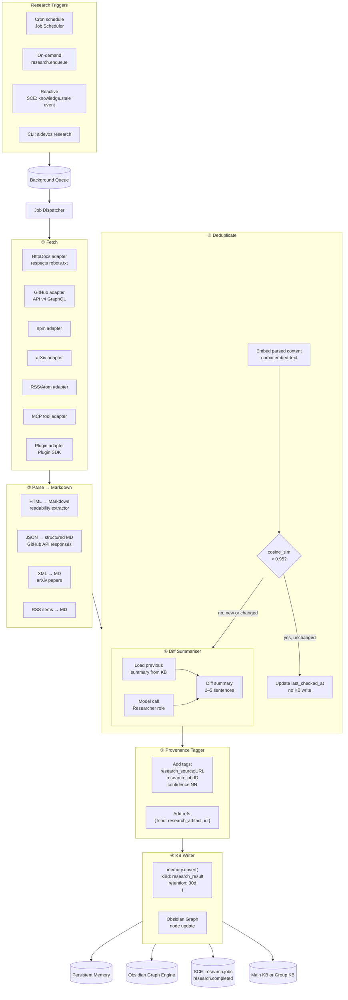
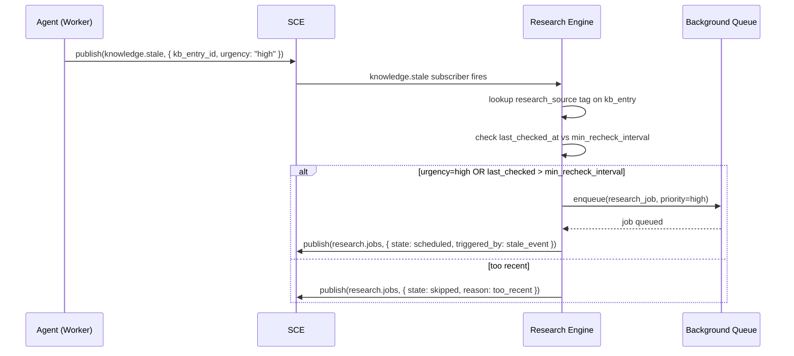
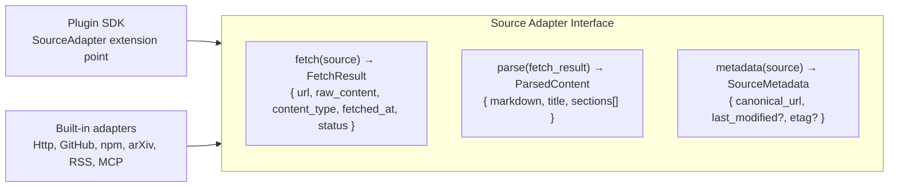

# Research Engine Flow

> End-to-end pipeline from trigger through fetch, parse, deduplication, diff summarisation, and KB write.

## Full Research Pipeline



## Deduplication Detail

```mermaid
flowchart LR
  EXISTING["Existing KB entry?\nmemory.list({ tags: ['research_source:URL'] })"]
  EXISTING -->|not found| NEW[NEW — write full summary]
  EXISTING -->|found| COS{cosine_sim\n(new_embed, existing_embed)\n> 0.95?}
  COS -->|yes| UNCHANGED[UNCHANGED\nupdate last_checked_at only\nno write]
  COS -->|no| CHANGED[CHANGED\nwrite diff_summary + new summary]
```

## Reactive Freshness



## Source Adapter Interface



## Related Documents

- [Research Engine](../docs/RESEARCH_ENGINE.md)
- [Knowledge System](../docs/KNOWLEDGE_SYSTEM.md)
- [Persistent Memory](../docs/PERSISTENT_MEMORY.md)
- [Obsidian Graph Engine](../docs/OBSIDIAN_GRAPH_ENGINE.md)
- [Job Scheduler](../docs/JOB_SCHEDULER.md)
- [Internet Search](../docs/INTERNET_SEARCH.md)
- [Web Intelligence](../docs/WEB_INTELLIGENCE.md)
