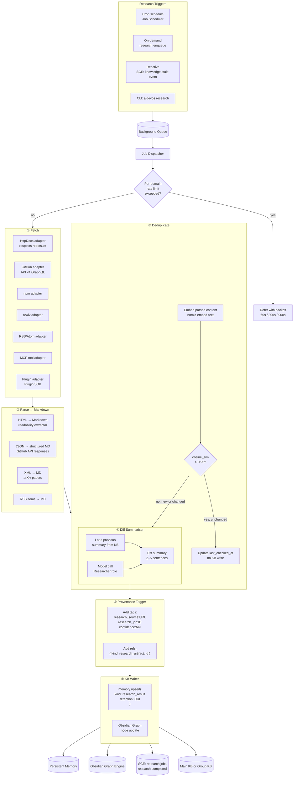
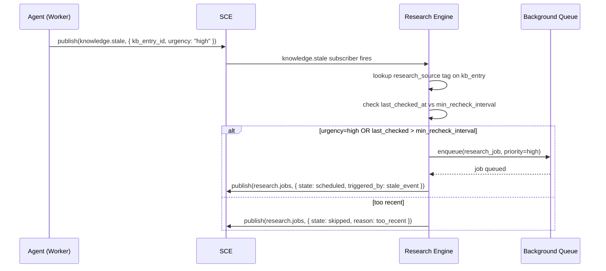
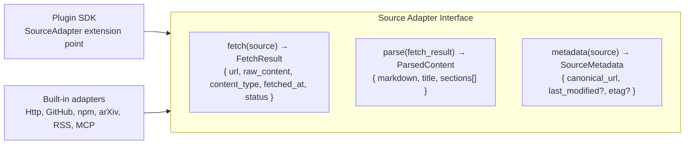

# Research Engine Flow

> End-to-end pipeline from trigger through fetch, parse, deduplication, diff summarisation, KB write, and rate limiting. Includes search flow detail, adapter interface, and failure modes.

## Full Research Pipeline



## Search Flow Detail

When a research task involves searching (as opposed to fetching a specific URL), the flow is:

```mermaid
flowchart TB
  QUERY[Research task with search query] --> SEARCH_PROV{Search provider\navailable?}
  
  SEARCH_PROV -->|web| WEB[Internet Search\nweb search API]
  SEARCH_PROV -->|github| GH[GitHub Analysis\nGraphQL search]
  SEARCH_PROV -->|none| ERR[Return error\nno search provider configured]

  WEB --> RESULTS[Search results\nranked by relevance]
  GH --> RESULTS

  RESULTS --> SELECT[Select top-K results\nK = task.max_results (default 5)]
  SELECT --> ENRICH[Enrich each result\nfetch + parse + dedup]

  subgraph ENRICH["Enrichment per result"]
    E_FETCH[Fetch URL content]
    E_PARSE[Parse to markdown]
    E_DEDUP[Deduplicate against KB]
    E_FETCH --> E_PARSE --> E_DEDUP
  end

  ENRICH --> AGGREGATE[Aggregate all enriched results]
  AGGREGATE --> SYNTHESIZE[Model call: synthesize\ninto single research summary]
  SYNTHESIZE --> WRITE_KB[Write to KB\nwith citations for each source]
```

Each search result is fetched and parsed independently, then all results are synthesised into a single KB entry with per-source citations.

## Deduplication Detail

```mermaid
flowchart LR
  EXISTING["Existing KB entry?\nmemory.list({ tags: ['research_source:URL'] })"]
  EXISTING -->|not found| NEW[NEW — write full summary]
  EXISTING -->|found| COS{cosine_sim\n(new_embed, existing_embed)\n> 0.95?}
  COS -->|yes| UNCHANGED[UNCHANGED\nupdate last_checked_at only\nno write]
  COS -->|no| CHANGED[CHANGED\nwrite diff_summary + new summary]
```

## Reactive Freshness



## Source Adapter Interface



## Rate Limiting and Backpressure

| Level | Mechanism | Default | Behaviour |
|-------|-----------|---------|-----------|
| Per-domain | Token bucket, sliding window | 1 request / 30s per domain | Exceeded → defer job, backoff 60s/300s/900s |
| Global | Parallel crawl semaphore | 10 concurrent crawls | At capacity → job queued in priority order |
| Per-source | `min_recheck_interval` | 5 min (varies by source config) | Source rechecked before `min_recheck_interval` → skip |
| Adapter-level | HTTP timeout per adapter | HttpDocs: 30s, GitHub: 60s | Timeout → retry up to 3 times with backoff |

Deferred jobs are written to the queue with `available_at = now + backoff_ms`. The Job Scheduler picks them up when `available_at` is reached.

## Failure Modes

| Scenario | Detection | Effect | Recovery |
|----------|-----------|--------|----------|
| HTTP 5xx from source | Adapter returns error status | Job retried up to 3 times | Exponential backoff: 30s, 120s, 300s; after 3 failures, source flagged degraded |
| DNS resolution failure | Network error from adapter | Immediate retry after 10s | Falls back to cache if stale content acceptable; logged |
| Parse error (unexpected format) | Parser exception in adapter | Job marked as failed, source flagged | Manual inspection required; source config may need update |
| Rate limit hit (HTTP 429) | Adapter returns 429 | Job deferred based on Retry-After header | If no Retry-After, default 60s backoff |
| Search provider unavailable | Search API returns error | Search falls back to cached results | Retries on next trigger; logged |
| Embedding service down | Dedup step fails | Dedup skipped; content treated as new | After recovery, reconciliation job re-checks existing entries |
| KB write conflict | Optimistic lock failure | Retry write with fresh base | Max 3 retries; if still failing, job marked as failed |
| Citation Engine unavailable | gRPC error | KB write proceeds without citation_id | Background reconciliation job re-creates missing citations |

## Implementation Notes

- Source adapters implement the `SourceAdapter` interface with `fetch`, `parse`, and `metadata` methods. The Plugin SDK allows registering custom adapters at startup.
- Search results are fetched in parallel using a semaphore-limited goroutine pool (max 3 concurrent fetches per search query).
- The diff summarizer uses the `Researcher` role model (typically a cheaper model like `claude-3-5-haiku` or `gpt-4o-mini`) to keep costs low.
- Dedup embeddings use `nomic-embed-text` (768-dim). The embedding model is loaded once at startup and shared across all dedup operations.
- Rate limit state is stored in-memory with a sliding window; on restart, rate limit state resets (conservative: first request always allowed).
- The `knowledge.stale` event is emitted by workers when they encounter KB entries with `confidence < 0.6` or `updated_at > 24h ago`.

## Related Documents

- [Research Engine](../docs/RESEARCH_ENGINE.md)
- [Knowledge System](../docs/KNOWLEDGE_SYSTEM.md)
- [Persistent Memory](../docs/PERSISTENT_MEMORY.md)
- [Obsidian Graph Engine](../docs/OBSIDIAN_GRAPH_ENGINE.md)
- [Job Scheduler](../docs/JOB_SCHEDULER.md)
- [Internet Search](../docs/INTERNET_SEARCH.md)
- [Web Intelligence](../docs/WEB_INTELLIGENCE.md)
- [Citation Engine](../docs/CITATION_ENGINE.md)
