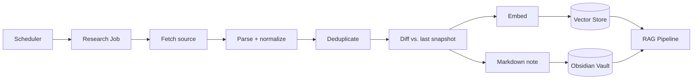

# Research Engine Flow

```mermaid
flowchart LR
  SCHED[Scheduler] --> JOB[Research Job]
  JOB --> FETCH[Fetch source]
  FETCH --> PARSE[Parse + normalize]
  PARSE --> DEDUP[Deduplicate]
  DEDUP --> DIFF[Diff vs. last snapshot]
  DIFF --> EMBED[Embed]
  EMBED --> STORE[(Vector Store)]
  DIFF --> NOTE[Markdown note]
  NOTE --> VAULT[(Obsidian Vault)]
  STORE --> RAG[RAG Pipeline]
  VAULT --> RAG
```
