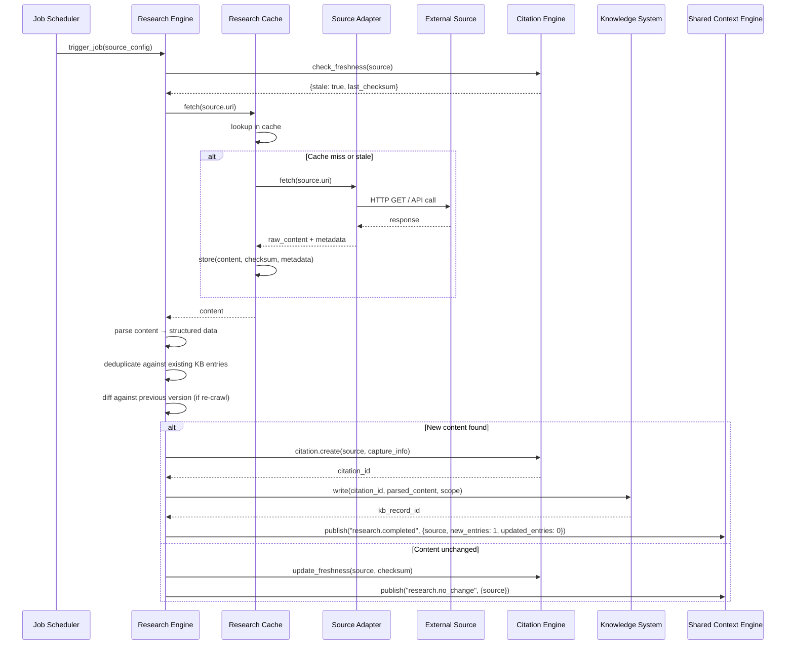

# Research Engine Sequence

> Sequence diagram of the Research Engine performing a scheduled crawl with caching and citation tracking.

## Related Documents

- [Research Engine](../docs/RESEARCH_ENGINE.md) — full pipeline spec
- [Research Cache](../docs/RESEARCH_CACHE.md) — caching layer
- [Citation Engine](../docs/CITATION_ENGINE.md) — provenance tracking
- [Source Ranking](../docs/SOURCE_RANKING.md) — source authority scoring
- [Knowledge System](../docs/KNOWLEDGE_SYSTEM.md) — KB record storage
