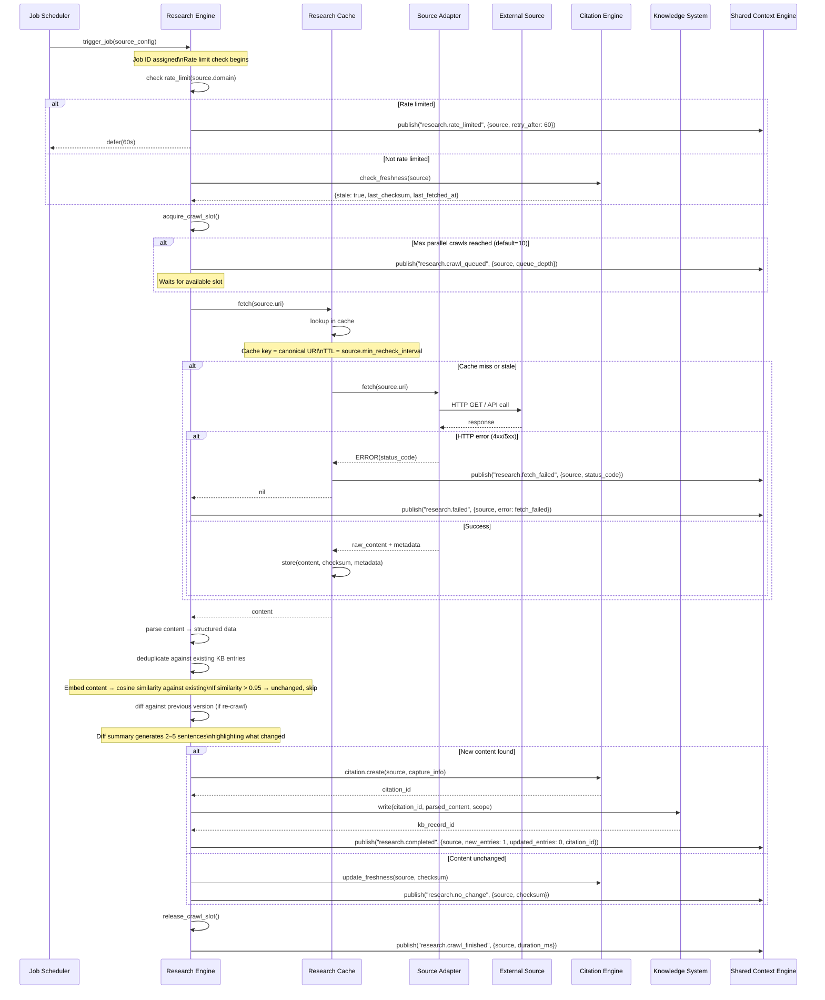
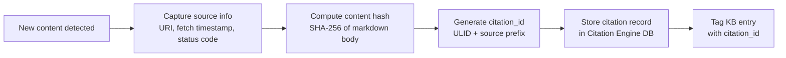

# Research Engine Sequence

> Sequence diagram of the Research Engine performing a scheduled crawl with caching, deduplication, citation tracking, and rate limit handling.

## Full Research Sequence



## Crawl Lifecycle

Each research job progresses through these stages:

1. **Trigger** — Job Scheduler emits `trigger_job(source_config)` from cron, on-demand, or reactive (stale knowledge event).
2. **Rate limit check** — RE checks per-domain rate limits. If exceeded, the job is deferred with exponential backoff: 60s, 300s, 900s max.
3. **Slot acquisition** — RE acquires a crawl slot from the shared semaphore. Default max parallel crawls = 10. Configurable per deployment.
4. **Freshness check** — Citation Engine returns whether the source is stale based on `min_recheck_interval` and `last_fetched_at`.
5. **Cache lookup** — Research Cache checks TTL cache. Cache hit with fresh content avoids the external fetch.
6. **External fetch** — Source Adapter translates canonical request to provider-specific API call.
7. **Parse + deduplicate** — Raw content is parsed to structured markdown, then deduplicated against existing KB entries.
8. **Diff + write** — If content changed, a diff summary is generated, citation created, and KB record upserted.
9. **Slot release** — Crawl slot is returned to the pool for the next queued job.

## Cache Decision Tree

```mermaid
flowchart LR
    Q[fetch(uri)] --> CACHE{In cache?}
    CACHE -->|yes| FRESH{Fresh enough?\nnow - fetched_at < TTL}
    FRESH -->|yes| HIT[Return cached content]
    FRESH -->|no| STALE[Fetch from source]
    CACHE -->|no| FETCH[Fetch from source]
    FETCH --> HTTP{HTTP 200?}
    HTTP -->|yes| STORE[Store in cache]
    HTTP -->|no| RET[Return error]
    STORE --> RET2[Return content]
```

## Deduplication Algorithm

```
function deduplicate(content, existing_entries):
    embed = embed_model.encode(content.markdown)
    for entry in existing_entries:
        sim = cosine_similarity(embed, entry.embedding)
        if sim > 0.95:
            return UNCHANGED, entry.id
    return CHANGED_OR_NEW, nil
```

- Threshold of 0.95 is conservative — tuned to catch near-identical re-crawls while allowing minor formatting changes.
- Per-source dedup scope: only entries tagged with the same `research_source:URL` tag are compared.
- Embedding model: `nomic-embed-text` (768-dim, ~50ms per encode).

## Citation Creation Flow



## Rate Limit Handling

| Scenario | Action | Backoff |
|----------|--------|---------|
| HTTP 429 from source | Defer job, emit `research.rate_limited` | Retry-After header or 60s default |
| Domain exceeds rate_limit_config | Defer job before making request | Configurable (default 60s) |
| Consecutive rate limits (>3) | Mark source as degraded, skip future jobs | Exponential: 60s → 300s → 900s |

## Parallel Crawl Limits

- Global max: 10 parallel crawls (configurable via `research.max_parallel_crawls`)
- Per-domain max: 2 parallel requests to the same domain
- Slot acquisition uses a weighted semaphore: external HTTP = 1 slot, local filesystem = 0 slots
- When all slots are busy, jobs queue with per-source priority (reactive > on-demand > cron)

## Failure Scenarios

| Scenario | Detection | Effect | Recovery |
|----------|-----------|--------|----------|
| HTTP 5xx from source | Adapter returns error | Job retried up to 3 times | Exponential backoff: 30s, 120s, 300s |
| DNS resolution failure | Network error | Immediate retry after 10s | Falls back to cache if stale content acceptable |
| Parse error (unexpected format) | Parser exception | Job marked as failed, source flagged | Manual inspection required |
| Citation Engine unavailable | gRPC connection error | KB write proceeds without citation_id | Background reconciliation job re-creates missing citations |
| KB write conflict | Optimistic lock failure | Retry write with fresh base version | Max 3 retries, then escalate to manual merge |

## Implementation Notes

- Rate limiting uses a sliding window per domain (token bucket with 1 request / `min_recheck_interval`).
- Crawl slots are implemented as a Go channel semaphore with `maxParallelCrawls` capacity and weighted acquire.
- Cache TTL is per-source, derived from `min_recheck_interval` in source config (default 30 min).
- The dedup embedding is computed once per crawl and reused for both dedup and the Knowledge Graph semantic edge.
- Job deferral writes to a priority queue in the database; the scheduler re-queues deferred jobs with `available_at` timestamp.

## Performance Characteristics

| Operation | Typical | P99 | Notes |
|-----------|---------|-----|-------|
| Cache lookup | 2ms | 10ms | In-memory hash map |
| External fetch (HTTP) | 500ms–5s | 30s | Dominant factor; varies by source |
| Parse to markdown | 50ms | 500ms | HTML readability extractor is slowest |
| Embed for dedup | 50ms | 200ms | nomic-embed-text inference time |
| Cosine similarity check | 1ms | 5ms | 768-dim vectors, brute force over per-source entries |
| Diff summarisation | 2–10s | 30s | Model call cost; uses Researcher role |
| KB write | 10ms | 100ms | SQLite upsert + vector index update |
| **End-to-end (cache miss)** | **3–20s** | **60s** | Dominated by external fetch |
| **End-to-end (cache hit)** | **100ms** | **500ms** | Skips external fetch entirely |

## Configuration Reference

| Setting | Default | Description |
|---------|---------|-------------|
| `research.max_parallel_crawls` | 10 | Global maximum concurrent crawls |
| `research.per_domain_limit` | 2 | Max concurrent requests per domain |
| `research.default_ttl` | 30m | Default cache TTL per source |
| `research.retry.max_attempts` | 3 | Max retries on fetch failure |
| `research.retry.backoff_base` | 30s | Initial retry backoff |
| `research.dedup.threshold` | 0.95 | Cosine similarity threshold for dedup |

## Related Documents

- [Research Engine](../docs/RESEARCH_ENGINE.md) — full pipeline spec
- [Research Cache](../docs/RESEARCH_CACHE.md) — caching layer
- [Citation Engine](../docs/CITATION_ENGINE.md) — provenance tracking
- [Source Ranking](../docs/SOURCE_RANKING.md) — source authority scoring
- [Knowledge System](../docs/KNOWLEDGE_SYSTEM.md) — KB record storage
- [Job Scheduler](../docs/JOB_SCHEDULER.md) — cron and event-driven triggers
