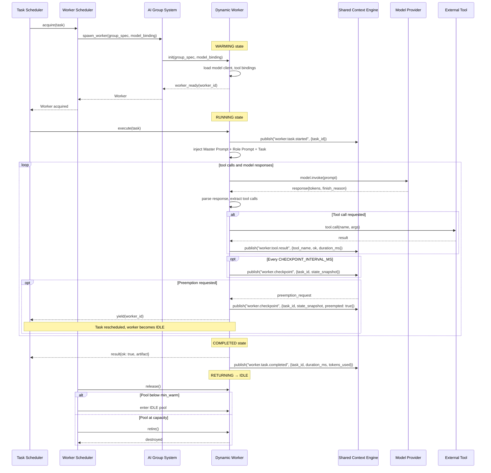

# Worker Lifecycle Sequence

> Sequence diagram of the Dynamic Worker lifecycle from spawn to retirement.

## Related Documents

- [Dynamic Workers](../docs/DYNAMIC_WORKERS.md) — worker execution and state machine
- [Worker Scheduler](../docs/WORKER_SCHEDULER.md) — worker pool management
- [Task Scheduler](../docs/TASK_SCHEDULER.md) — task dispatch
- [AI Group System](../docs/AI_GROUP_SYSTEM.md) — worker pool ownership
- [Agent Lifecycle](../docs/AGENT_LIFECYCLE.md) — worker lifecycle and checkpointing
