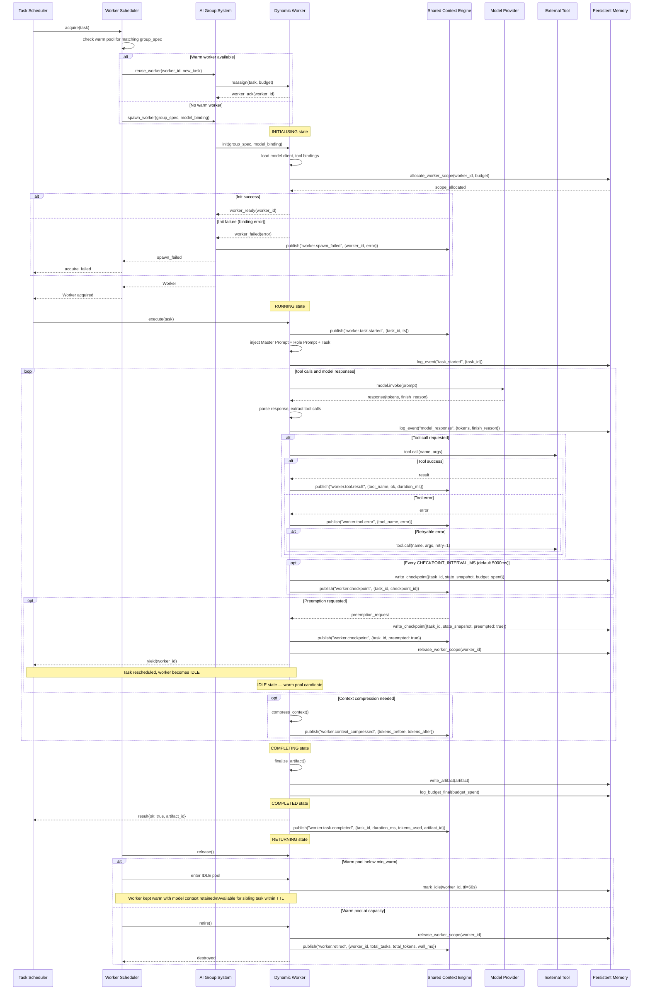
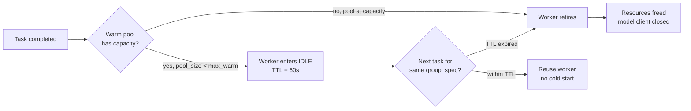
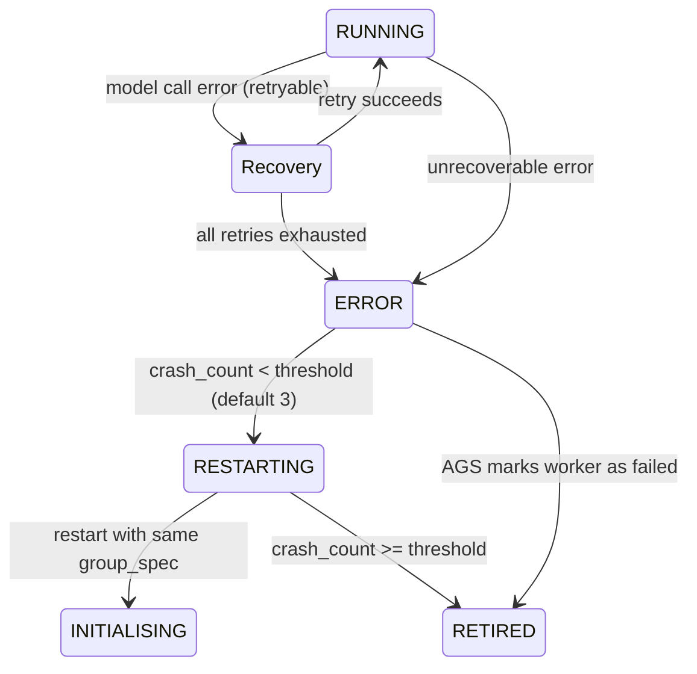

# Worker Lifecycle Sequence

> Sequence diagram of the Dynamic Worker lifecycle from spawn to retirement, including checkpointing, preemption, warm pool integration, and error recovery.

## Full Worker Lifecycle



## Checkpoint States

| State | Label | Trigger | Duration | Persistence |
|-------|-------|---------|----------|-------------|
| Periodic | `worker.checkpoint` | `CHECKPOINT_INTERVAL_MS` elapsed | ~50ms | Persistent Memory |
| Preemptive | `worker.checkpoint` + `preempted: true` | External preemption signal | ~100ms | Persistent Memory (high priority) |
| Explicit | `worker.checkpoint` + `trigger: explicit` | Worker calls `checkpoint()` | ~50ms | Persistent Memory |
| Final | `worker.completed` | Task finishes | — | Persistent Memory (artifact + budget) |

## Preemption Flow

```mermaid
flowchart LR
    SCE[SCE: preemption_request] --> DW[Worker receives signal]
    DW --> CHECKPOINT[Write emergency checkpoint\nto Persistent Memory]
    CHECKPOINT --> YIELD[Return yield() to Task Scheduler]
    YIELD --> RESCHEDULE[Task rescheduled\nwith checkpoint_id]
    RESCHEDULE --> NEW_WORKER[New or warm worker\nloads checkpoint and continues]
```

Preemption is triggered when:
- A higher-priority task enters the queue
- Kernel initiates run cancellation
- Budget exhaustion is imminent
- System resources are under pressure (memory, API rate limits)

## Warm Pool Integration



- Default warm pool size: `min(5, max_workers * 0.2)`
- Per-group warm pool: `max_warm = 2` (group-specific configuration)
- TTL extensions: each reassignment resets the 60s TTL

## Error Recovery Transitions



## Resource Cleanup Guarantee

When a worker enters `RETIRING` (either through normal retirement, error, or cancellation):

1. **Tool handles** are released — all MCP/plugin connections are closed with a 5s graceful shutdown.
2. **SCE cursors** are unsubscribed — the worker's topic subscriptions are removed.
3. **Budget** is reported — final `budget_spent` is written to Persistent Memory.
4. **Warm pool slot** is freed — the slot becomes available for a new worker.
5. **Checkpoint** is written if not already — ensures no work is lost on error retirement.

## Lifecycle Event Catalog

| Event | Publisher | Payload | Retention |
|-------|-----------|---------|-----------|
| `worker.spawn_failed` | AGS | `{worker_id, error, group_spec}` | 90d |
| `worker.started` | Worker | `{worker_id, role, model_id, tools[]}` | 90d |
| `worker.task_assigned` | AGS | `{task_id, budget_slice}` | 90d |
| `worker.task.started` | Worker | `{task_id, ts}` | 90d |
| `worker.token` | Worker | `{text, finish_reason}` | 7d (high volume) |
| `worker.tool_call` | Worker | `{name, args}` | 90d |
| `worker.tool.result` | Worker | `{tool_name, ok, duration_ms}` | 90d |
| `worker.tool.error` | Worker | `{tool_name, error, retryable}` | 90d |
| `worker.checkpoint` | Worker | `{checkpoint_id, budget_spent}` | 90d |
| `worker.context_compressed` | Worker | `{tokens_before, tokens_after}` | 30d |
| `worker.task.completed` | Worker | `{artifact_id, duration_ms, tokens_used}` | 90d |
| `worker.failed` | Worker | `{error_code, message, budget_spent}` | 90d |
| `worker.cancelling` | Worker | `{reason}` | 90d |
| `worker.cancelled` | Worker | `{reason, budget_spent}` | 90d |
| `worker.budget_exhausted` | Worker | `{budget_type, spent, limit}` | 90d |
| `worker.retired` | Worker | `{total_tasks, total_tokens, wall_ms}` | 90d |

## Failure Scenarios

| Scenario | Detection | Effect | Recovery |
|----------|-----------|--------|----------|
| Model provider 5xx | Worker receives error | Immediate retry with same model (max 3) | If exhausted → fallback model chain |
| Model provider timeout | Request exceeds timeout (default 120s) | Same as 5xx; checkpoint saved before retry | Fallback chain if primary times out > 3x |
| Tool call error (retryable) | Tool returns retryable error | Worker retries with backoff: 1s, 5s, 15s | If exhausted → mark failure, continue without tool result |
| Tool call error (fatal) | Tool returns non-retryable error | Worker continues with partial result | Tool result excluded from artifact |
| Context overflow | Token count > context_window | Worker compresses and continues | Compression logged; sliding window applied |
| Checkpoint write failure | Persistent Memory unavailable | Worker continues without checkpoint | Last checkpoint used for recovery (if any) |
| Worker crash (OOM, panic) | AGS detects heartbeat loss | Worker marked as failed; checkpoint restored | New worker spawned from last checkpoint |

## Implementation Notes

- Checkpoint interval is configurable per group via `checkpoint_interval_ms` (default 5000ms).
- Preemption is signalled through an SCE topic the worker subscribes to during `INITIALISING`.
- Warm pool TTL is a global config with per-group override (`warm_pool_ttl_ms`, default 60000).
- The `crash_count` threshold is configurable via `AGS.max_worker_restarts` (default 3).
- All lifecycle events are written to Persistent Memory in addition to SCE for audit log durability.

## Related Documents

- [Dynamic Workers](../docs/DYNAMIC_WORKERS.md) — worker execution and state machine
- [Worker Scheduler](../docs/WORKER_SCHEDULER.md) — worker pool management
- [Task Scheduler](../docs/TASK_SCHEDULER.md) — task dispatch
- [AI Group System](../docs/AI_GROUP_SYSTEM.md) — worker pool ownership
- [Agent Lifecycle](../docs/AGENT_LIFECYCLE.md) — worker lifecycle and checkpointing
- [Tool Calling](../docs/TOOL_CALLING.md) — tool dispatch and error handling
