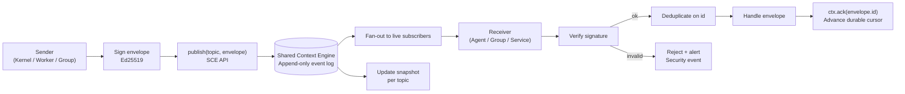

# Agent Communication

> The wire protocol and semantics agents use to talk to each other and to the Kernel — envelope format, transport abstraction, delivery guarantees, and security model. This document is normative — implementations MUST satisfy every MUST clause below.

## Overview

Agent Communication is the messaging layer that allows every agent, worker, group, and the Kernel to exchange structured information reliably. All communication — commands, events, queries, and responses — flows through the [Shared Context Engine](./SHARED_CONTEXT_ENGINE.md) as durable, signed envelopes. There are no direct peer-to-peer channels; the SCE is the single observable channel for all inter-agent communication.

This design means:
- Every message is auditable (the SCE is append-only).
- Every message is observable (any authorised subscriber can tail any topic).
- Delivery guarantees are provided by the SCE, not by individual agents.
- Agents do not need to know each other's location, process, or transport; they only need the SCE topic name.

For the local process-to-process communication that bypasses the SCE (CLI ↔ Backend), see [IPC](./IPC.md).

## Goals

- Single envelope schema across all transports (in-process, IPC, WebSocket, MCP).
- At-least-once delivery with idempotent handler semantics.
- Signed envelopes: every message carries an Ed25519 signature verifiable by consumers.
- Every exchange observable through the SCE and audit log.
- Backpressure: slow subscribers signal back-pressure via the SCE broker.

## Non-Goals

- Real-time chat (<< 100 ms latency) — the SCE has WAL-mode SQLite latency (~1–5 ms publish); for tighter loops, use in-process function calls.
- Peer-to-peer agent channels — all communication is mediated by the SCE.
- Implementation code — this repository is documentation-only (see [AI Coding Rules](./AI_CODING_RULES.md)).

## Architecture



## Envelope Schema

```
Envelope {
  id:            ulid               # globally unique, monotonic per publisher
  ts:            rfc3339            # publisher-side timestamp
  sender: {
    id:          string             # agent_id or "kernel" or "system"
    role:        NineRole | "system"
    group_id?:   string
    run_id?:     string
  }
  recipients:    string[]           # topic(s) for fan-out; [] = broadcast on topic
  topic:         string             # SCE topic name (e.g., "run.abc123")
  kind:          "event"            # unsolicited state change (fire-and-forget)
               | "command"          # request to take an action (expects response)
               | "query"            # request for information (expects response)
               | "response"         # reply to a command or query
               | "error"            # error response
               | "tick"             # heartbeat / keepalive

  correlation_id: string            # from originating Kernel run; propagated end-to-end
  causation_id:   string?           # id of the envelope that caused this one (for response)
  schema_name:    string?           # optional payload schema identifier
  schema_version: string?
  payload:        object            # message-specific content (see below)
  signature:      string            # base64 Ed25519 over canonical bytes
}
```

### Canonical signing bytes

```
canonical = id + "|" + ts + "|" + sender.id + "|" + SHA256(JSON.stringify(payload))
signature = base64(ed25519.sign(canonical, agent_private_key))
```

## Message Kinds

### `event` — Fire-and-forget state change

Used when the sender does not need a response. The sender publishes and moves on. Example: `worker.token` events during streaming.

```
Envelope {
  kind: "event"
  topic: "run.<run_id>"
  payload: { type: "worker.token", text: "Hello", finish_reason: null }
}
```

### `command` — Request action with expected response

Used when the sender needs the receiver to do something and confirm. The sender SHOULD set a timeout and handle `TIMEOUT` if no response arrives.

```
# Command
Envelope { id: "cmd-1", kind: "command", topic: "group.<group_id>", payload: { action: "spawn_worker", spec: WorkerSpec } }

# Response
Envelope { id: "resp-1", kind: "response", causation_id: "cmd-1", payload: { worker_id: "..." } }
```

### `query` — Request information

Used when an agent needs to read state from another agent or service.

```
Envelope { id: "q-1", kind: "query", topic: "router.assignments", payload: { role: "builder" } }
Envelope { id: "r-1", kind: "response", causation_id: "q-1", payload: { binding: ModelBinding } }
```

### `tick` — Heartbeat

Used by workers to signal liveness. Published on `group.<group_id>` every `heartbeat_interval_ms`. If the AGS does not receive a `tick` within `heartbeat_grace`, it reassigns the task.

```
Envelope { kind: "tick", topic: "group.<group_id>", payload: { worker_id, state: "executing", progress_pct: 45 } }
```

## Transport Abstraction

The SCE presents the same API regardless of backend. Agents never deal with transport details:

```typescript
interface SCEClient {
  // Publish an envelope
  publish(envelope: Envelope): Promise<void>

  // Subscribe to a topic (returns a cursor-tracked async iterator)
  subscribe(topic: string, opts?: { from?: "latest" | "snapshot" | ulid }): AsyncIterator<Envelope>

  // Request/response (command or query) with timeout
  request(topic: string, envelope: Envelope, timeout_ms: number): Promise<Envelope>

  // Acknowledge receipt (advance durable cursor)
  ack(envelope_id: string): Promise<void>
}
```

## Delivery Guarantees

| Guarantee | Provided by |
|-----------|-------------|
| At-least-once | SCE WAL log + cursor replay |
| Ordering (per topic) | Monotonic ULID sequencing |
| Deduplication | Receiver dedupes on `envelope.id` |
| Durability | SQLite WAL + optional NATS JetStream |
| Exactly-once semantics | Application-level idempotency (via `id` deduplication) |

Agents MUST implement idempotent handlers: processing the same envelope twice (same `id`) MUST produce the same result as processing it once.

## Signature Verification

Every receiver MUST verify the envelope's Ed25519 signature before processing:

1. Compute canonical bytes: `id + "|" + ts + "|" + sender.id + "|" + SHA256(payload)`.
2. Lookup sender's public key from the [Key Registry](./KEY_REGISTRY.md) using `sender.id`.
3. Verify signature: `ed25519.verify(canonical, base64_decode(envelope.signature), public_key)`.
4. If verification fails: reject the envelope; publish a `security.signature_failure` alert on the SCE.

New agents receive a key pair on first registration. The public key is published to the Key Registry. Private keys are stored in [Secrets Management](./SECRETS_MANAGEMENT.md).

## Requirements

- **MUST** route all inter-agent communication through the SCE; no direct peer-to-peer channels.
- **MUST** sign every outgoing envelope with the agent's Ed25519 private key.
- **MUST** verify every incoming envelope's signature before processing.
- **MUST** implement idempotent handlers: duplicate delivery (same `id`) MUST be no-op.
- **MUST** propagate `correlation_id` from the Kernel run in every envelope.
- **MUST** publish a `security.signature_failure` event when signature verification fails.
- **MUST** implement the `tick` heartbeat for all long-running workers.
- **SHOULD** use `causation_id` to link responses to their originating command/query.
- **SHOULD** implement a request timeout (default 30 s for commands; 5 s for queries).
- **MAY** include `schema_name` and `schema_version` for typed payload validation.

## Failure Modes

| Mode | Detection | Response |
|------|-----------|----------|
| SCE broker unavailable | Publish timeout / connection error | Buffer to local outbox; retry with exponential backoff |
| Signature verification failure | `ed25519.verify` returns false | Reject envelope; emit security alert; audit log |
| Duplicate delivery | `id` already processed | Silent no-op (idempotent handler) |
| Command timeout | No response within `timeout_ms` | Return `TIMEOUT` error to caller; emit `agent.command_timeout` |
| Heartbeat missed | AGS: `tick` not received within `heartbeat_grace` | Mark worker missing; reassign task |
| Dead-letter (undeliverable) | No subscriber for topic after TTL | Move envelope to DLQ; emit alert |

## Observability

| Metric | Labels | Description |
|--------|--------|-------------|
| `agent_envelope_total` | `kind`, `direction=in\|out` | Envelopes by kind and direction |
| `agent_envelope_seconds` | `kind` | Processing latency |
| `agent_signature_failure_total` | `sender` | Failed signature verifications |
| `agent_dedup_total` | — | Duplicate envelopes suppressed |
| `agent_command_timeout_total` | `topic` | Timed-out commands |

Traces: one span per envelope (send and receive). See [Tracing](./TRACING.md).

## Acceptance Criteria

- An agent replaying a command envelope with the same `id` twice produces exactly one observable effect.
- A tampered envelope (payload modified after signing) is rejected within the verification step and a `security.signature_failure` event appears on the SCE.
- `correlation_id` from the originating Kernel `RunSpec` appears in every envelope on `run.<run_id>` topic for that run.
- Publishing an envelope to a topic with no active subscribers does not block; the envelope is stored in the event log and delivered to future subscribers.
- A worker that stops publishing `tick` envelopes is marked as `missing` by the AGS within `heartbeat_interval_ms + heartbeat_grace`.

## Open Questions

- Whether to support envelope-level encryption (E2E) for sensitive group communications, in addition to transport-level TLS — tracked in [templates/ADR](../templates/ADR.md).

## Related Documents

- [Shared Context Engine](./SHARED_CONTEXT_ENGINE.md)
- [Event Bus](./EVENT_BUS.md)
- [IPC](./IPC.md)
- [AI Group System](./AI_GROUP_SYSTEM.md)
- [Dynamic Workers](./DYNAMIC_WORKERS.md)
- [Security Model](./SECURITY_MODEL.md)
- [Key Registry](./KEY_REGISTRY.md)
- [Audit Log](./AUDIT_LOG.md)
- [System Overview](./SYSTEM_OVERVIEW.md)
- [Main AI Kernel](./MAIN_AI_KERNEL.md)
