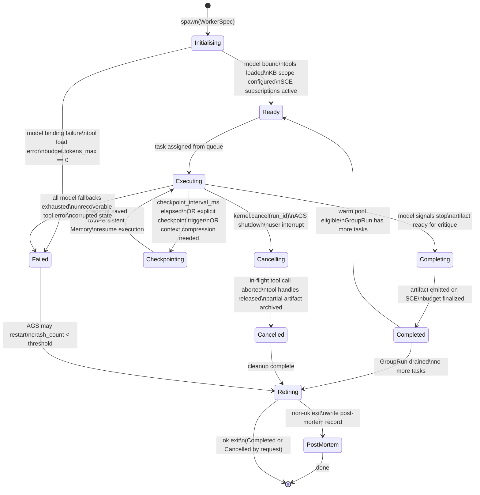

# Agent Lifecycle

> How agents are spawned, warmed, checkpointed, retired, and post-mortemed — with budget enforcement, state machine, and SCE event schema. This document is normative — implementations MUST satisfy every MUST clause below.

## Overview

Agent Lifecycle governs everything that happens to a [Dynamic Worker](./DYNAMIC_WORKERS.md) from the moment the [AI Group System](./AI_GROUP_SYSTEM.md) spawns it to the moment it is retired. A healthy lifecycle produces a completed artifact; an unhealthy one produces a failure event, a checkpoint for replay, and a post-mortem record.

The lifecycle is designed around three principles:
1. **Bounded resource use**: every agent has a wall-clock, token, and cost budget. When any budget is exhausted, the agent stops cleanly and archives what it has.
2. **Reproducible runs**: checkpoints capture the full execution context so a fresh agent can continue from where a crashed one left off.
3. **Graceful retirement**: tool handles, SCE subscriptions, and model streams are always released, even on crash.

## Goals

- Full, inspectable state machine for every worker.
- Budget enforcement with hard stops and partial-result archival.
- Checkpoint-based replay for crash recovery.
- Warm-pool reuse of agents within a GroupRun for amortised cold start.
- Complete post-mortem record for every non-successful retirement.

## Non-Goals

- Agent routing and group management — see [AI Group System](./AI_GROUP_SYSTEM.md).
- Model selection — see [Nine Router](./NINE_ROUTER.md).
- Implementation code — this repository is documentation-only (see [AI Coding Rules](./AI_CODING_RULES.md)).

## State Machine



## AgentSpec

The `WorkerSpec` (synonym: `AgentSpec`) passed to `spawn`:

```
WorkerSpec {
  id:              ulid
  run_id:          ulid
  task_id:         ulid
  role:            NineRole                    # e.g. "builder"
  group_id:        string
  model_binding:   ModelBinding               # from Nine Router
  tools:           ToolRef[]                  # allowed tools for this task
  kb_scope: {
    workspace:     string
    project?:      string
    group?:        string
    agent?:        string                      # set to self on spawn
  }
  system_prompt:   string                     # composed by Kernel from GroupSpec + role prompts
  context:         Message[]                  # initial context window
  budget: {
    tokens_max:    number                     # total tokens (in + out)
    wall_ms_max:   number                     # wall-clock budget
    usd_max:       number                     # cost budget
  }
  checkpoint_interval_ms: number             # default 30_000
  heartbeat_interval_ms:  number             # default 10_000
  correlation_id:  string                    # from originating Kernel run
}
```

## Checkpoint Protocol

Checkpoints allow a fresh agent to resume a failed or cancelled agent's work:

```
Snapshot {
  id:                  ulid
  worker_id:           ulid
  task_id:             ulid
  run_id:              ulid
  ts:                  rfc3339
  context_hash:        string             # SHA-256 of current context window
  budget_spent: {
    tokens:            number
    wall_ms:           number
    usd:               number
  }
  tool_history:        ToolCall[]         # all tool calls completed so far
  partial_artifact:    string?            # partial output text
  model_state:         object?            # provider continuation token (if any)
}
```

Checkpoints are written to [Persistent Memory](./PERSISTENT_MEMORY.md) with `kind: "checkpoint"` and `retention: "7d"`.

On restart after failure:
1. AGS loads the latest `Snapshot` for the `task_id`.
2. AGS spawns a fresh worker with the original `WorkerSpec` augmented by `checkpoint_id`.
3. The fresh worker skips already-completed tool calls (deduplicated by `ToolCall.id`).
4. The fresh worker reconstructs context from `Snapshot.partial_artifact` + `tool_history`.

## Budget Enforcement

The `BudgetTracker` monitors three dimensions:

```
tokens_used    = sum(chunk.usage.total_tokens) for all model calls
wall_ms        = monotonic_now() - spawn_ts
usd_spent      = sum(tokens_in * input_price + tokens_out * output_price) per model call
```

On every token event:
```
if tokens_used >= budget.tokens_max:
    cancel_model_stream()
    emit worker.budget_exhausted { budget_type: "tokens" }
    → Completing state (deliver partial artifact)

if wall_ms >= budget.wall_ms_max:
    cancel_model_stream()
    emit worker.budget_exhausted { budget_type: "wall_ms" }
    → Completing state

if usd_spent >= budget.usd_max:
    cancel_model_stream()
    emit worker.budget_exhausted { budget_type: "usd" }
    → Completing state
```

## Warm Pool

After completing a task, a worker enters the warm pool if:
- `GroupRun.warm_pool_size > 0`.
- The worker's model context is under `warm_pool_max_context_tokens`.
- The GroupRun has more tasks with the same role.

A warm worker retains its context window and tool initialisation state. The next task is delivered directly to its `Ready` state, bypassing the model cold-start (~1–3 s for large models). Warm workers expire after `warm_pool_ttl_ms` (default 60 s) if no new task arrives.

## Post-Mortem Record

For every non-ok exit (Failed, Cancelled with incomplete task), a post-mortem record is written:

```
PostMortem {
  id:             ulid
  worker_id:      ulid
  task_id:        ulid
  run_id:         ulid
  exit_state:     "failed" | "cancelled"
  exit_reason:    string
  crash_count:    number
  budget_spent:   { tokens, wall_ms, usd }
  last_checkpoint_id: ulid?
  last_tool_call: ToolCall?
  error:          { code, message, stack? }
  ts:             rfc3339
}
```

Post-mortems are written to [Persistent Memory](./PERSISTENT_MEMORY.md) with `kind: "postmortem"` and `retention: "90d"`. They are queryable by the Kernel for analysis and by operators for debugging.

## SCE Events

All lifecycle events are published on `run.<run_id>` with `correlation_id`, `worker_id`, and `task_id`.

| Transition | Event type | Key payload |
|-----------|-----------|-------------|
| spawn | `worker.started` | `role, model_id, tools[], budget` |
| Ready → Executing | `worker.task_assigned` | `task_id, budget_slice` |
| Executing (token) | `worker.token` | `text, finish_reason?` |
| Executing (tool) | `worker.tool_call` | `name, args, result?, error?, duration_ms` |
| Heartbeat | `worker.tick` | `state, progress_pct` |
| Checkpointing | `worker.checkpointed` | `checkpoint_id, budget_spent` |
| Completing | `worker.completed` | `artifact_id, budget_spent` |
| Budget exhausted | `worker.budget_exhausted` | `budget_type, spent, limit` |
| Failed | `worker.failed` | `error_code, message, budget_spent` |
| Cancelling | `worker.cancelling` | `reason` |
| Cancelled | `worker.cancelled` | `partial_artifact_id?, budget_spent` |
| Retired | `worker.retired` | `exit_state, total_tokens, wall_ms` |

## Requirements

- **MUST** implement the full state machine as described; no state transitions are optional.
- **MUST** checkpoint at every `checkpoint_interval_ms`; a checkpoint MUST be taken before any context compression.
- **MUST** publish heartbeat `worker.tick` events at every `heartbeat_interval_ms`.
- **MUST** enforce budget in all three dimensions (tokens, wall_ms, usd); any dimension exhausted causes a clean stop.
- **MUST** write a `PostMortem` record for every non-ok exit.
- **MUST** release all tool handles, SCE subscriptions, and model streams before retiring.
- **MUST** implement idempotent tool replay: if restarting from a checkpoint, skip tool calls already in `Snapshot.tool_history`.
- **SHOULD** implement warm pool reuse for same-role same-group tasks within `warm_pool_ttl_ms`.
- **MAY** support context compression (truncate oldest turns to stay under `context_window` limit) with a `worker.context_compressed` event.

## Failure Modes

| Mode | Detection | Response |
|------|-----------|----------|
| Budget exhausted | BudgetTracker threshold | Stop model stream; deliver partial artifact; Completing state |
| All fallbacks exhausted | Router.ExhaustedFallbacks | Failed state; PostMortem; AGS may reassign if crash_count < threshold |
| Tool deadlock | Watchdog: tool_call active > tool_timeout_ms | Kill tool call; retry tool with backoff; Failed if max_tool_retries exceeded |
| Checkpoint write failure | Persistent Memory write error | Continue without checkpoint (risk of full replay on failure); emit alert |
| Heartbeat missed (from AGS view) | AGS: no `worker.tick` within heartbeat_grace | Mark worker missing; reassign task |
| Context overflow | Token count > model.context_window | Compress context; take checkpoint first |

## Acceptance Criteria

- A worker that exhausts its `tokens_max` budget stops cleanly, delivers a partial artifact, and writes a `worker.budget_exhausted` SCE event.
- Killing a worker process mid-task causes the checkpoint to be loaded on restart; completed tool calls are not re-executed.
- A warm worker assigned a second task does not re-initialize model tools (measured by absence of tool initialization log entries).
- A PostMortem record is written for every `Failed` or `Cancelled` (incomplete) worker within 1 s of retirement.
- All lifecycle events appear on `run.<run_id>` topic with matching `worker_id`, `task_id`, and `correlation_id`.

## Open Questions

- Whether context compression should be a separate role (a "Compressor" worker) or handled in-process by the executing worker — tracked in [templates/ADR](../templates/ADR.md).

## Related Documents

- [Dynamic Workers](./DYNAMIC_WORKERS.md)
- [AI Group System](./AI_GROUP_SYSTEM.md)
- [Agent Memory](./AGENT_MEMORY.md)
- [Persistent Memory](./PERSISTENT_MEMORY.md)
- [Tool Calling](./TOOL_CALLING.md)
- [Nine Router](./NINE_ROUTER.md)
- [Agent Communication](./AGENT_COMMUNICATION.md)
- [System Overview](./SYSTEM_OVERVIEW.md)
- [Main AI Kernel](./MAIN_AI_KERNEL.md)
