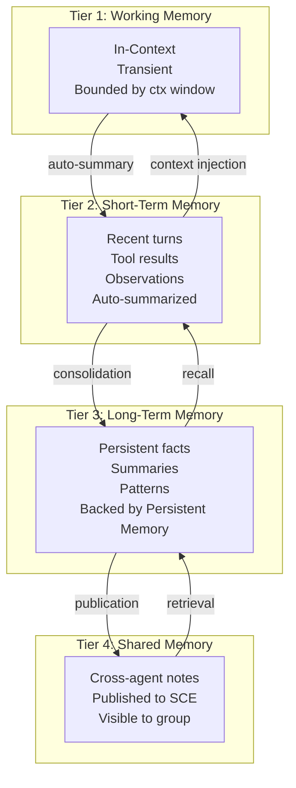

# Agent Memory

> **Domain:** Per-Agent Memory Model
> **Applies to:** Kernel, Agent Runtime, Persistent Memory
> **Last updated:** 2026-07-22

## Overview

Every agent in AI Dev OS has a four-tier memory system that balances context cost, recall speed, and persistence. The tiers form a hierarchy: data flows upward through consolidation and downward through retrieval.



## Memory Tiers

### Working Memory (Tier 1)

- **Storage:** In-context — held in the agent's prompt window.
- **Lifetime:** Transient — lost when the turn ends unless explicitly captured.
- **Bound:** Limited to the model's context window (minus system prompt and tools).
- **Content:** Current task instructions, immediate observations, intermediate reasoning.
- **Persistence:** None unless promoted via `remember()`.

### Short-Term Memory (Tier 2)

- **Storage:** Recent interaction history stored in a ring buffer.
- **Lifetime:** Configurable TTL (default: 30 minutes), evicted by LRU.
- **Capacity:** Default 10,000 tokens of recent turns, tool results, and observations.
- **Auto-summarization:** When the buffer exceeds 70% capacity, `summarize()` produces a compressed digest. The digest replaces the oldest 50% of entries.
- **Indexing:** Each entry is tagged with a turn ID, timestamp, and importance score (0.0–1.0).

### Long-Term Memory (Tier 3)

- **Storage:** Persistent Memory (encrypted SQLite + vector index).
- **Lifetime:** Until explicitly deleted or consolidated away by retention policy.
- **Content:** Cross-session facts, learned patterns, agent summaries, skill definitions.
- **Backing store:** Persistent Memory — survives agent restarts and workspace restarts.
- **Retention policy:** Entries with importance < 0.3 are candidates for pruning after 7 days. Entries with importance > 0.8 are preserved indefinitely.

### Shared Memory (Tier 4)

- **Storage:** Published as named notes on the SCE event bus.
- **Visibility:** All agents in the same group or workspace (depending on the SCE topic scope).
- **Lifetime:** Until explicitly unpublished or the SCE topic is compacted.
- **Use cases:** Shared context (e.g., "database schema loaded by agent-alpha"), coordination markers ("phase-1 complete"), conflict markers ("file-X locked by agent-beta").

## Promotion Path

Data moves through the tiers via a consolidation pipeline:

```
Working Memory
    │  turn ends
    ▼
Short-Term Memory
    │  importance > 0.5 AND (buffer 70% full OR 5 min idle)
    ▼
Long-Term Memory
    │  published_to_scce = true AND group_visible
    ▼
Shared Memory
```

**Consolidation rules:**
1. Every turn end: the agent calls `consolidate()` which scans Working Memory for facts with importance > 0.5.
2. If Short-Term Memory exceeds 70% capacity: `summarize()` runs, creating a digest that is immediately promoted to Long-Term Memory.
3. Long-Term Memory entries tagged `shared: true` are automatically published to the SCE shared topic.
4. Entries with `ttl: <duration>` are evicted from Long-Term Memory after the TTL expires.

## Memory Retrieval

Retrieval is **scope-aware** and **escalating**:

```python
def recall(query, scope="local"):
    # 1. Check Working Memory (fast, exact match)
    results = working_memory.match(query)
    if results and len(results) >= scope.min_results:
        return results

    # 2. Check Short-Term Memory (recent context)
    results = short_term_memory.search(query)
    if results and len(results) >= scope.min_results:
        return results

    # 3. Check Long-Term Memory (semantic search)
    results = long_term_memory.search(query, top_k=10)
    if results and len(results) >= scope.min_results:
        return results

    # 4. Check Shared Memory (cross-agent)
    results = shared_memory.search(query, topic=scope.topic)
    return results
```

Each tier adds latency but expands recall breadth. The agent can set `scope.min_results` to tune the tradeoff.

## Memory Eviction

| Tier | Strategy | Default Limit |
|------|----------|---------------|
| Working Memory | LRU — oldest entries dropped when context window fills. | Model-dependent (typically 8K–128K tokens). |
| Short-Term Memory | TTL-based (entry age > max_ttl) + LRU (buffer full). | 10,000 tokens / 30 min TTL. |
| Long-Term Memory | Retention-based (importance < threshold + age > retention_period). | 100,000 entries / 7 day retention. |
| Shared Memory | Explicit unpublish or SCE topic compaction. | Unlimited (topic compaction by event count). |

## Interfaces

| Interface | Description |
|-----------|-------------|
| `remember(key, value, importance, ttl?)` | Store a fact in Working Memory (auto-promoted on turn end). |
| `recall(query, scope?)` | Retrieve matching facts (escalating tier search). |
| `forget(key_pattern)` | Remove facts matching the pattern from all tiers. |
| `consolidate()` | Manually trigger promotion from Working → Short-Term → Long-Term. |
| `summarize(buffer_id?)` | Generate a summary digest of Short-Term Memory entries. |
| `memory.stats()` | Return counts and token usage per tier. |
| `memory.clear(tier?)` | Clear a specific tier (or all tiers). |

## Usage Example

```typescript
// Agent stores a fact during a coding task
await agent.remember(
  "db_schema.users_table",
  "users table has columns: id (uuid), email (text), created_at (timestamptz)",
  { importance: 0.9, ttl: "7d" }
);

// Later in the same session, recall with escalating scope
const schema = await agent.recall("users table schema", { min_results: 1 });
// 1. Checks Working Memory (miss)
// 2. Checks Short-Term Memory (hit — just consolidated from working)
// 3. Returns immediately with recent context

// Across sessions, after consolidation to Long-Term Memory:
const schema = await agent.recall("users table schema", { min_results: 1 });
// 1. Working Memory: miss
// 2. Short-Term Memory: miss (evicted by TTL)
// 3. Long-Term Memory: hit (semantic search, score: 0.94)
// 4. Returns the persisted fact

// Agent publishes a shared note for sibling agents
await agent.remember(
  "phase.3.complete",
  "Database migration applied. Schema version now 42.",
  { importance: 0.8, shared: true, scope: "group" }
);
// This is automatically published to the SCE shared topic and visible to all agents in the group.
```

## Failure Modes

| Mode | Detection | Response |
|------|-----------|----------|
| Corrupt recall | Memory retrieval returns malformed or incomplete data | Validate each entry against schema; drop corrupt entries; log warning; re-consolidate from raw observations |
| Stale context | Tier 2 Short-Term Memory contains outdated information beyond its TTL | Enforce TTL eviction; tag entries with `cached_at` timestamp; agent can force refresh via `recall(query, { freshen: true })` |
| Memory limit hit | Tier 2 ring buffer exceeds configured capacity | LRU eviction of oldest entries; auto-summarization compresses oldest 50%; emit `memory.capacity_warning` metric |
| Concurrent write conflicts | Two agents write to the same Long-Term Memory key simultaneously | Last-writer-wins with timestamp ordering; conflict logged with both agent IDs; shared memory uses SCE event ordering for consistency |
| Promotion failure | `consolidate()` fails to promote Working Memory to Short-Term Memory | Retry with backoff; if persistent, preserve Working Memory content for the next turn and log error |
| Encryption key unavailable | Tier 3 storage cannot decrypt due to missing or rotated key | Mark memory as `unavailable`; fail open to agent with degraded performance; alert operator for key recovery |

## Security Considerations

- **Memory isolation between projects:** Each project's memory store is backed by a separate encrypted SQLite database. Agents from project A cannot read or write memory entries belonging to project B.
- **Encryption at rest:** Long-Term Memory (Tier 3) is encrypted with AES-256-GCM. The encryption key is derived from the workspace master key and stored in the OS keychain. Shared Memory events on the SCE are also encrypted when the topic is marked `encrypted: true`.
- **Access control:** Memory operations are gated by the same ABAC policy engine used by the Kernel. `remember()` and `recall()` check the caller's identity against the memory entry's project and group scope before allowing access.
- **Ephemeral tiers:** Working Memory (Tier 1) and Short-Term Memory (Tier 2) exist only in process memory and are never written to disk. They are zeroed on agent teardown.
- **Audit:** All `remember()`, `forget()`, and `clear()` operations are logged to the Audit Log with caller identity, key pattern, and timestamp.

See [Security Overview](./SECURITY.md) and [Encryption](./ENCRYPTION.md).

## Observability

| Metric | Type | Labels | Description |
|--------|------|--------|-------------|
| `memory_tier_size_total` | Gauge | `tier` | Current entry count per tier |
| `memory_tier_tokens_total` | Gauge | `tier` | Token consumption per tier |
| `memory_recall_latency_seconds` | Histogram | `tier`, `hit` | Recall latency per tier, whether result was found |
| `memory_consolidation_total` | Counter | `source_tier`, `target_tier` | Consolidation promotions between tiers |
| `memory_eviction_total` | Counter | `tier`, `reason` | Evictions by tier and reason (ttl/lru/retention) |
| `memory_summarization_total` | Counter | `tier` | Auto-summarization runs |
| `memory_conflict_total` | Counter | `tier` | Concurrent write conflicts detected |
| `memory_access_denied_total` | Counter | `operation` | ABAC-denied memory operations |

Traces: one span per `recall()` and `consolidate()` call, with child spans for each tier accessed.

## Acceptance Criteria

- An agent stores a fact via `remember("deploy_key", "value", { importance: 0.9 })` and immediately recalls it from Working Memory in the same turn — recall time under 10 ms.
- The same fact is recalled from Long-Term Memory in a new session after consolidation — recall returns the correct value with a similarity score above 0.9.
- Filling Short-Term Memory beyond 70% capacity triggers auto-summarization within 5 seconds, producing a digest entry in Long-Term Memory.
- An agent from project A attempting `memory.query` on project B's scope receives an ABAC denial — the operation returns an empty result set and increments `memory_access_denied_total`.
- Concurrent `remember()` calls to the same Long-Term Memory key from two agents resolve via last-writer-wins with a logged conflict entry — no data corruption or crash occurs.

## Related Documents

| Document | Description |
|----------|-------------|
| [Persistent Memory](PERSISTENT_MEMORY.md) | Long-term storage backend, encryption, compaction |
| [Context Window Management](CONTEXT_WINDOW_MANAGEMENT.md) | Token budgeting, truncation, sliding window |
| [Knowledge System](KNOWLEDGE_SYSTEM.md) | Main KB, Global KB, FTS5 search |
| [Agent Lifecycle](AGENT_LIFECYCLE.md) | Agent creation, dispatch, teardown |
| [Embeddings](EMBEDDINGS.md) | Vector generation for semantic memory search |
