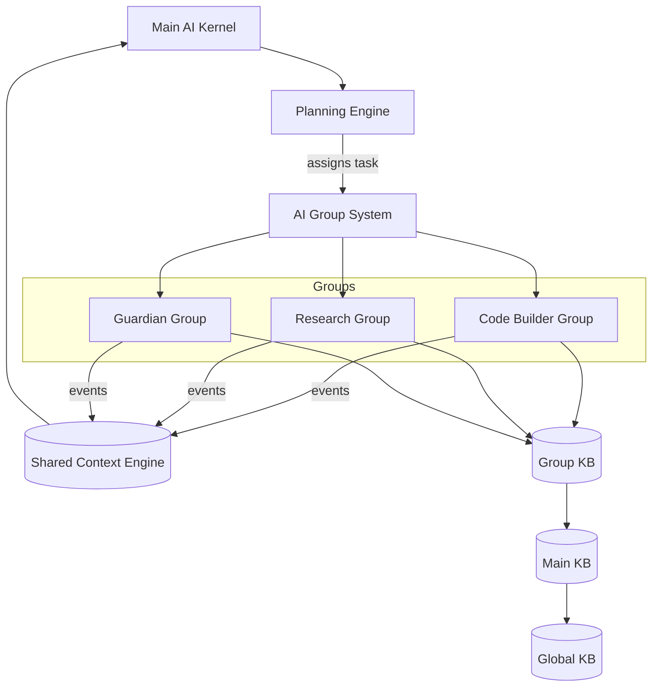

# AI Groups

> The catalog of named role-clusters that the OS uses to assemble specialist teams for every task category. This document is normative — implementations MUST satisfy every MUST clause below.

## Overview

AI Groups are the primary organisational unit of the AI Development Operating System. A Group is a named, declarative cluster of agent roles, model preferences, shared prompts, and knowledge-base scope. When the [Planning Engine](./PLANNING_ENGINE.md) decomposes a goal into tasks, it assigns each task to exactly one lead Group. The [AI Group System](./AI_GROUP_SYSTEM.md) then assembles the workers for that Group, enforcing isolation so that a misbehaving Group cannot destabilise the [Main AI Kernel](./MAIN_AI_KERNEL.md) or another Group.

Groups are **declarative**: adding, renaming, or retiring a Group is a documentation change — a new or updated `GroupSpec` YAML front matter block in a doc under `docs/groups/`. No code change is required to register a Group with the runtime.

Every Group communicates exclusively through the [Shared Context Engine](./SHARED_CONTEXT_ENGINE.md). A Group never calls another Group's workers directly; it publishes a request event and the Kernel routes the response.

## Goals

- Every task maps to exactly one lead Group so responsibility is unambiguous.
- Groups own playbooks (step-by-step procedures) and shared prompts in their Group KB.
- Groups declare which roles they need; the Group System assembles matching workers at task-start time.
- Groups are composable — a parent Group may spawn child Groups for sub-problems, always under Kernel supervision.
- Group membership, model preferences, and KB scope are version-controlled alongside the rest of the documentation.

## Non-Goals

- Implementation code — this repository is documentation-only (see [AI Coding Rules](./AI_CODING_RULES.md)).
- Cross-Group direct RPC — Groups talk through the SCE, never peer-to-peer.
- Duplicating contracts that belong to another subsystem; link instead.

## GroupSpec Schema

Every Group is defined by a YAML front matter block at the top of its specification document:

```yaml
---
group:
  id: string                  # stable kebab-case identifier, e.g. "code-builder"
  name: string                # human display name
  mission: string             # one-sentence statement of purpose
  roles:                      # roles this Group activates (subset of the Nine)
    - kernel                  # optional — most Groups do not own a Kernel slot
    - planner
    - builder
    - critic
  default_models:             # optional role → model overrides for this Group
    builder: "anthropic/claude-opus-4-5"
    critic:  "openai/gpt-4o"
  tools:                      # tool names this Group is permitted to invoke
    - file_read
    - file_write
    - shell_exec
    - web_search
  kb_scope:                   # knowledge bases this Group reads
    - global
    - main
    - group                   # this Group's own KB
  playbooks:                  # links to procedure docs in docs/playbooks/
    - "../../playbooks/code-review.md"
  parent: string?             # parent group id for nested Groups
---
```

## The Standard Groups

AI Dev OS ships with the following built-in Groups. Each has a normative specification document linked below. Operators MAY add custom Groups without modifying the built-in catalog.

### Orchestration Groups

| Group ID | Name | Mission |
|----------|------|---------|
| `kernel-ops` | Kernel Operations | Manage the Kernel loop itself — health, scheduling, budget enforcement |
| `planning` | Planning Group | Translate user goals into `TaskGraph` structures |
| `routing` | Routing Group | Assign models to tasks and maintain fallback chains |

### Development Groups

| Group ID | Name | Mission |
|----------|------|---------|
| `code-builder` | Code Builder | Write, edit, and test application code |
| `code-reviewer` | Code Reviewer | Review diffs for correctness, style, and security |
| `debugger` | Debugger | Diagnose failures and produce minimal reproductions |
| `refactor` | Refactor Group | Restructure code without changing behaviour |
| `test-writer` | Test Writer | Generate unit, integration, and e2e tests |
| `doc-writer` | Doc Writer | Produce and maintain technical documentation |

### Knowledge Groups

| Group ID | Name | Mission |
|----------|------|---------|
| `researcher` | Research Group | Gather, synthesise, and summarise external knowledge |
| `knowledge-curator` | Knowledge Curator | Maintain and deduplicate all knowledge bases |
| `graph-maintainer` | Graph Maintainer | Keep the Obsidian knowledge graph consistent |

### Operations Groups

| Group ID | Name | Mission |
|----------|------|---------|
| `devops` | DevOps Group | Configure CI/CD, infrastructure, and deployments |
| `security` | Security Group | Threat-model, audit, and harden the system |
| `performance` | Performance Group | Profile, benchmark, and optimise hot paths |

### Governance Groups

| Group ID | Name | Mission |
|----------|------|---------|
| `guardian` | Architecture Guardian Group | Enforce invariants and veto unsafe changes |
| `merger` | Merge Group | Reconcile parallel agent edits safely |
| `critic-panel` | Critic Panel | Multi-perspective review and quality gates |

## Architecture



The subsystem is stateless at the process boundary; all durable state lives in the [Persistent Memory](./PERSISTENT_MEMORY.md) tier and is projected on demand.

## Interfaces

```
# GroupSpec registration (declarative — parsed from doc front matter at startup)
groups.list() → GroupSpec[]
groups.get(group_id) → GroupSpec
groups.validate(spec) → ValidationResult   # dry-run before writing a new doc

# Runtime (called by the Group System, not user code)
groups.roles(group_id) → NineRole[]
groups.tools(group_id) → ToolName[]
groups.kb_scope(group_id) → KBScope[]
groups.playbooks(group_id) → Playbook[]
```

All interfaces follow the envelope defined in [Agent Communication](./AGENT_COMMUNICATION.md) and the error contract defined in [API Spec](./API_SPEC.md).

## Data Model

```
GroupSpec {
  id:             string          # kebab-case, globally unique
  name:           string
  mission:        string          # ≤ 120 chars
  roles:          NineRole[]      # required roles; must be non-empty
  default_models: { [role]: model_id }?
  tools:          ToolName[]
  kb_scope:       ("global"|"main"|"group"|"individual")[]
  playbooks:      FilePath[]
  parent:         GroupId?
  version:        semver          # doc version, not runtime version
}
```

```
GroupKB {
  group_id:    string
  entries:     KBEntry[]         # see knowledge-bases/GROUP_KB.md
  playbooks:   Playbook[]
}
```

Retention and encryption rules are inherited from [Data Retention](./DATA_RETENTION.md) and [Encryption](./ENCRYPTION.md).

## Knowledge Base Scope

Each Group reads from a layered KB hierarchy. A query fans out from the narrowest scope (Individual) to the broadest (Global) and merges results, with narrower entries taking precedence on conflict:

```
Individual KB  →  Group KB  →  Main KB  →  Global KB
    (agent)       (group)      (project)   (system-wide)
```

Full KB specifications:
- [Global KB](./knowledge-bases/GLOBAL_KB.md)
- [Main KB](./knowledge-bases/MAIN_KB.md)
- [Group KB](./knowledge-bases/GROUP_KB.md)
- [Individual KB](./knowledge-bases/INDIVIDUAL_KB.md)

## Requirements

- **MUST** be consumable by both humans and AI agents without code inspection.
- **MUST** publish every state change (Group spawned, Group retired, playbook updated) to the [Shared Context Engine](./SHARED_CONTEXT_ENGINE.md).
- **MUST** pass every rule enforced by the [Architecture Guardian](./ARCHITECTURE_GUARDIAN.md).
- **MUST** be observable through the metrics defined in [Observability](./OBSERVABILITY.md).
- **MUST** ensure that every task assigned to a Group that lacks a required role causes the Planner to block and request reassignment.
- **MUST** validate every `GroupSpec` front matter block at doc-parse time; an invalid spec MUST NOT be registered.
- **SHOULD** degrade gracefully — if a non-critical role in a Group is unavailable, the Group MAY proceed with a warning rather than failing.
- **MAY** be extended via the [Plugin SDK](./PLUGIN_SDK.md) when the extension point is declared in the GroupSpec.

## Failure Modes

| Mode | Detection | Response |
|------|-----------|----------|
| Required role missing from Group | Role not in `GroupSpec.roles` | Planner blocks task; requests reassignment |
| Group KB unavailable | SCE write NAK | Buffer locally; retry with backoff; alert |
| Playbook not found | Missing file reference | Warn; proceed without playbook if non-critical |
| Invalid GroupSpec | Schema validation failure | Refuse to register; surface error to doc author |
| Group worker crash loop | Repeated heartbeat misses | Group System opens circuit breaker; Kernel notified |

Every failure emits a structured event on the SCE and is recorded in the [Audit Log](./AUDIT_LOG.md).

## Security Considerations

- A Group's tool list is enforced at capability-grant time by the Kernel; a worker that requests a tool not in the Group's `tools[]` list is denied.
- Group KB entries are scoped — a Group cannot read another Group's KB without an explicit cross-group grant.
- Trust boundary: Groups communicate only through signed SCE events (see [Security Model](./SECURITY_MODEL.md)).
- Secrets are read from [Secrets Management](./SECRETS_MANAGEMENT.md); never inlined in GroupSpec.

## Observability

| Metric | Labels | Description |
|--------|--------|-------------|
| `group_task_assigned_total` | `group_id` | Tasks routed to each Group |
| `group_task_duration_seconds` | `group_id`, `state` | Task execution time histogram |
| `group_worker_count` | `group_id` | Current active worker count |
| `group_kb_query_total` | `group_id`, `scope` | KB queries per Group per scope |
| `group_playbook_invocations_total` | `group_id`, `playbook` | Playbook step executions |

Traces and logs conform to [Observability](./OBSERVABILITY.md), [Tracing](./TRACING.md), and [Logging](./LOGGING.md). Every run carries a `correlation_id` propagated from the Kernel.

## Acceptance Criteria

- Adding a new Group by creating a new doc with a valid `GroupSpec` front matter causes it to appear in `groups.list()` after a doc-parse cycle — no code change required.
- Attempting to assign a task to a Group that lacks the `builder` role when the task type requires `builder` causes the Planner to emit a `task.blocked` event with reason `missing_role`.
- A Group's KB query returns Group-scoped entries first, falling back to Main, then Global, in ≤ 50 ms for a warmed cache.
- Retiring a Group (setting `status: retired` in the front matter) removes it from `groups.list()` but preserves all historical events in the [Audit Log](./AUDIT_LOG.md).

## Open Questions

- Whether nested Group hierarchies (parent/child) should inherit parent tool lists or require explicit declaration at each level — tracked in [templates/ADR](../templates/ADR.md).
- Optimal default Group set for a minimal single-developer workspace vs. a large engineering org.

## Related Documents

- [AI Group System](./AI_GROUP_SYSTEM.md) — the runtime that assembles and supervises Groups
- [Dynamic Workers](./DYNAMIC_WORKERS.md) — workers spawned within Groups
- [Planning Engine](./PLANNING_ENGINE.md) — assigns tasks to Groups
- [Model Routing Policy](./MODEL_ROUTING_POLICY.md) — Group-level model overrides
- [Knowledge System](./KNOWLEDGE_SYSTEM.md) — KB layer Group reads from
- [knowledge-bases/GROUP_KB.md](./knowledge-bases/GROUP_KB.md)
- [System Overview](./SYSTEM_OVERVIEW.md)
- [Main AI Kernel](./MAIN_AI_KERNEL.md)
- [Architecture Guardian](./ARCHITECTURE_GUARDIAN.md)
