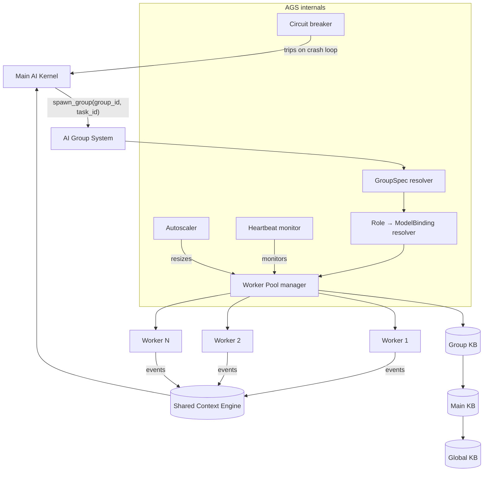
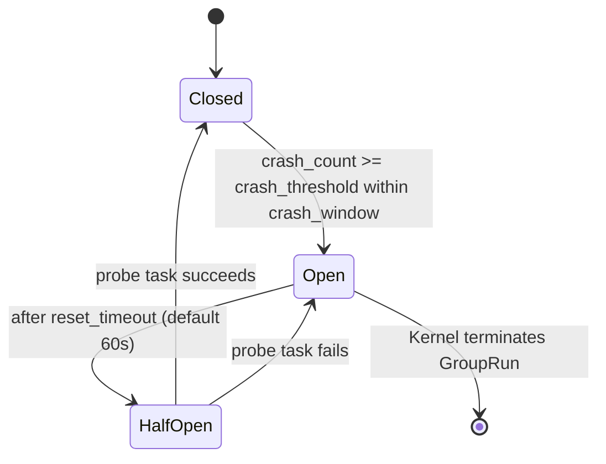

# AI Group System

> The runtime that assembles, schedules, supervises, and elastically scales AI Groups. This document is normative — implementations MUST satisfy every MUST clause below.

## Overview

The AI Group System (AGS) is the process-level supervisor that sits between the [Main AI Kernel](./MAIN_AI_KERNEL.md) and individual [Dynamic Workers](./DYNAMIC_WORKERS.md). When the Kernel assigns a task to a Group, the AGS is responsible for:

1. Looking up the `GroupSpec` from the [AI Groups](./AI_GROUPS.md) catalog.
2. Resolving required roles to `ModelBinding` objects via the [Nine Router](./NINE_ROUTER.md).
3. Spawning the right number of workers from the [Dynamic Workers](./DYNAMIC_WORKERS.md) pool.
4. Monitoring worker health and triggering elastic scaling.
5. Collecting worker outputs and assembling a `GroupResult` for the Kernel's Critic stage.
6. Enforcing isolation so that a failing Group cannot contaminate other Groups or the Kernel.

The AGS is stateless at the process boundary; all durable state — task assignments, worker health records, `GroupRun` entities — lives in [Persistent Memory](./PERSISTENT_MEMORY.md) and is projected on demand via the [Shared Context Engine](./SHARED_CONTEXT_ENGINE.md).

## Goals

- **Elastic scaling**: spin workers up when the Group's task queue deepens; scale to zero when idle.
- **Failure isolation**: a Group that enters a crash loop opens a circuit breaker and notifies the Kernel without touching other Groups.
- **Uniform observability**: every Group exposes the same health endpoint and metric set regardless of its domain.
- **Fast cold-start**: a Group with no cached workers MUST start its first worker within two scheduler ticks.
- **Deterministic teardown**: when a `GroupRun` terminates (success or failure), all workers MUST release tool handles and report their final state within one heartbeat window.

## Non-Goals

- Implementation code — this repository is documentation-only (see [AI Coding Rules](./AI_CODING_RULES.md)).
- Scheduling across Groups (that is the Kernel's job); the AGS only schedules within a Group.
- Peer-to-peer Group communication — Groups talk through the SCE.
- Duplicating contracts that belong to another subsystem; link instead.

## Architecture



## Requirements

- **MUST** resolve a `GroupSpec` for every `spawn_group` call; if the Group ID is unknown, return `GROUP_NOT_FOUND` immediately without starting any workers.
- **MUST** resolve all roles declared in the `GroupSpec` to valid `ModelBinding` objects before spawning any worker; if resolution fails for a required role, return `ROLE_UNRESOLVABLE`.
- **MUST** publish `group.spawned`, `group.worker_added`, `group.worker_removed`, `group.completed`, and `group.failed` events on the `group.<group_id>` SCE topic.
- **MUST** enforce the Group's `tools[]` capability list: workers that request an undeclared tool receive `TOOL_DENIED`.
- **MUST** enforce the Group's `kb_scope[]`: workers can only read KB tiers in the declared scope.
- **MUST** implement a heartbeat protocol: workers MUST ping the AGS every `heartbeat_interval` (default 5 s); a missed heartbeat triggers reassignment after `heartbeat_grace` (default 15 s).
- **MUST** implement a circuit breaker: if the same worker or task crashes more than `crash_threshold` times (default 3) within `crash_window` (default 60 s), open the breaker and notify the Kernel.
- **MUST** support graceful shutdown: `system.shutdown_group(group_id)` drains the task queue, waits for in-flight workers to checkpoint, then terminates.
- **SHOULD** implement elastic autoscaling: scale workers up when `queue_depth / worker_count > scale_up_ratio` (default 2.0); scale down when `queue_depth / worker_count < scale_down_ratio` (default 0.5) for `scale_down_cooldown` (default 30 s).
- **SHOULD** reuse warm workers across tasks in the same Group run to avoid cold-start latency.
- **MAY** allow a `GroupSpec` to declare a fixed `min_workers` / `max_workers` to override autoscaling bounds.

## Interfaces

```
# Lifecycle (called by Kernel)
system.spawn_group(group_id, task_id, ctx?) → GroupRun
system.shutdown_group(group_id, run_id, drain?: bool) → Ack
system.report(group_id) → GroupHealth

# Introspection (called by CLI, UI, monitoring)
system.list_runs(group_id?, state?) → GroupRun[]
system.get_run(run_id) → GroupRun
system.workers(run_id) → WorkerInfo[]

# Autoscaling config (called by Ops)
system.set_scaling_policy(group_id, policy) → Ack
system.get_scaling_policy(group_id) → ScalingPolicy
```

### GroupHealth shape

```
GroupHealth {
  group_id:     string
  state:        "idle" | "running" | "degraded" | "circuit_open"
  worker_count: number
  queue_depth:  number
  crash_count:  number     # within current crash_window
  last_hb_ts:   rfc3339
  circuit:      { open: bool, opened_at?: rfc3339, reason?: string }
}
```

All interfaces follow the envelope defined in [Agent Communication](./AGENT_COMMUNICATION.md) and the error contract defined in [API Spec](./API_SPEC.md).

## Data Model

```
GroupRun {
  id:          ulid
  group_id:    string
  task_id:     ulid
  workers:     WorkerInfo[]
  state:       "assembling" | "running" | "draining" | "completed" | "failed"
  started:     rfc3339
  ended:       rfc3339?
  verdict:     Verdict?
  crash_count: number
  correlation_id: uuid
}

WorkerInfo {
  id:          ulid
  role:        NineRole
  model:       ModelBinding
  state:       "starting" | "idle" | "executing" | "checkpointing" | "terminated"
  last_hb:     rfc3339
  tasks_done:  number
  crashes:     number
}

ScalingPolicy {
  group_id:         string
  min_workers:      number   # default 0
  max_workers:      number   # default 10
  scale_up_ratio:   number   # default 2.0
  scale_down_ratio: number   # default 0.5
  cooldown_s:       number   # default 30
}
```

Retention and encryption rules are inherited from [Data Retention](./DATA_RETENTION.md) and [Encryption](./ENCRYPTION.md).

## Heartbeat Protocol

```
Worker → AGS : { type: "hb", worker_id, run_id, ts, task_id?, progress? }
AGS    → Worker : { type: "hb_ack", next_hb_deadline: ts }

On missed heartbeat (no ping within heartbeat_grace):
  1. Emit group.worker_timeout event on SCE
  2. Mark worker state: "terminated"
  3. Re-enqueue orphaned task_id
  4. Spawn replacement worker (if crash_count < crash_threshold)
  5. Else: increment crash_count; if >= crash_threshold → open circuit breaker
```

## Circuit Breaker States



When the breaker is Open:
- No new workers are spawned for the Group.
- Pending tasks are returned to the Kernel queue with priority `retry`.
- The Kernel is notified via `group.circuit_open` SCE event.
- The UI shows the Group as **Degraded**.

## Elastic Autoscaling

The autoscaler runs every `scale_eval_interval` (default 5 s) per active GroupRun:

```
desired = ceil(queue_depth / target_concurrency)   # target_concurrency default 1
desired = clamp(desired, min_workers, max_workers)

if desired > current_worker_count:
  if ts_since_last_scale_up > scale_up_cooldown (0s):
    spawn(desired - current_worker_count) workers
elif desired < current_worker_count:
  if ts_since_last_scale_down > scale_down_cooldown (30s):
    drain_and_remove(current_worker_count - desired) workers
```

Scale-down removes workers that have been idle the longest first. A worker mid-task is never preempted — it completes the current task before removal.

## Failure Modes

| Mode | Detection | Response |
|------|-----------|----------|
| Group ID unknown | `spawn_group` with unregistered ID | Return `GROUP_NOT_FOUND`; do not start |
| Role unresolvable | Nine Router returns no binding | Return `ROLE_UNRESOLVABLE`; Kernel replans |
| Worker crash loop | crash_count ≥ threshold | Open circuit breaker; notify Kernel |
| Heartbeat timeout | No HB within grace period | Reassign task; spawn replacement |
| Scale-up failure | Worker pool at max | Queue tasks; emit `group.queue_saturated`; alert |
| GroupSpec invalid | Front-matter parse error | Refuse to spawn; surface error to operator |
| Shutdown timeout | Workers don't terminate within `shutdown_grace` | SIGKILL; emit `group.forced_shutdown`; audit |

Every failure emits a structured event on the SCE and is recorded in the [Audit Log](./AUDIT_LOG.md).

## Security Considerations

- The AGS acts as a capability broker: it only grants the tools and KB scopes declared in the `GroupSpec`. Worker-level over-reach is denied at the AGS boundary.
- All `spawn_group` calls are authenticated: only the Kernel (or an operator with explicit permission) may spawn a Group.
- Worker identities are ephemeral ULID tokens issued per-GroupRun; they expire when the GroupRun terminates.
- The circuit breaker state is persisted to the Audit Log to prevent tampering.
- See [Security Model](./SECURITY_MODEL.md) and [AuthZ/RBAC](./AUTHZ_RBAC.md).

## Observability

| Metric | Labels | Description |
|--------|--------|-------------|
| `ags_group_spawn_total` | `group_id`, `ok` | Spawn attempts |
| `ags_worker_count` | `group_id`, `state` | Current worker count by state |
| `ags_queue_depth` | `group_id` | Pending task count |
| `ags_heartbeat_miss_total` | `group_id` | Missed heartbeat events |
| `ags_crash_total` | `group_id` | Worker crash events |
| `ags_circuit_open_total` | `group_id` | Circuit breaker trips |
| `ags_scale_event_total` | `group_id`, `direction=up\|down` | Autoscale events |
| `ags_group_run_seconds` | `group_id`, `state` | GroupRun duration histogram |

Traces: one span per `spawn_group` call, with child spans per worker lifecycle event. See [Tracing](./TRACING.md).

## Acceptance Criteria

- `system.spawn_group("code-builder", task_id)` succeeds within two scheduler ticks on a machine with at least one local model assigned to the Builder role.
- A worker that misses three consecutive heartbeats causes the task to be re-enqueued and a replacement worker spawned, without manual intervention.
- Opening the circuit breaker on Group `code-builder` causes all pending tasks for that Group to be returned to the Kernel queue with `retry` priority within one scheduler tick.
- Scaling a GroupRun from 1 to 3 workers when queue depth crosses `scale_up_ratio` is reflected in `system.workers(run_id)` within `scale_eval_interval`.
- `system.shutdown_group(group_id, drain: true)` completes within `shutdown_grace` (default 30 s) when all workers checkpoint cleanly.

## Open Questions

- Whether the AGS should own the Critic step for a GroupRun or always delegate back to the Kernel — tracked in [templates/ADR](../templates/ADR.md).
- Optimal `heartbeat_interval` for high-latency network environments (e.g., remote MCP servers).

## Related Documents

- [AI Groups](./AI_GROUPS.md) — GroupSpec catalog
- [Dynamic Workers](./DYNAMIC_WORKERS.md) — workers managed by the AGS
- [Nine Router](./NINE_ROUTER.md) — resolves `ModelBinding` for each role
- [Multi-Agent Orchestration](./MULTI_AGENT_ORCHESTRATION.md)
- [Reliability](./RELIABILITY.md)
- [System Overview](./SYSTEM_OVERVIEW.md)
- [Main AI Kernel](./MAIN_AI_KERNEL.md)
- [Architecture Guardian](./ARCHITECTURE_GUARDIAN.md)
