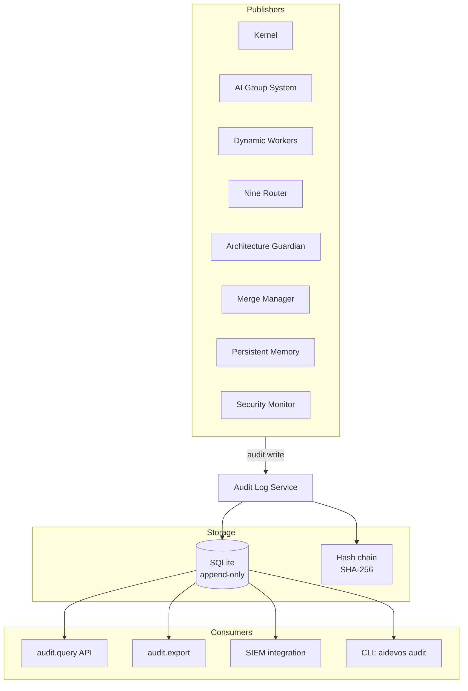

# Audit Log

> Append-only, tamper-evident, hash-chained event store for every security-relevant and operationally-significant action in AI Dev OS. This document is normative — implementations MUST satisfy every MUST clause below.

## Overview

The Audit Log is the system of record for "who did what, when, and with which authority." Every subsystem publishes audit events for actions that cross trust boundaries or affect durable state: Kernel runs, model provider calls, role assignments, memory writes, Guardian verdicts, and security decisions. The log is append-only — events are never modified or deleted — and hash-chained so that tampering with past entries is detectable.

The Audit Log is separate from the [Shared Context Engine](./SHARED_CONTEXT_ENGINE.md) event log: SCE events are operational (high-volume, streaming, topic-organised), while audit events are compliance-oriented (lower-volume, forever-retained, hash-chained). The SCE itself writes audit events for its own administrative actions (topic creation, ACL changes).

## Goals

- Append-only: no modification or deletion of committed events.
- Tamper-evident: hash chain links every event to its predecessor.
- Queryable: filtered by actor, action, resource, time range, and correlation_id.
- Exportable: full or filtered export in JSON and CSV for SIEM ingestion.
- Performance: sustained write throughput of 1,000 events/s on local SQLite; p99 read < 50 ms.

## Non-Goals

- Real-time event streaming — use the [Shared Context Engine](./SHARED_CONTEXT_ENGINE.md) for that.
- Large payload storage (> 64 KB per event detail) — store a reference pointer instead.
- Implementation code — this repository is documentation-only (see [AI Coding Rules](./AI_CODING_RULES.md)).

## Architecture



## AuditEvent Schema

```
AuditEvent {
  id:            ulid                  # monotonic global order
  ts:            rfc3339               # broker-assigned timestamp
  
  actor: {
    id:          string                # kernel | system | agent_id | user_id
    kind:        "kernel"|"agent"|"user"|"system"|"plugin"|"mcp"
    role:        string?               # NineRole for agents
  }

  action:        string                # verb-noun; e.g. "run.submit", "memory.write"
  resource: {
    type:        string                # "run"|"memory"|"model"|"provider"|"group"|etc.
    id:          string?               # resource identifier
    path:        string?               # file path if applicable
  }

  detail:        object?               # action-specific payload (max 64 KB)
  result:        "success"|"denied"|"failure"|"veto"|"timeout"
  reason:        string?               # human-readable explanation on non-success

  correlation_id: uuid                 # from originating Kernel run
  causation_id:  ulid?                 # id of the AuditEvent that caused this one

  # Hash chain
  prev_hash:     string                # SHA-256 of previous AuditEvent (canonical bytes)
  hash:          string                # SHA-256 of this event's canonical bytes (including prev_hash)
  signature:     string                # Ed25519 signed by Kernel
}
```

### Canonical bytes for hashing

```
canonical = JSON.stringify({
  id, ts, actor, action, resource, detail, result, correlation_id, prev_hash
})
hash = SHA256(canonical)
```

## Hash Chain Verification

```
verify_chain(from_id, to_id):
  events = read_range(from_id, to_id)
  for i in 1..len(events)-1:
    expected_prev = SHA256(canonical(events[i-1]))
    assert events[i].prev_hash == expected_prev
  assert verify_signature(events[-1])  # Kernel signature
```

The chain root (first event) has `prev_hash = SHA256("aidevos-audit-log-v1")`. Any gap or mismatch in `prev_hash` indicates tampering.

## Action Taxonomy

| Action category | Examples |
|----------------|----------|
| `run.*` | `run.submit`, `run.start`, `run.complete`, `run.cancel`, `run.fail`, `run.replay` |
| `worker.*` | `worker.spawn`, `worker.complete`, `worker.fail`, `worker.cancel`, `worker.checkpoint` |
| `model.*` | `model.discover`, `model.assigned`, `model.unassigned`, `model.fallback` |
| `provider.*` | `provider.connect`, `provider.auth_error`, `provider.rate_limited`, `provider.degraded` |
| `memory.*` | `memory.write`, `memory.delete`, `memory.expire`, `memory.export` |
| `kb.*` | `kb.write`, `kb.upsert`, `kb.delete` |
| `group.*` | `group.spawn`, `group.shutdown`, `group.circuit_open`, `group.worker_add` |
| `merge.*` | `merge.begin`, `merge.commit`, `merge.conflict`, `merge.resolve` |
| `guardian.*` | `guardian.evaluate`, `guardian.veto`, `guardian.auto_fix` |
| `security.*` | `security.auth_success`, `security.auth_denied`, `security.signature_failure`, `security.key_rotation` |
| `config.*` | `config.set`, `config.delete`, `config.import` |
| `admin.*` | `admin.user_add`, `admin.user_remove`, `admin.workspace_create` |

## Interfaces

```
audit.write(event: AuditEventInput) → AuditEvent    # internal; called by subsystems
audit.get(id: ulid) → AuditEvent
audit.query(filter: AuditFilter) → AuditEvent[]
audit.stream(filter: AuditFilter) → AsyncIterator<AuditEvent>
audit.export(filter: AuditFilter, format: "json"|"csv") → ExportRef
audit.verify(from_id?: ulid, to_id?: ulid) → VerifyReport
audit.stats() → AuditStats
```

### AuditFilter

```
AuditFilter {
  actors?:        string[]
  actions?:       string[]        # prefix match; "run." matches all run actions
  resource_types?: string[]
  resource_ids?:  string[]
  results?:       AuditResult[]
  correlation_id?: uuid
  after?:         rfc3339
  before?:        rfc3339
  limit?:         number          # default 100, max 10000
  offset?:        ulid            # cursor-based pagination
}
```

### AuditStats

```
AuditStats {
  total_events:        number
  oldest_event:        rfc3339
  newest_event:        rfc3339
  events_by_action:    { [action]: number }
  events_by_result:    { [result]: number }
  chain_verified:      boolean
  chain_from:          ulid
  chain_to:            ulid
}
```

## Retention

- Audit events are retained **forever**. There is no expiry or compaction.
- The only permitted deletion is a court-ordered legal hold reversal, which must preserve the hash chain by inserting a `redaction` event (not modifying the original).
- Storage estimate: ~500 bytes per event + detail payload. At 10,000 events/day → ~5 MB/day → ~1.8 GB/year.
- For high-volume deployments, audit sharding by workspace is supported.

## Requirements

- **MUST** be append-only: events MUST NOT be modified or deleted after commit.
- **MUST** implement a SHA-256 hash chain linking every event to its predecessor.
- **MUST** sign every event with the Kernel's Ed25519 key for authenticity.
- **MUST** support query by actor, action, resource type, result, correlation_id, and time range.
- **MUST** export events in JSON and CSV formats.
- **MUST** verify the hash chain on demand and report any gaps or mismatches.
- **MUST** support at least 1,000 events/s sustained write throughput on SQLite backend.
- **SHOULD** emit `audit.chain_gap` alert when hash chain verification fails.
- **SHOULD** support SIEM integration via syslog or Webhook (see [Webhooks](./WEBHOOKS.md)).
- **MAY** shard by workspace for high-volume deployments.

## Failure Modes

| Mode | Detection | Response |
|------|-----------|----------|
| Write failure (disk full) | SQLite error | Buffer to local WAL; alert operator; retry on recovery |
| Hash chain gap | `verify_chain` returns mismatch | Emit `audit.chain_gap` critical alert; freeze non-critical operations; page on-call |
| Corruption (single event) | Checksum mismatch on read | Skip corrupted event; return surrounding events with gap marker; alert |
| Query timeout | Complex filter on large dataset | Return partial results with `truncated: true`; suggest narrower filter |
| Export fails | File write error | Retry with exponential backoff; alert after 3 failures |

## Security Considerations

- The Audit Log is the authoritative source for forensic investigation. Its integrity is protected by the hash chain and Kernel signature — even a compromised Kernel cannot silently alter past events without breaking the chain.
- Read access is governed by [AuthZ/RBAC](./AUTHZ_RBAC.md): operators see all events; agents see only events within their `correlation_id` scope.
- The `detail` field MUST NOT contain secrets, credentials, or PII. Subsystems MUST sanitize before calling `audit.write`.
- See [Security Model](./SECURITY_MODEL.md) for key management and signing.

## Observability

| Metric | Labels | Description |
|--------|--------|-------------|
| `audit_write_total` | `result` | Events written |
| `audit_write_seconds` | — | Write latency histogram |
| `audit_query_seconds` | — | Query latency histogram |
| `audit_export_bytes` | `format` | Export size |
| `audit_total_events` | — | Current event count gauge |
| `audit_chain_gap_total` | — | Chain verification failures |

## Acceptance Criteria

- Writing 10,000 events sequentially and calling `verify_chain()` returns `{ verified: true }`.
- Tampering with one byte of an event's `detail` field causes the subsequent `verify_chain()` call to report a gap at the modified event's position.
- `audit.query({ actions: ["run.submit"], limit: 5 })` returns 5 events with `action == "run.submit"` ordered by `id` descending.
- Exporting 100,000 events as CSV produces a valid CSV file with all events in order.
- Simultaneously writing from 10 concurrent publishers sustains 1,000 events/s on a commodity SSD.

## Open Questions

- Whether to support external immutable storage backends (AWS Glacier, Azure Blob immutable) for long-term archive — tracked in [templates/ADR](../templates/ADR.md).
- Hash chain verification frequency: on every read vs. periodic background job vs. on-demand only.

## Related Documents

- [Security Model](./SECURITY_MODEL.md) — trust architecture and signing
- [Shared Context Engine](./SHARED_CONTEXT_ENGINE.md) — operational event log
- [Observability](./OBSERVABILITY.md) — metrics and alerting
- [Data Retention](./DATA_RETENTION.md) — retention policies for non-audit data
- [System Overview](./SYSTEM_OVERVIEW.md)
- [Main AI Kernel](./MAIN_AI_KERNEL.md)
- [Architecture Guardian](./ARCHITECTURE_GUARDIAN.md)
