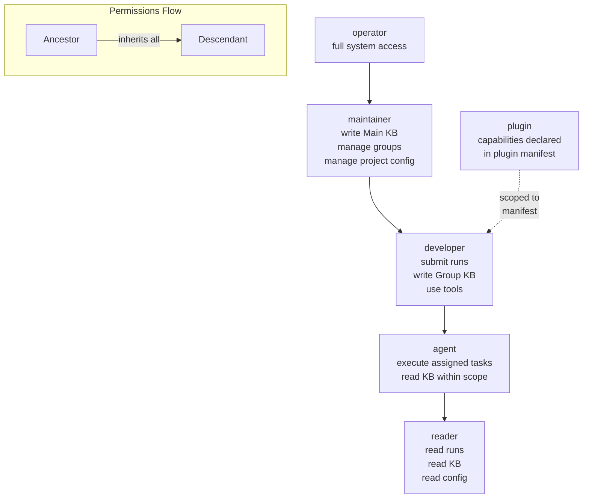

# AuthZ / RBAC

> Declarative role-based access control for AI Dev OS — role hierarchy, permission definitions, scope model, and runtime resolution algorithm. This document is normative — implementations MUST satisfy every MUST clause below.

## Overview

AuthZ/RBAC defines the human- and machine-readable mapping from **roles** to **permissions** across **scopes** in AI Dev OS. It is the policy layer between authentication (who you are — see [Auth System](./AUTH_SYSTEM.md)) and runtime capability enforcement (what you carry — see [Security Model](./SECURITY_MODEL.md)).

The system follows a **hierarchical role model**: roles form a strict inheritance chain where every descendant inherits all permissions of its ancestors. Permissions are granted at four granularity tiers — role defaults, scope overrides, group-level grants, and per-session capability tokens — resolved at runtime into a single effective permission set via the algorithm defined in [Role Resolution](#role-resolution-algorithm).

AuthZ/RBAC does not authenticate actors, sign tokens, or enforce wire-level access. Those responsibilities belong to the Auth System and Security Model respectively. This subsystem answers only "given this identity and scope, what may they do?"

### Relationship to Capability Tokens

The Security Model issues signed `CapabilityToken` objects that carry an explicit `capabilities[]` list. AuthZ/RBAC is the source of truth for deriving that list: given an actor's role(s) and scope, the Kernel calls `rbac.resolve(actor, scope)` to produce the permission set that is then minted into the token. The token is the **runtime instantiation** of the RBAC policy.

```
Identity (from Auth System)
    │
    ▼
rbac.resolve(identity)  ──►  Permission[]
    │
    ▼
Kernel mints CapabilityToken  ──►  Security Model enforces at every call
```

## Goals

- **Declarative role definitions**: every role and its permission set is declared as data (not code), reloadable at runtime.
- **Hierarchical role inheritance**: descendant roles inherit all permissions of their ancestors; override is additive only (no permission removal via inheritance).
- **Scope-based permissions**: every permission is evaluated against a triple `{ workspace, project?, group? }`; the same role may carry different effective permissions in different scopes.
- **Integration with capability tokens**: `rbac.resolve()` is the exclusive input to `CapabilityToken` minting; no capability is granted without an RBAC policy check.
- **Runtime re-evaluation**: role assignments and scope overrides take effect on the next capability resolution, not on next login; no restart required.

## Non-Goals

- Authentication — see [Auth System](./AUTH_SYSTEM.md).
- Token signing, verification, or expiry — see [Security Model](./SECURITY_MODEL.md).
- Wire-level access enforcement — handled by the Kernel's capability gate.
- Audit log of access decisions — see [Audit Log](./AUDIT_LOG.md).
- Implementation code — this repository is documentation-only (see [AI Coding Rules](./AI_CODING_RULES.md)).

## Role Hierarchy



Inheritance is strict: every role possesses the union of its own permissions and all permissions of every ancestor. No permission can be removed at a lower level — only additional permissions can be granted.

## Built-in Roles

| Role | Base Permissions | Typical Scope | Inherits From |
|------|-----------------|---------------|---------------|
| `operator` | `admin.*`, full `config.*`, `memory.*`, `kb.*`, `run.*`, `kernel.*` | Workspace | — (root) |
| `maintainer` | `kb.write.main`, `admin.groups`, `admin.projects`, `config.read`, `config.write` (project-scoped) | Workspace / Project | operator |
| `developer` | `run.submit`, `run.read`, `kb.write.group`, `tool.*`, `memory.read`, `memory.write` | Project / Group | operator → maintainer |
| `agent` | `run.read` (assigned only), `kb.read.*` (within scope), `tool.<assigned>` | Group (per session) | operator → maintainer → developer |
| `reader` | `run.read`, `kb.read.*`, `config.read` | Workspace / Project | operator → maintainer → developer → agent |
| `plugin` | As declared in plugin manifest; no inheritance | Workspace (scoped) | None (ad-hoc) |

### Operator

Full system access. Operators manage users, workspaces, providers, and global configuration. Operators are the only role that can call `admin.*` permissions and modify the workspace-level `config.*` namespace.

### Maintainer

Write access to the Main Knowledge Base, group and project management, and project-scoped configuration. Maintainers cannot modify workspace-level configuration, manage users, or call `admin.*` permissions.

### Developer

Submit and cancel runs, write to Group KBs, read all KBs, use tools (including MCP tools), and read/write memory within the assigned group scope. Developers are the primary human role for daily AI-assisted development work.

### Agent

AI agent role. Agents execute only the tasks they are assigned by a `GroupRun`. They read KBs within their group scope, read run state, and call only the tools listed in their `GroupSpec`. Agents cannot submit runs, cancel runs, write KBs, or modify configuration.

### Reader

Read-only access. Readers can inspect runs, read all KBs (within their scope), and read configuration. Readers cannot execute anything, write anything, or use tools.

### Plugin

Plugins declare their required capabilities in their `plugin.toml` manifest (see [Plugin SDK](./PLUGIN_SDK.md)). The declared capabilities are validated against the installing operator's permissions at install time — a plugin cannot request capabilities the installer does not possess.

## Permission Definitions

Permissions are namespaced, dot-delimited strings that follow a consistent naming convention:
- `domain.subdomain.action` — e.g., `run.submit`, `kb.write.main`
- `domain.*` — wildcard granting all actions within a domain

| Permission | Roles | Description |
|------------|-------|-------------|
| `run.submit` | developer, operator, maintainer | Submit a new run (goal) to the Kernel |
| `run.cancel` | developer, operator, maintainer | Cancel a running or queued run |
| `run.read` | all roles | Read run state, events, and results |
| `run.read.assigned` | agent | Read only runs assigned to this agent |
| `run.replay` | operator | Replay a completed run from its event log |
| `memory.read` | developer, maintainer, operator | Query persistent memory records |
| `memory.write` | developer, maintainer, operator | Write new memory records |
| `memory.delete` | maintainer, operator | Delete memory records |
| `kb.read.global` | all roles | Read Global Knowledge Base |
| `kb.read.main` | all roles | Read Main Knowledge Base |
| `kb.read.group` | all roles | Read Group Knowledge Base (within scope) |
| `kb.write.main` | maintainer, operator | Write to Main Knowledge Base |
| `kb.write.group` | developer, maintainer, operator | Write to Group Knowledge Base (within scope) |
| `tool.*` | developer, operator | Call any native or MCP tool |
| `tool.<name>` | agent, plugin | Call a specific named tool |
| `tool.mcp.<server>.<tool>` | varies | Call a specific MCP server tool |
| `config.read` | all roles | Read system and workspace configuration |
| `config.write` | maintainer, operator | Modify configuration (scoped) |
| `config.write.global` | operator | Modify workspace-level configuration |
| `admin.users` | operator | Manage user accounts and role assignments |
| `admin.groups` | maintainer, operator | Manage AI Groups |
| `admin.projects` | maintainer, operator | Manage projects within a workspace |
| `admin.providers` | operator | Configure model providers |
| `admin.workspace` | operator | Manage workspace settings, deletion, export |
| `admin.audit` | operator | Read and export the Audit Log |
| `admin.*` | operator | All administrative actions |
| `kernel.*` | operator | Kernel-level operations (shutdown, reinit, etc.) |
| `plugin.install` | operator | Install and remove plugins |
| `plugin.call.<id>` | varies | Call a specific plugin (scoped to manifest) |

### Wildcard Resolution

A permission `a.b.*` matches any action under `a.b.<action>`. An empty permission set denies all actions. The wildcard does not cross domain boundaries — `kb.*` matches `kb.read` and `kb.write` but not `kb.read.global` — dot-separated segments are explicit.

## Scope Model

Permissions are always evaluated within a **scope triple**:

```
Scope { workspace: string, project?: string, group?: string }
```

| Scope Level | Granularity | Typical Use |
|-------------|-------------|-------------|
| Workspace | `{ workspace: "ws-xxx" }` | Operator, reader, global config |
| Project | `{ workspace: "ws-xxx", project: "proj-yyy" }` | Maintainer, project-scoped config |
| Group | `{ workspace: "ws-xxx", project: "proj-yyy", group: "group-zzz" }` | Developer, agent, run execution |

### Scope Composition

Role assignments may be scoped at any level. When resolving permissions:

1. A permission granted at workspace scope applies to all projects and groups within that workspace.
2. A permission granted at project scope applies to all groups within that project but not to other projects.
3. A permission granted at group scope applies only within that specific group.
4. When multiple scopes grant the same permission, the **most specific scope wins** for permission presence (the union applies).

```
actor: Alice
role: developer
assignments:
  - scope: { workspace: "ws-1" }                        # can read all KBs in ws-1
  - scope: { workspace: "ws-1", group: "g-team-a" }     # can also write to g-team-a's KB
```

### Scope Validation

Scopes are validated at assignment time:
- A scope MUST reference an existing workspace, project, and group (where specified).
- A project scope MUST be a child of the assigned workspace.
- A group scope MUST be a child of the assigned project (if project specified) or workspace.

## Interfaces

```
# Permission checks
rbac.check(actor: Identity, action: string, resource: ResourceRef) → bool
rbac.check_batch(checks: CheckRequest[]) → CheckResult[]

# Role queries
rbac.roles(actor: Identity) → RoleAssignment[]
rbac.permissions(actor: Identity, scope?: Scope) → string[]    # resolved permission set
rbac.resolve(actor: Identity, scope?: Scope) → ResolvedPolicy  # full policy snapshot

# Role management
rbac.assign(actor: Identity, role: string, scope: Scope) → Ack
rbac.revoke(actor: Identity, role: string, scope: Scope) → Ack
rbac.revoke_all(actor: Identity) → Ack

# Role definitions (read)
rbac.list_roles() → RoleDefinition[]
rbac.get_role(role_id: string) → RoleDefinition

# Scope queries
rbac.list_assignments(scope: Scope) → RoleAssignment[]
rbac.list_assignments_by_actor(actor: Identity) → RoleAssignment[]
```

### Request / Response shapes

```
RoleDefinition {
  id:          string            # e.g. "developer"
  display:     string            # e.g. "Developer"
  inherits:    string?           # parent role id, or null for root
  permissions: string[]          # this role's direct permissions
  description: string
}

RoleAssignment {
  actor:       Identity
  role:        string
  scope:       Scope
  assigned_by: Identity
  assigned_at: rfc3339
  expires_at?: rfc3339           # optional time-bound assignment
}

CheckRequest {
  actor:       Identity
  action:      string            # e.g. "kb.write.main"
  resource:    ResourceRef
}

CheckResult {
  allowed:     boolean
  reason?:     string            # denial reason
  matched_rule?: string          # which permission rule matched/did-not-match
}

ResourceRef {
  kind:        "run" | "memory" | "kb" | "config" | "tool" | "admin"
  id?:         string
  scope:       Scope
}

ResolvedPolicy {
  actor:       Identity
  role:        string[]          # all assigned roles
  permissions: string[]          # resolved intersection across roles
  scope:       Scope
  resolved_at: rfc3339
}
```

## Role Resolution Algorithm

The Kernel calls `rbac.resolve(actor, scope)` to compute the effective permission set before minting capability tokens. Resolution follows a priority chain:

```
resolve(actor, scope):
  1. assignments = load_assignments(actor)
     # ordered: explicit > group membership > default

  2. for each assignment:
     a. If assignment is explicit (actor directly assigned role at scope):
        role = lookup_role(assignment.role)
        perms += role.permissions
        perms += inherit(role)                        # walk ancestor chain
     b. If actor is a member of a group that has a role assignment:
        role = lookup_role(group_role)
        perms += intersect(role.permissions, group_tools)  # constrained by GroupSpec
        perms += inherit(role)
     c. If no assignment found:
        role = default_role(actor.kind)
        # human → "reader", agent → "agent", plugin → per-manifest
        perms += default_role.permissions

  3. perms = union(perms)                             # deduplicate

  4. if scope.group:
     group = load_group(scope.group)
     perms = intersect(perms, group.allowed_permissions)  # group-level constraint
     perms = union(perms, group.extra_permissions)        # group-level extension

  5. perms = apply_overrides(actor, scope)            # scope-level overrides (operator-set)

  6. return ResolvedPolicy { actor, permissions: perms, scope }
```

### Priority Order

| Priority | Source | Example |
|----------|--------|---------|
| 1 (highest) | Explicit assignment | `rbac.assign(user, "maintainer", { project: "proj-x" })` |
| 2 | Group membership | User belongs to `group-a` which is assigned role "developer" |
| 3 (lowest) | Default role | Human user defaults to "reader" |

### Constraint Layering

After resolution, the policy is **constrained** by:
1. **GroupSpec tool allow-list** — agents may only use tools declared in their `GroupSpec.tools`.
2. **Scope boundaries** — a permission scoped to a project does not apply to other projects.
3. **Plugin manifest** — a plugin's effective permissions are the intersection of its manifest declaration and the installer's permissions at install time.

## Role Definition Storage

Role definitions are stored in `~/.aidevos/roles/` as declarative YAML files:

```yaml
# ~/.aidevos/roles/developer.yaml
id: developer
display: "Developer"
inherits: maintainer
permissions:
  - run.submit
  - run.cancel
  - run.read
  - kb.write.group
  - kb.read.*
  - memory.read
  - memory.write
  - tool.*
description: "Primary development role for AI-assisted coding"
```

Custom roles MAY be added by operators by creating new files in this directory. The RBAC engine reloads definitions on `rbac.list_roles()` if file modification timestamps have changed (hot-reload).

## Failure Modes

| Mode | Detection | Response |
|------|-----------|----------|
| Role definition not found | `lookup_role(id)` returns null | Return `ROLE_NOT_FOUND`; assignment or resolution fails with clear error |
| Circular inheritance | `inherits` chain contains a cycle | Detect during definition load; reject all definitions in the cycle; emit critical alert |
| Scope invalid | Scope references non-existent workspace/project/group | Return `SCOPE_NOT_FOUND` at assignment time; do not create dangling assignment |
| Actor not found | `load_assignments(actor)` has no records and no default role | Return empty permission set (deny-all); log and audit |
| Group membership resolution failure | Group service unavailable | Fall back to explicit assignments only; emit warning on SCE `rbac.group_resolution_failure` |
| Permission wildcard expansion fails | Unknown domain in `a.b.*` | Skip wildcard; log parse error; return partial permission set |
| Role file parse error | YAML syntax error on reload | Keep previous role definition; surface parse error to operator |
| Concurrent assignment conflict | Two operators modify the same actor's role simultaneously | Last-write-wins with causality tracking via ULID timestamps; conflicting assignments are recorded in audit log |

Every failure emits a structured event on the SCE topic `rbac.events` and is recorded in the [Audit Log](./AUDIT_LOG.md).

## Security Considerations

- AuthZ/RBAC is the **sole source of truth** for permission-to-role mappings. No subsystem may grant permissions outside this system. The [Architecture Guardian](./ARCHITECTURE_GUARDIAN.md) enforces a rule (`guardian-rule-rbac-exclusive`) that vetoes any subsystem that attempts to embed ad-hoc permission logic.
- Integration with the Security Model capability layer is one-directional: RBAC resolves permissions, the Security Model mints them into signed tokens. An RBAC misconfiguration may grant excessive permissions, but the token still expires, is scoped, and is verified at every use.
- Role definition files are validated at load time. Malformed definitions are rejected and do not affect the currently loaded policy (fail-safe on reload).
- Audit logging is mandatory for every `rbac.assign` and `rbac.revoke` call, including the assigning actor's identity, the target actor, role, scope, and timestamp. See [Audit Log](./AUDIT_LOG.md).
- Time-bound role assignments (`RoleAssignment.expires_at`) are enforced at resolution time — expired assignments are treated as if they do not exist.
- The `admin.*` permission is reserved exclusively for the `operator` role. No custom role definition may declare `admin.*` unless the system configuration explicitly permits it via an operator-set flag.

### Audit Events

Every RBAC state change produces an audit event:

```
RBACEvent {
  id:          ulid
  ts:          rfc3339
  kind:        "assign" | "revoke" | "resolve" | "deny" | "role_definition_change"
  actor:       Identity          # who performed the action
  target:      Identity?         # who was assigned/revoked
  role:        string?
  scope:       Scope?
  detail:      string
  correlation_id: uuid
  signature:   string            # Ed25519 signed by RBAC service
}
```

## Observability

| Metric | Labels | Description |
|--------|--------|-------------|
| `rbac_check_total` | `allowed=true\|false` | Permission check decisions |
| `rbac_check_seconds` | — | Permission check latency histogram |
| `rbac_resolve_total` | — | Full policy resolution calls |
| `rbac_resolve_seconds` | — | Resolution latency histogram |
| `rbac_assign_total` | `role` | Role assignments |
| `rbac_revoke_total` | `role` | Role revocations |
| `rbac_active_assignments` | `role` | Gauge of active role assignments |
| `rbac_role_count` | — | Number of loaded role definitions |
| `rbac_group_resolution_failure_total` | — | Group service unavailable errors |
| `rbac_definition_reload_total` | `ok=true\|false` | Role definition hot-reload events |
| `rbac_deny_total` | `reason` | Denied permission checks by reason |

Traces: one span per `rbac.check` and `rbac.resolve` call; one child span per role inheritance walk. See [Tracing](./TRACING.md).

## Acceptance Criteria

1. A user assigned the `developer` role with a group scope `{ workspace: "ws-1", group: "g-a" }` can call `run.submit` and `kb.write.group` within `g-a` but receives `DENIED` for `kb.write.main`.
2. An agent with no explicit role assignment falls back to the `agent` default role and can only read resources and call tools listed in its `GroupSpec`.
3. Creating a role definition with `inherits: developer` and adding a custom permission makes that permission available to all actors assigned the custom role.
4. Revoking a role assignment takes effect immediately — the next `rbac.check` call for that actor returns the updated permission set.
5. A circular `inherits` chain (A → B → C → A) is detected at load time and none of the roles in the cycle are loaded; the pre-existing role set remains active.
6. `rbac.check` with a non-existent role returns `false` (deny) with a logged warning, not an error or panic.
7. An expired time-bound assignment (`expires_at` in the past) is treated as if the assignment does not exist.
8. All `rbac.assign` and `rbac.revoke` calls produce a signed `RBACEvent` in the Audit Log within 100 ms.

## Open Questions

- Whether custom role definitions should be allowed to declare `admin.*` permissions — tracked in [templates/ADR](../templates/ADR.md).
- Whether scope inheritance should support negative overrides (explicitly denying a permission inherited from a broader scope) — currently denied by design to keep the model simple and auditable.
- Whether the plugin role should support limited inheritance from specific ancestors (e.g., "inherit `config.read` from `reader`") rather than ad-hoc manifest declarations only.

## Related Documents

- [Security Model](./SECURITY_MODEL.md) — capability token minting and runtime enforcement
- [Auth System](./AUTH_SYSTEM.md) — human user authentication and session tokens
- [Audit Log](./AUDIT_LOG.md) — append-only event store for RBAC state changes
- [Agent Communication](./AGENT_COMMUNICATION.md) — envelope format for RBAC service calls
- [Architecture Guardian](./ARCHITECTURE_GUARDIAN.md) — enforces RBAC-exclusive permission rule
- [Plugin SDK](./PLUGIN_SDK.md) — plugin manifest format and capability declarations
- [AI Groups](./AI_GROUPS.md) — group membership and GroupSpec tool constraints
- [Configuration](./CONFIGURATION.md) — `~/.aidevos/roles/` directory and `~/.aidevos/operator.toml`
- [System Overview](./SYSTEM_OVERVIEW.md)
- [Main AI Kernel](./MAIN_AI_KERNEL.md)
