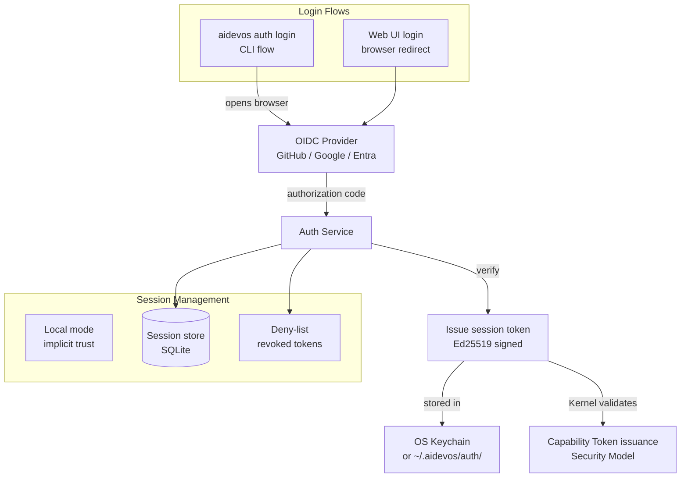

# Auth System

> Human user authentication for AI Dev OS — local identity, OAuth 2.0 / OpenID Connect integration, session management, and token lifecycle. This document is normative — implementations MUST satisfy every MUST clause below.

## Overview

The Auth System authenticates human users to AI Dev OS. In local mode, authentication is implicit (the OS user owns `~/.aidevos/`). In cloud/team mode, users authenticate via OAuth 2.0 / OpenID Connect against a configurable identity provider (GitHub, Google, Microsoft Entra, or generic OIDC). Every authenticated session produces a signed session token that the Kernel uses to issue capability tokens.

The Auth System does not authorise actions — that is the responsibility of [AuthZ/RBAC](./AUTHZ_RBAC.md) and the [Security Model](./SECURITY_MODEL.md) capability layer. This system only answers "who is this user?" not "what may they do?"

## Goals

- Local mode: zero-config; the OS user IS the AI Dev OS user.
- OIDC integration: GitHub, Google, Microsoft Entra, and generic OIDC providers.
- Session tokens: short-lived (default 1 h) with refresh token rotation.
- CLI and Web login flows: `aidevos auth login` opens a browser; `aidevos auth token` outputs a machine-readable token.
- Session revocation: operator can revoke any session; tokens are checked against a deny-list.

## Non-Goals

- Authorisation policy — see [AuthZ/RBAC](./AUTHZ_RBAC.md).
- Agent authentication — agents authenticate via capability tokens; see [Security Model](./SECURITY_MODEL.md).
- Multi-factor authentication — delegated to the OIDC provider.
- Implementation code — this repository is documentation-only (see [AI Coding Rules](./AI_CODING_RULES.md)).

## Architecture



## Authentication Flows

### Local Mode

In local mode, the user is authenticated by their ownership of `~/.aidevos/`:

```
1. aidevos init creates ~/.aidevos/ with 0700 permissions
2. The Kernel reads the local identity from ~/.aidevos/identity.toml
3. The local identity is treated as a "user" actor for capability issuance
4. No OIDC flow is needed; no network calls are made
```

### OIDC Login Flow (CLI)

```
1. User runs: aidevos auth login
2. CLI opens browser to Auth Service at http://127.0.0.1:PORT/oauth/start
3. Auth Service redirects to OIDC provider's authorization endpoint
4. User authenticates and consents on OIDC provider
5. OIDC provider redirects to Auth Service callback URL with authorization code
6. Auth Service exchanges code for ID token + access token
7. Auth Service verifies ID token (signature, issuer, audience, nonce)
8. Auth Service creates session:
   - Generates session_id (ULID)
   - Creates session token (JWT-like, Ed25519 signed)
   - Stores refresh token (encrypted at rest)
   - Returns session token to CLI
9. CLI stores session token in OS keychain
10. auth login exits with success
```

### OIDC Login Flow (Web)

Same as CLI flow but the redirect starts at the Web UI login page. The session token is stored in an HTTP-only secure cookie.

## Session Token Schema

```
SessionToken {
  id:             ulid              # session_id
  user_id:        string            # from OIDC sub claim, or local username
  provider:       "local" | "github" | "google" | "entra" | "oidc"
  display_name:   string
  email:          string?
  roles:          string[]          # from RBAC lookup at login time
  issued_at:      rfc3339
  expires_at:     rfc3339           # default 1 hour
  refresh_token_id: ulid?
  scope:          { workspace: string }
  signature:      string            # Ed25519 signed by Auth Service
}
```

## Interfaces

```
# Authentication
auth.login(provider?: string) → SessionToken     # opens browser flow
auth.logout(session_id) → Ack                    # revokes session
auth.refresh(session_token) → SessionToken       # rotates token
auth.status() → AuthStatus                       # current session info

# Token validation (called by Kernel)
auth.validate(session_token) → { ok: boolean, identity?: Identity, error?: string }
auth.whoami(session_token) → UserInfo

# Admin
auth.sessions(filter?: SessionFilter) → SessionInfo[]
auth.revoke_session(session_id, reason?) → Ack
auth.revoke_all_sessions(user_id) → Ack

# Provider configuration
auth.configure_provider(provider_id, config) → Ack
auth.list_providers() → ProviderConfig[]
```

### AuthStatus

```
AuthStatus {
  authenticated:  boolean
  user_id?:       string
  provider?:      string
  session_id?:    ulid
  expires_at?:    rfc3339
  workspace_id:   string
}
```

## Provider Configuration

Providers are configured in `~/.aidevos/auth.toml`:

```toml
[auth]
default_provider = "github"

[auth.providers.github]
client_id = "ov23..."
# client_secret is stored in Secrets Management; not in config
authorize_url = "https://github.com/login/oauth/authorize"
token_url = "https://github.com/login/oauth/access_token"
userinfo_url = "https://api.github.com/user"
scopes = ["openid", "email", "profile"]

[auth.providers.google]
client_id = "123....apps.googleusercontent.com"
authorize_url = "https://accounts.google.com/o/oauth2/v2/auth"
token_url = "https://oauth2.googleapis.com/token"
userinfo_url = "https://openidconnect.googleapis.com/v1/userinfo"
scopes = ["openid", "email", "profile"]

[auth.providers.entra]
client_id = "..."  # Microsoft Entra ID (formerly Azure AD)
tenant_id = "..."
authorize_url = "https://login.microsoftonline.com/{tenant}/oauth2/v2.0/authorize"
token_url = "https://login.microsoftonline.com/{tenant}/oauth2/v2.0/token"
scopes = ["openid", "email", "profile"]
```

## Session Token Validation

The Kernel validates every session token before issuing capability tokens:

```
validate(session_token):
  1. Check deny-list: if session_id in deny_list → return INVALID
  2. Verify Ed25519 signature using Auth Service public key
  3. Check expiry: session_token.expires_at > now
  4. Return { ok: true, identity: { id: user_id, kind: "user", roles } }
```

## Requirements

- **MUST** support local mode with no network dependencies: `~/.aidevos/` ownership is sufficient authentication.
- **MUST** support OAuth 2.0 / OpenID Connect with GitHub, Google, and Microsoft Entra out of the box.
- **MUST** support generic OIDC providers via configuration.
- **MUST** issue short-lived session tokens (default 1 h) with refresh token rotation.
- **MUST** support session revocation via a deny-list checked on every `auth.validate` call.
- **MUST** store refresh tokens encrypted at rest.
- **MUST** never expose tokens in logs, error messages, or `--json` output.
- **SHOULD** store session tokens in the OS keychain when available (macOS Keychain, Windows Credential Manager, libsecret).
- **SHOULD** support `aidevos auth login --headless` for CI environments (device code flow).
- **MAY** support API tokens (long-lived, scoped, rotatable) for CI/CD and automation.

## Failure Modes

| Mode | Detection | Response |
|------|-----------|----------|
| OIDC provider unreachable | HTTP timeout at authorize/token endpoint | Return `PROVIDER_UNREACHABLE`; suggest local mode or different provider |
| Token expired | `expires_at < now` | Return `TOKEN_EXPIRED`; client calls `auth.refresh` |
| Refresh token expired | Refresh grant fails | Return `SESSION_EXPIRED`; user must re-authenticate |
| Token revoked | Session ID in deny-list | Return `TOKEN_REVOKED`; user must re-authenticate |
| Keychain unavailable | OS keychain write error | Fall back to `~/.aidevos/auth/tokens/` with 0600 permissions; warn |
| OIDC provider returns invalid ID token | Signature or claim verification fails | Reject login; log security event; alert operator |

## Security Considerations

- Client secrets for OIDC providers are stored in [Secrets Management](./SECRETS_MANAGEMENT.md); never in config files.
- Session tokens are signed by the Auth Service private key, not the Kernel root key, limiting blast radius if the auth key is compromised.
- The deny-list is checked on every `auth.validate` call; it is replicated to all Kernel instances.
- Refresh tokens are single-use (rotation); using a rotated refresh token invalidates the current session (token theft detection).
- See [Security Model](./SECURITY_MODEL.md) for the full trust architecture.

## Observability

| Metric | Labels | Description |
|--------|--------|-------------|
| `auth_login_total` | `provider`, `ok` | Login attempts |
| `auth_session_active` | `provider` | Active sessions gauge |
| `auth_token_refresh_total` | `ok` | Token refresh attempts |
| `auth_token_revoke_total` | — | Token revocations |
| `auth_validate_seconds` | — | Token validation latency |
| `auth_provider_error_total` | `provider`, `error` | Provider errors |

## Acceptance Criteria

- `aidevos auth login` on a machine with GitHub OIDC configured opens a browser, completes the OAuth flow, and stores a session token in the keychain.
- `aidevos auth token --json` returns a valid non-expired `SessionToken` after successful login.
- Running `aidevos auth logout` revokes the session; subsequent `aidevos run` with the revoked token returns `TOKEN_REVOKED`.
- A session token with an expired `expires_at` causes `auth.validate()` to return `{ ok: false, error: "TOKEN_EXPIRED" }`.
- Local mode (`auth.provider = "local"`) completes `aidevos init && aidevos run "hello"` with no network calls.

## Related Documents

- [Security Model](./SECURITY_MODEL.md) — trust architecture and capability tokens
- [AuthZ/RBAC](./AUTHZ_RBAC.md) — role-to-permission mappings
- [Audit Log](./AUDIT_LOG.md) — all auth events are logged
- [Secrets Management](./SECRETS_MANAGEMENT.md) — OIDC client secret storage
- [Configuration](./CONFIGURATION.md) — `~/.aidevos/auth.toml` format
- [CLI](./CLI.md) — `aidevos auth` subcommands
- [System Overview](./SYSTEM_OVERVIEW.md)
