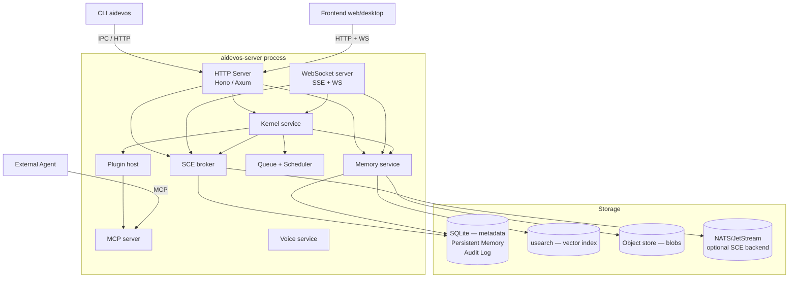

# Backend

> The reference implementation server — process architecture, data layer, API surface, and operational model for the AI Dev OS runtime. This document is normative — implementations MUST satisfy every MUST clause below.

## Overview

The Backend is the process (or set of processes) that hosts the [Main AI Kernel](./MAIN_AI_KERNEL.md), the [Shared Context Engine](./SHARED_CONTEXT_ENGINE.md), the [Persistent Memory](./PERSISTENT_MEMORY.md) store, and all subsystems that require durable state. It exposes:

- An HTTP + WebSocket API for the [Frontend](./FRONTEND.md), [CLI](./CLI.md), and external integrations.
- An MCP server for tool and resource exposure (see [MCP](./MCP.md)).
- An IPC interface for local in-process communication (see [IPC](./IPC.md)).

The Backend is designed **local-first**: a single-developer installation runs the entire stack on one machine with SQLite as the only data store and zero cloud dependencies. Remote and multi-tenant configurations layer on top of this baseline without changing the core interfaces.

## Goals

- **Local-first**: fully functional on a single machine with SQLite + embedded vector index, zero network egress required.
- **Single-binary deployment**: one compiled binary (`aidevos-server`) starts the full stack.
- **Boring stack**: well-supported, battle-tested components — no experimental frameworks.
- **Every mutation through the SCE**: no database mutation happens without a corresponding SCE event.
- **Graceful degradation**: losing any optional component (NATS, Redis, Postgres) degrades to SQLite fallbacks; the core loop keeps running.

## Non-Goals

- Frontend rendering — belongs in [Frontend](./FRONTEND.md).
- Model provider I/O beyond proxying — belongs in [Model Providers](./MODEL_PROVIDERS.md).
- Implementation code — this repository is documentation-only (see [AI Coding Rules](./AI_CODING_RULES.md)).

## Process Architecture



##Technology Stack

| Component | Default | Optional alternatives |
|-----------|---------|----------------------|
| HTTP framework | Hono (TS) / Axum (Rust) | Express, Fastify |
| Database | SQLite (via `better-sqlite3` / `rusqlite`) | PostgreSQL |
| Vector index | `usearch` / Chroma (embedded) | `pgvector`, Qdrant |
| Object store | Local filesystem (`~/.aidevos/objects/`) | S3-compatible |
| SCE backend | SQLite WAL-mode | NATS/JetStream, Kafka |
| Queue | In-memory with SQLite persistence | Redis, NATS |
| Model gateway | Nine Router (localhost:20128) | None (Nine Router is required) |
| Auth | JWT + OS keychain | OAuth2, OIDC |
| Metrics | Prometheus (`/metrics`) | OpenTelemetry push |
| Traces | OTLP (stdout JSON by default) | Jaeger, Tempo |

Stack decisions are tracked as ADRs in [templates/ADR](../templates/ADR.md).

## API Surface

The Backend exposes the full HTTP + WebSocket API documented in [API Spec](./API_SPEC.md). Key surfaces:

```
# Health and configuration
GET  /healthz                       → { ok, version, uptime_s }
GET  /readyz                        → { ok, services: { sce, memory, models, ... } }
GET  /metrics                       → Prometheus text format
GET  /v1/config                     → current resolved config
PUT  /v1/config                     → update config (hot-reloadable keys only)

# Kernel
POST /v1/runs                       → submit goal → { run_id }
GET  /v1/runs                       → list runs
GET  /v1/runs/:id                   → run status
GET  /v1/runs/:id/events            → SSE stream of run events
DELETE /v1/runs/:id                 → cancel run

# Models / Router
GET  /v1/models                     → list all discovered models
POST /v1/models/refresh             → trigger discovery
GET  /v1/models/:id                 → single model
GET  /v1/router/roles               → current role assignments
PUT  /v1/router/roles/:role         → assign model to role

# Memory
POST /v1/memory                     → write record
GET  /v1/memory                     → query (relational + semantic)
GET  /v1/memory/:id                 → single record
DELETE /v1/memory/:id               → delete record

# SCE
GET  /v1/context/topics             → list topics
GET  /v1/context/:topic             → snapshot + SSE tail
POST /v1/context/:topic             → publish event

# Research
POST /v1/research                   → enqueue job
GET  /v1/research                   → list jobs
GET  /v1/research/:id               → job status

# Plugins
GET  /v1/plugins                    → list installed plugins
POST /v1/plugins                    → install
PUT  /v1/plugins/:id/enable         → enable
PUT  /v1/plugins/:id/disable        → disable
```

Full request/response schemas, error codes, and versioning rules are in [API Spec](./API_SPEC.md).

## Data Layer

### SQLite schema (overview)

```sql
-- Core tables (abbreviated; full schema in DATABASE.md)
CREATE TABLE runs (
  id TEXT PRIMARY KEY,        -- ULID
  goal TEXT NOT NULL,
  state TEXT NOT NULL,
  plan TEXT,                  -- JSON TaskGraph
  budget TEXT,                -- JSON
  spent  TEXT,                -- JSON
  correlation_id TEXT,
  created_at TEXT,
  updated_at TEXT
);

CREATE TABLE sce_events (
  id TEXT PRIMARY KEY,        -- ULID (monotonic per topic)
  topic TEXT NOT NULL,
  ts TEXT NOT NULL,
  actor TEXT,                 -- JSON
  correlation_id TEXT,
  causation_id TEXT,
  schema_name TEXT,
  schema_version TEXT,
  payload BLOB,               -- JSON
  sig TEXT
);

CREATE TABLE memory_records (
  id TEXT PRIMARY KEY,
  workspace TEXT NOT NULL,
  project TEXT,
  group_id TEXT,
  agent TEXT,
  kind TEXT NOT NULL,
  key TEXT,
  text TEXT NOT NULL,
  tags TEXT,                  -- JSON array
  retention TEXT,
  encrypted INTEGER,
  created_at TEXT,
  updated_at TEXT,
  expires_at TEXT
);

-- Indexes for common query patterns
CREATE INDEX sce_topic_ts ON sce_events(topic, id);
CREATE INDEX memory_workspace_kind ON memory_records(workspace, kind);
CREATE INDEX memory_key ON memory_records(workspace, key) WHERE key IS NOT NULL;
```

Full schema, migration scripts, and index rationale are in [Database](./DATABASE.md).

### WAL mode and durability

SQLite runs in WAL (Write-Ahead Logging) mode for concurrent read performance. `PRAGMA synchronous = NORMAL` is the default; operators may set `FULL` for maximum durability at the cost of ~10% write performance.

The Kernel MUST NOT acknowledge a run as `delivered` until the `deliver` event has been `PRAGMA synced` (i.e., `synchronous = FULL` or explicit `PRAGMA wal_checkpoint(FULL)` after the final write).

## Configuration

The Backend reads configuration from:

1. `/etc/aidevos/config.toml` (system-wide, lowest priority)
2. `~/.aidevos/config.toml` (user-wide)
3. `./aidevos.toml` (project-local, highest priority for non-security settings)
4. Environment variables (`AIDEVOS_*`, override everything)

Key configuration sections:

```toml
[server]
listen      = "127.0.0.1:7700"
tls         = false              # set true + cert_file/key_file for remote deployments

[database]
path        = "~/.aidevos/db.sqlite"
wal_mode    = true
synchronous = "NORMAL"           # NORMAL | FULL

[sce]
backend     = "sqlite"           # sqlite | nats
nats_url    = ""                 # required when backend = "nats"

[router]
endpoint    = "http://localhost:20128"  # Nine Router — model gateway

[vector]
backend     = "usearch"          # usearch | chroma | pgvector
dimensions  = 768                # must match embedding model output
m           = 16                 # usearch HNSW M parameter

[memory]
encryption  = true
key_source  = "secrets"          # secrets | env | file (file is dev-only)

[objects]
backend     = "local"            # local | s3
path        = "~/.aidevos/objects/"

[models]
discovery_ttl_minutes = 10      # models discovered via Nine Router

[auth]
mode        = "local"            # local | jwt | oidc
jwt_secret  = ""                 # only for jwt mode; prefer secrets
```

## Startup Sequence

```
1. Parse and validate config
2. Open SQLite (create schema if first run)
3. Run pending migrations (see DATABASE.md)
4. Verify Nine Router connectivity at configured endpoint (localhost:20128)
5. Start SCE broker (SQLite or NATS)
6. Start Persistent Memory service (relational + vector)
7. Load plugin manifests from ~/.aidevos/plugins/
8. Start Job Scheduler (load scheduled jobs from DB)
9. Discover models from Nine Router
10. Start HTTP + WebSocket server
11. Start MCP server
12. Emit server.started event on SCE
13. Signal readiness (READY on stdout for process supervisors)
```

## Graceful Shutdown

On `SIGTERM` or `SIGINT`:

```
1. Stop accepting new HTTP/WebSocket connections
2. Emit server.stopping event on SCE
3. Wait for in-flight HTTP requests to complete (drain_timeout_ms, default 30 s)
4. Cancel all active Kernel runs (kernel.cancel with reason "server_shutdown")
5. Wait for workers to checkpoint (shutdown_grace_ms, default 10 s)
6. Flush SCE event buffer and WAL checkpoint
7. Close database connections
8. Exit 0
```

## Security Considerations

- The HTTP server MUST bind to `127.0.0.1` by default; only bind to `0.0.0.0` when `server.listen` is explicitly set and TLS is enabled.
- All API endpoints require authentication except `/healthz` and `/metrics` (the latter can be protected via `metrics.auth_required: true`).
- Secrets are fetched from [Secrets Management](./SECRETS_MANAGEMENT.md) at startup; never read from environment variables in production.
- All inbound request bodies are size-limited (`max_body_bytes`, default 10 MB) and schema-validated before reaching any handler.
- SQL queries use parameterised statements; no string concatenation into SQL.
- See [Security Model](./SECURITY_MODEL.md), [Auth System](./AUTH_SYSTEM.md), and [AuthZ/RBAC](./AUTHZ_RBAC.md).

## Failure Modes

| Mode | Detection | Response |
|------|-----------|----------|
| SQLite corruption | DB integrity check on startup | Restore from latest snapshot; see [Disaster Recovery](./DISASTER_RECOVERY.md) |
| Port already in use | `bind()` fails | Log error with `aidevos doctor` hint; exit 1 |
| Plugin crash at startup | Plugin subprocess exits | Log error; mark plugin `disabled`; continue startup |
| Vector index OOM | `usearch` allocation failure | Disable semantic queries; fall back to FTS; alert |
| NATS unreachable | SCE broker connect failure | Fall back to SQLite SCE; emit `sce.degraded` event |
| Shutdown timeout | Drain exceeds `drain_timeout_ms` | Force-kill in-flight requests; SIGKILL workers; exit 1 |

## Observability

| Metric | Description |
|--------|-------------|
| `server_request_total{method,path,status}` | HTTP request count |
| `server_request_seconds{method,path}` | Request latency histogram |
| `server_active_connections` | Active WebSocket connections |
| `server_uptime_seconds` | Time since startup |
| `db_query_seconds{table,op}` | SQLite query latency |
| `db_wal_pages` | SQLite WAL size |

Full guidance in [Observability](./OBSERVABILITY.md), [Metrics](./METRICS.md), [Tracing](./TRACING.md), and [Logging](./LOGGING.md).

## Acceptance Criteria

- `aidevos-server` starts, passes `/readyz`, and serves `GET /v1/models` in < 2 s on a fresh machine with only Ollama installed.
- Stopping the server mid-run and restarting within 30 s resumes the run from the last checkpoint.
- `GET /metrics` returns valid Prometheus text-format output with at least `server_request_total` and `server_uptime_seconds`.
- Sending `SIGTERM` causes the server to drain in-flight requests and exit 0 within `drain_timeout_ms`.
- SQLite WAL checkpoint completes and all events are durable after graceful shutdown.

## Open Questions

- Runtime language: TypeScript/Bun vs. Rust — tracked as an ADR in [templates/ADR](../templates/ADR.md).
- Whether the HTTP server and the SCE broker should run as separate processes or co-located in one — affects deployment complexity vs. operational simplicity.

## Related Documents

- [Frontend](./FRONTEND.md)
- [Database](./DATABASE.md)
- [API Spec](./API_SPEC.md)
- [MCP](./MCP.md)
- [IPC](./IPC.md)
- [Queueing](./QUEUEING.md)
- [Job Scheduler](./JOB_SCHEDULER.md)
- [Shared Context Engine](./SHARED_CONTEXT_ENGINE.md)
- [Persistent Memory](./PERSISTENT_MEMORY.md)
- [Deployment](./DEPLOYMENT.md)
- [Localhost Architecture](./LOCALHOST_ARCHITECTURE.md)
- [System Overview](./SYSTEM_OVERVIEW.md)
- [Main AI Kernel](./MAIN_AI_KERNEL.md)
- [Architecture Guardian](./ARCHITECTURE_GUARDIAN.md)
