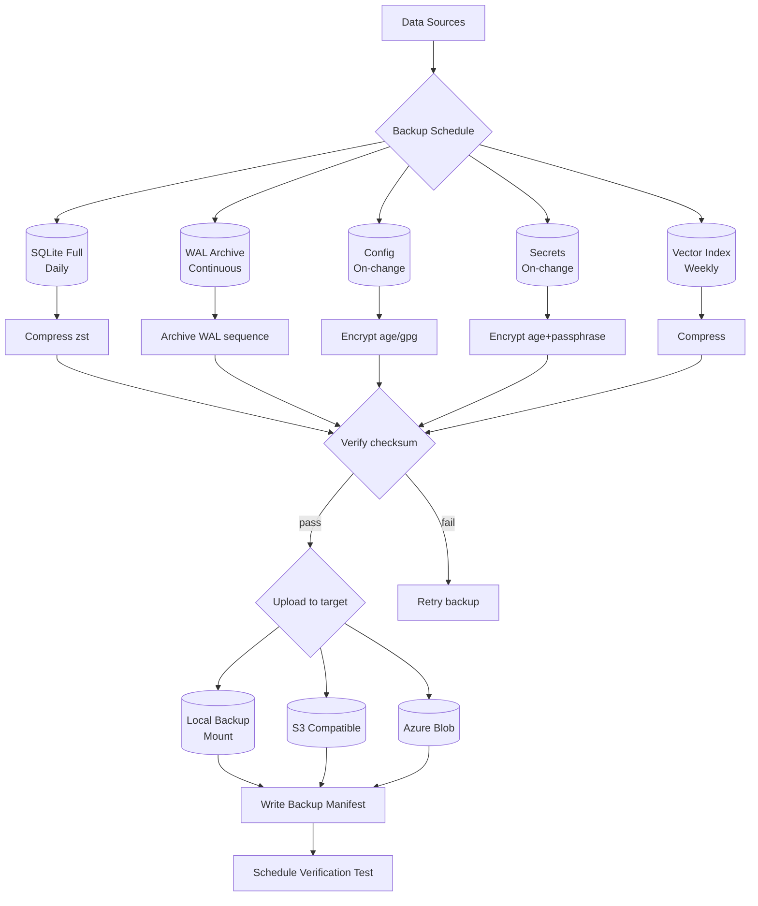

# Backup Strategy

> How AI Dev OS data is backed up, verified, and restored. This document is normative — implementations MUST satisfy every MUST clause below.

## Overview

AI Dev OS stores durable state across several data stores: the SQLite/Postgres database, vector index, configuration files, secrets, and custom user rules. A single backup strategy covers all of them with appropriate frequency, consistency guarantees, and retention policies.

The backup architecture follows a **copy-on-write with WAL archiving** pattern for databases and **filesystem snapshot** for configuration. Every backup is checksummed and the manifest is recorded in the backup log for auditability.

## What to Back Up

| Asset | Location | Size estimate | Criticality |
|-------|----------|---------------|-------------|
| SQLite database | `{AIDEVOS_HOME}/data/aidevos.db` | 10 MB – 50 GB | Critical |
| Postgres database (server mode) | External Postgres cluster | 1 GB – 500 GB | Critical |
| Configuration directory | `~/.aidevos/` | < 1 MB | High |
| Secrets directory | `~/.aidevos/secrets/` | < 100 KB | Critical |
| Custom rules | `{AIDEVOS_HOME}/rules/` | < 10 MB | Medium |
| SCE event log (WAL archives) | `{AIDEVOS_HOME}/data/scd/` | 100 MB – 10 GB | High |
| Vector index (usearch) | `{AIDEVOS_HOME}/data/vectors/` | 100 MB – 10 GB | Low (rebuildable) |

Secrets MUST be backed up with client-side encryption. Vector indexes SHOULD be backed up only if the embeddings source (database) is not available for rebuild.

## Backup Methods

### SQLite .backup command

For SQLite-backed deployments, use the `.backup` command via the CLI:

```
aidevos db backup --output /mnt/backup/aidevos_$(date +%F).db
```

The `.backup` command acquires a shared lock, creates a consistent snapshot without blocking readers, and verifies the resulting file with `PRAGMA integrity_check`.

### Filesystem copy (cold)

For configuration, rules, and secrets, an atomic filesystem copy suffices:

```bash
rsync -a --link-dest=/mnt/backup/latest \
  ~/.aidevos/ \
  /mnt/backup/$(date +%F)/
```

Use `--link-dest` for incremental snapshots. Secrets MUST be encrypted before copying to the backup target.

### WAL checkpoint + copy

For point-in-time recovery capability, archive the SQLite WAL and shm files alongside the database:

```bash
sqlite3 aidevos.db "PRAGMA wal_checkpoint(TRUNCATE);"
cp aidevos.db aidevos.db-wal aidevos.db-shm /mnt/backup/pitr/
```

This produces a consistent state at the checkpoint. For continuous archiving, enable WAL journal mode and archive WAL files as they fill (`wal_archive_dir` config option).

### Postgres pg_dump / pgBackRest

For server-mode Postgres:

| Method | Tool | RPO | RTO | Use case |
|--------|------|-----|-----|----------|
| Logical dump | `pg_dump` | Daily | 1–4 hr | Small databases, schema-only |
| Physical backup | `pgBackRest` | 1 min (WAL streaming) | 5–30 min | Large databases, PITR |
| Snapshot | Volume snapshot (EBS, Cinder) | Configurable | 1–5 min | Cloud deployments |

## Backup Schedule

| Data | Frequency | Retention | Method |
|------|-----------|-----------|--------|
| SQLite database | Daily (full), hourly (WAL) | 30 daily, 12 monthly | `.backup` + WAL archive |
| Postgres database | Continuous WAL, daily full | 7 daily, 4 weekly, 12 monthly | pgBackRest |
| Configuration | On-change (post-save hook) | 90 days | Filesystem copy |
| Secrets | On-change | 90 days, encrypted | Filesystem copy + age/gpg |
| Custom rules | On-change | 90 days | Filesystem copy |
| SCE event log | Daily (WAL rotation) | 7 days | WAL archive |
| Vector index | Weekly | 4 weekly | Filesystem copy |

On-change backups use a filesystem watcher (`inotify` / `ReadDirectoryChangesW`) that triggers a backup within 60 s of detecting a write.

## Restore Procedure

### Database restore

```
1. Stop the aidevos-server process.
2. Locate the target backup: `ls /mnt/backup/$(date -d '-1 day' +%F)/`
3. Restore the database file:
   cp /mnt/backup/2026-07-21/aidevos.db {AIDEVOS_HOME}/data/aidevos.db
4. Run integrity check: `aidevos db check`
5. Apply WAL archives for PITR if needed (see Point-in-Time Recovery).
6. Start the server: `aidevos server start`
7. Verify with: `aidevos doctor --quick`
```

### Configuration restore

```
1. rsync -a /mnt/backup/2026-07-21/config/ ~/.aidevos/
2. Decrypt secrets: `age --decrypt -i ~/.age/key.txt < backup/secrets.tar.age | tar xf -`
3. Restart server to reload configuration.
```

### Full system restore

```
1. Reinstall AI Dev OS (same version as backup).
2. Restore database (above).
3. Restore configuration and rules (above).
4. Restore secrets (above).
5. Run `aidevos doctor --full` to validate all subsystems.
6. Run `aidevos db reindex` to rebuild vector and FTS indexes.
7. Verify agent workspaces are accessible and history is intact.
```

## Point-in-Time Recovery (PITR)

SQLite WAL archiving enables PITR within the window of retained WAL files:

```
1. Identify the target timestamp: 2026-07-21T14:30:00Z
2. Locate the base backup: /mnt/backup/2026-07-21/aidevos_base.db
3. Locate WAL archive: /mnt/backup/wal_archive/
4. Replay WAL files up to the target timestamp:
   sqlite3 aidevos_restored.db "
     PRAGMA journal_mode = WAL;
     RESTORE FROM '/mnt/backup/wal_archive/';
   "
5. Verify consistency: `PRAGMA integrity_check;`
```

WAL files are named `{seq_number}_{timestamp}.wal` and are automatically rotated at 10 MB or hourly, whichever comes first.

## Testing Backups

| Test | Frequency | Action |
|------|-----------|--------|
| Integrity check | Daily (automated) | `PRAGMA integrity_check` on all backups |
| Restore dry-run | Weekly | Restore to a staging directory; verify checksums |
| Full restore drill | Monthly | Spin up a clean environment; restore from latest backup |
| PITR drill | Quarterly | Pick a random timestamp; verify exact state recovery |
| Secrets decryption | Weekly | Attempt decryption of the latest secrets backup |

Each test produces a structured result published as `backup.test_result` on the SCE. Failure of any test MUST alert the operator.

## Cloud Backup Integration (Optional)

### S3-compatible object store

```
bucket: aidevos-backups-{env}
prefix: {hostname}/{backup_type}/
lifecycle: auto-delete after retention period
encryption: server-side AES-256 or client-side age
```

Backup command with S3 upload:

```bash
aidevos db backup --output /tmp/aidevos.db --compress
aws s3 cp /tmp/aidevos.db.zst s3://aidevos-backups-prod/host01/daily/
```

### Azure Blob Storage

```
container: aidevos-backups
blob tier: Hot (7 days), Cool (30 days), Archive (after 30 days)
```

### Upload retry

Cloud uploads use truncated exponential backoff (base 2 s, max 60 s, 5 attempts). If all attempts fail, the backup remains on local disk and a `backup.upload_failed` event is emitted.

## Failure Modes

| Failure | Detection | Response |
|---------|-----------|----------|
| Backup target disk full | `backup.disk_full` event | Rotate oldest backups; alert operator |
| Backup checksum mismatch | `backup.checksum_mismatch` event on verify | Retry backup immediately; if repeat, alert |
| Secrets backup unreadable | Decryption test fails | Re-encrypt and re-upload; revoke compromised key |
| Cloud upload failure | `backup.upload_failed` event | Local backup retained; retry on next schedule |
| WAL archive gap | Missing sequence in WAL file names | Stop archiving; alert; perform full backup |
| Database restore fails integrity check | `PRAGMA integrity_check` returns errors | Attempt restore from next oldest backup; escalate |

All backup failures are recorded in the [Audit Log](./AUDIT_LOG.md) and surfaced via the [Observability](./OBSERVABILITY.md) subsystem.

## Mermaid Backup Flow



## Backup Schedule (Detailed)

| Data | Full | Incremental | Retention | Method |
|------|------|-------------|-----------|--------|
| SQLite database | Daily 02:00 | WAL: continuous | 30 daily, 12 monthly | `.backup` + WAL archive |
| Postgres database | Daily 02:00 | WAL: continuous | 7 daily, 4 weekly, 12 monthly | pgBackRest |
| Configuration | On-change | N/A | 90 days | Filesystem copy + encrypt |
| Secrets | On-change | N/A | 90 days | Filesystem copy + age |
| Custom rules | On-change | N/A | 90 days | Filesystem copy |
| SCE event log | Daily 03:00 | WAL rotation | 7 days | WAL archive |
| Vector index | Weekly Sun 04:00 | N/A | 4 weekly | Filesystem copy |

## Retention Policy

| Backup Age | Retention Action |
|------------|-----------------|
| 0-7 days | All backups retained |
| 7-30 days | Daily backups retained; hourly WAL deleted |
| 30-90 days | Weekly backups retained |
| 90-365 days | Monthly backups retained |
| > 365 days | Annual backup retained; others deleted |

Retention is enforced by a cron job that runs daily at 05:00. Deleted backups are reported in the backup log.

## Encryption (Detailed)

| Layer | Method | Key Storage |
|-------|--------|-------------|
| In-transit (local) | File system permissions (0700) | N/A |
| In-transit (cloud) | TLS 1.3 + S3 SSE-S3 or Azure SSE | Provider-managed |
| At-rest (local backup) | age encryption (X25519 + ChaCha20-Poly1305) | Age key file + optional passphrase |
| At-rest (cloud backup) | Client-side age + server-side AES-256 | Age key file + KMS |
| Secrets backup | age encryption + separate passphrase | Separate from data key |
| Key backup | Printed QR code + HSM backup | Offline storage |

## Restoration Testing (Expanded)

| Test | Frequency | Method | Success Criteria |
|------|-----------|--------|------------------|
| Checksum verification | Daily | Automated script | SHA-256 matches manifest |
| Restore dry-run | Weekly | Restore to staging directory | Files intact; decrypt succeeds |
| Full restore drill | Monthly | Clean environment; restore from backup | All subsystems functional |
| PITR drill | Quarterly | Pick random timestamp; restore | Exact state match |
| Secrets decryption | Weekly | Decrypt latest secret backup | All keys decrypt successfully |
| Cross-region restore | Quarterly | Restore to secondary region | Full functionality in DR region |
| Vector index rebuild | Monthly | Rebuild from database | Query results match original |

## Cross-Workspace Isolation

Backups are isolated per workspace:

```
/mnt/backup/
├── workspace_abc/
│   ├── 2026-07-21/
│   ├── 2026-07-22/
│   └── latest -> 2026-07-22/
├── workspace_def/
│   ├── 2026-07-21/
│   └── latest -> 2026-07-21/
└── global/
    ├── config/
    └── secrets/
```

Restoring one workspace's backup does not affect other workspaces. Global config and secrets are backed up separately.

## Failure Modes (Expanded)

| Failure | Detection | Response |
|---------|-----------|----------|
| Backup target disk full | `backup.disk_full` event | Rotate oldest backups; alert operator |
| Backup checksum mismatch | `backup.checksum_mismatch` event on verify | Retry backup immediately; if repeat, alert |
| Secrets backup unreadable | Decryption test fails | Re-encrypt and re-upload; revoke compromised key |
| Cloud upload failure | `backup.upload_failed` event | Local backup retained; retry on next schedule |
| WAL archive gap | Missing sequence in WAL file names | Stop archiving; alert; perform full backup |
| Database restore fails integrity check | `PRAGMA integrity_check` returns errors | Attempt restore from next oldest backup; escalate |
| Encryption key lost | Decryption impossible | Restore from key backup (QR code/HSM); rotate all keys |
| Retention job failure | Old backups not deleted | Manual cleanup; fix cron job |
| Cross-region replication failure | Secondary bucket out of sync | Replicate from primary; alert operator |

## Acceptance Criteria

- A daily full backup completes within 5 minutes for a 10 GB database.
- WAL archiving captures every transaction within 60 seconds of commit.
- Restoring a backup to a clean machine produces a fully functional system (verified by `aidevos doctor --full`).
- Point-in-time recovery restores a database to any timestamp within the WAL retention window.
- All backups are encrypted with age (X25519 + ChaCha20-Poly1305) and verified by checksum.
- A backup manifest is written for every backup and recorded in the audit log.
- Secrets backup decryption is verified daily and reported to the metrics pipeline.

## Related Documents

- [Disaster Recovery](./DISASTER_RECOVERY.md) — RPO/RTO targets, recovery procedures per scenario
- [Data Retention](./DATA_RETENTION.md) — retention policies, archival, purging
- [Persistent Memory](./PERSISTENT_MEMORY.md) — memory record durability, WAL buffering
- [Database](./DATABASE.md) — SQLite and Postgres configuration, WAL tuning
- [Secrets Management](./SECRETS_MANAGEMENT.md) — backup encryption, key management
- [Deployment](./DEPLOYMENT.md) — cloud backup integration, volume snapshots
- [Reliability](./RELIABILITY.md) — backup verification as part of DR testing
